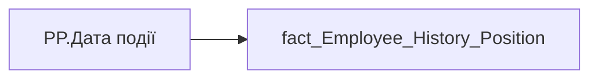

# PP.Дата події

*тека `Personal_Profile\Життєвий цикл`*

## Технічний опис

| Властивість | Значення |
|---|---|
| Тип | міра |
| Home table | _Measures |
| displayFolder | `Personal_Profile\Життєвий цикл` |
| formatString | — |
| dataType | — |
| Прихована | ні |

### DAX

```dax
VAR _maxd = MAX('fact_Employee_History_Position'[PERIOD])
RETURN FORMAT(_maxd, "dd.mm.yyyy")
```

### Джерела даних

Вихідні таблиці: `DM.vw_R27_fact_Employee_History_Position`

Колонки: `PERIOD`

Power Query: `fact_Employee_History_Position`

### Залежності (таблиці й колонки)

Таблиці: `fact_Employee_History_Position`

Колонки: `fact_Employee_History_Position[PERIOD]`

### Схема



---

## Бізнес-суть

!!! note "Бізнес-визначення відсутнє"
    Поля міри не зіставлено з wiki «Таблицями джерел даних». Можна заповнити вручну в `manualNotes`.

## На сторінках звіту

[Personal Profile](../report/personal-profile.md)

## Пов'язані міри

_Прямих зв'язків з іншими мірами немає._

## Нотатки

_порожньо_
