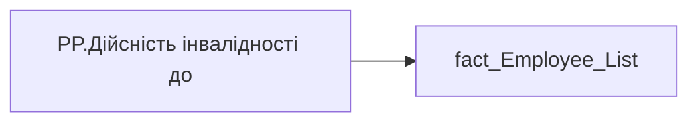

# PP.Дійсність інвалідності до

*тека `Personal_Profile\Загальна інформація`*

## Технічний опис

| Властивість | Значення |
|---|---|
| Тип | міра |
| Home table | _Measures |
| displayFolder | `Personal_Profile\Загальна інформація` |
| formatString | — |
| dataType | — |
| Прихована | ні |

### DAX

```dax
VAR _date = SELECTEDVALUE(fact_Employee_List[DISABILITY_VALIDITY])
RETURN
COALESCE(
	SWITCH(
		TRUE(),
		_date = DATE(1900,1,1), "Безстроково",
		NOT ISBLANK(_date), FORMAT(_date, "dd.mm.yyyy"),
		"-"
	),
	"-"
)
```

### Джерела даних


Колонки: `DISABILITY_VALIDITY`

Power Query: `fact_Employee_List`

### Залежності (таблиці й колонки)

Таблиці: `fact_Employee_List`

Колонки: `fact_Employee_List[DISABILITY_VALIDITY]`

### Схема



---

## Бізнес-суть

DISABILITY_VALIDITY → Дійсність інвалідності до

Поле зберігається в довіднику [ dm.vw_R27_dim_person]  <br>Це поле має бути доступне у візуалізаціях, побудованих на основі фактової таблиці [dm.vw_R27_fact_Employee_List_PDP]  через відповідний зв’язок за ключем person_key  <br>Якщо значення в полі відсутнє, то показати текст "Дані відсутні"  або знак "-".

**Вимоги:** `Індивідуальний-профіль-працівника/Сторінка-Загальна-інформація-про-працівника`

## На сторінках звіту

[Personal Profile](../report/personal-profile.md)

## Пов'язані міри

_Прямих зв'язків з іншими мірами немає._

## Нотатки

_порожньо_
