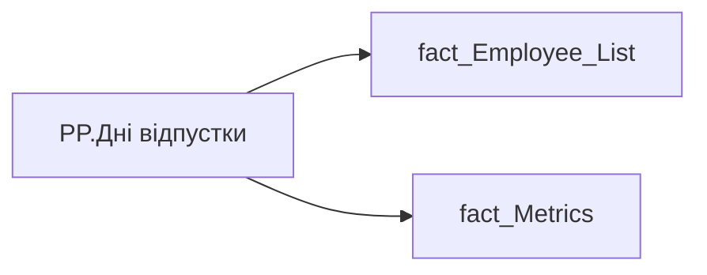

# PP.Дні відпустки

*тека `Personal_Profile\Здоров'я та благополуччя` · формат `0`*

## Бізнес-суть

IS_MAIN_POSITION → Пріоритетне місце роботи; IS_MAIN_POSITION → is_main_position; VACATION_DAY → % днів відпустки  в робочі дні (за останні 12 місяців); VACATION_DAY → Дні відпустки; VACATION_DAY → Середня тривалість відпустки; VACATION_DAY → Середня кількість днів використаної відпустки співробітником 12 міс.; VACATION_DAY → Середня тривалість відпустки співробітника, днів; VACATION_DAY → % днів відпустки  в робочі дні; VACATION_DAY → % днів відпустки в робочі дні

1 - Так  <br>0 - Ні Показує відсоток днів відпуски, які припадають на робочі дні за останні 12 місяців, включно із поточним.  <br>Розраховується як (Vacation_Day-Weekend_Day)/Vacation_Day  <br>Якщо значення в полі відсутнє, то показати текст "Дані відсутні". Розрахункове поле.  <br>Кількість днів відпусток всіх видів, використаних за останні 12 місяців (включно із поточним місяцем) в сумі. Розрахункове поле.  <br>Потрібно кількість днів відпустки за останні 12 місяців поділити на кількість таких відпусток та округлити до десятих = Vacation_Day/Vacation_Number  <br>Якщо значення в полі відсутнє

**Вимоги:** `Індивідуальний-профіль-працівника/Історія-по-посадам`, `Індивідуальний-профіль-працівника/Історія-по-посадам/Реліз-1.-Історія-по-посадам`, `Індивідуальний-профіль-працівника/Сторінка-Взаємодія-Viva-та-залученість-працівника/Сторінка-Ефективність-працівника/Вітрина-Відвідування-офісів`, `Індивідуальний-профіль-працівника/Сторінка-Загальна-інформація-про-працівника`, `Індивідуальний-профіль-працівника/Сторінка-Здоров'я-та-благополуччя-працівника`, `Командний-профіль/Сторінка-Здоров'я-та-благополуччя-команди`, `Командний-профіль/Сторінка-Моя-команда/ТЗ.-Деталізація-метрик-групового-профілю-звіту`, `Командний-профіль/Сторінка-Плинність-та-Exits/ТЗ-на-вітрину-Exits`

## На сторінках звіту

[Personal Profile](../report/personal-profile.md)

## Пов'язані міри

_Прямих зв'язків з іншими мірами немає._

---

## Технічний опис

| Властивість | Значення |
|---|---|
| Тип | міра |
| Home table | _Measures |
| displayFolder | `Personal_Profile\Здоров'я та благополуччя` |
| formatString | `0` |
| dataType | — |
| Прихована | ні |

### DAX

```dax
VAR _employee_id = SELECTEDVALUE('fact_Employee_List'[EMPLOYEE_ID])
VAR _main_position = 
	CALCULATE(
		VALUES('fact_Employee_List'[USER_ACCESS_ID]),
		REMOVEFILTERS('fact_Employee_List'),
		'fact_Employee_List'[EMPLOYEE_ID] = _employee_id,
		'fact_Employee_List'[IS_MAIN_POSITION] = 1
	)
VAR _filter0 = TREATAS({_main_position}, 'fact_Metrics'[USER_ACCESS_ID])
VAR _result = 
	CALCULATE(
		SUM('fact_Metrics'[VACATION_DAY]),
		REMOVEFILTERS(fact_Metrics),
		_filter0
	)
RETURN COALESCE(_result, "-")
```

### Джерела даних


Колонки: `EMPLOYEE_ID`, `IS_MAIN_POSITION`, `USER_ACCESS_ID`, `VACATION_DAY`

Power Query: `fact_Employee_List`

### Залежності (таблиці й колонки)

Таблиці: `fact_Employee_List`, `fact_Metrics`

Колонки: `fact_Employee_List[EMPLOYEE_ID]`, `fact_Employee_List[IS_MAIN_POSITION]`, `fact_Employee_List[USER_ACCESS_ID]`, `fact_Metrics[USER_ACCESS_ID]`, `fact_Metrics[VACATION_DAY]`

### Схема



## Нотатки

_порожньо_
