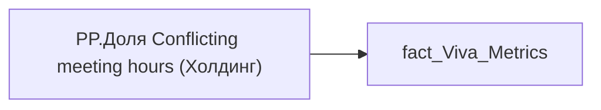

# PP.Доля Conflicting meeting hours (Холдинг)

*тека `Personal_Profile\Viva\Viva Meetings` · формат `0.00%;-0.00%;0.00%`*

## Технічний опис

| Властивість | Значення |
|---|---|
| Тип | міра |
| Home table | _Measures |
| displayFolder | `Personal_Profile\Viva\Viva Meetings` |
| formatString | `0.00%;-0.00%;0.00%` |
| dataType | — |
| Прихована | ні |

### DAX

```dax
VAR __val =
	DIVIDE(
		SUM( 'fact_Viva_Metrics'[CONFLICTING_MEETING_HOUR] ),
		SUM( 'fact_Viva_Metrics'[WORKDAY_WITHOUT_SICKLEAVE_AND_VACATION] )
	)
	
RETURN __val
```

### Джерела даних


Колонки: `CONFLICTING_MEETING_HOUR`, `WORKDAY_WITHOUT_SICKLEAVE_AND_VACATION`

Power Query: `fact_Viva_Metrics`

### Залежності (таблиці й колонки)

Таблиці: `fact_Viva_Metrics`

Колонки: `fact_Viva_Metrics[CONFLICTING_MEETING_HOUR]`, `fact_Viva_Metrics[WORKDAY_WITHOUT_SICKLEAVE_AND_VACATION]`

### Схема



---

## Бізнес-суть

!!! note "Бізнес-визначення відсутнє"
    Поля міри не зіставлено з wiki «Таблицями джерел даних». Можна заповнити вручну в `manualNotes`.

## На сторінках звіту

- [Personal Profile](../report/personal-profile.md) — VIVA › Viva
- [Group Profile](../report/group-profile.md) — Viva

## Пов'язані міри

**Використовується в:** [PP.Доля Conflicting meeting hours (кадровий підрозділ)](../measures/pp-dolia-conflicting-meeting-hours-kadrovyi-pidrozdil.md), [PP.Доля Conflicting meeting hours (напрям)](../measures/pp-dolia-conflicting-meeting-hours-napriam.md), [PP.Доля Conflicting meeting hours (співробітник)](../measures/pp-dolia-conflicting-meeting-hours-spivrobitnyk.md)

## Нотатки

_порожньо_
