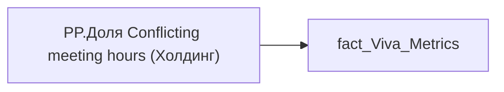

# PP.Доля Conflicting meeting hours (Холдинг)

*тека `Personal_Profile\Viva\Viva Meetings` · формат `0.00%;-0.00%;0.00%`*

## Технічний опис

| Властивість | Значення |
|---|---|
| Тип | міра |
| Home table | _Measures |
| displayFolder | `Personal_Profile\Viva\Viva Meetings` |
| formatString | `0.00%;-0.00%;0.00%` |
| dataType | — |
| Прихована | ні |

### DAX

```dax
VAR __val =
	DIVIDE(
		SUM( 'fact_Viva_Metrics'[CONFLICTING_MEETING_HOUR] ),
		SUM( 'fact_Viva_Metrics'[WORKDAY_WITHOUT_SICKLEAVE_AND_VACATION] )
	)
	
RETURN __val
```

### Джерела даних


Колонки: `CONFLICTING_MEETING_HOUR`, `WORKDAY_WITHOUT_SICKLEAVE_AND_VACATION`

Power Query: `fact_Viva_Metrics`

### Залежності (таблиці й колонки)

Таблиці: `fact_Viva_Metrics`

Колонки: `fact_Viva_Metrics[CONFLICTING_MEETING_HOUR]`, `fact_Viva_Metrics[WORKDAY_WITHOUT_SICKLEAVE_AND_VACATION]`

### Схема



---

## Бізнес-суть

CONFLICTING_MEETING_HOUR → Годин зустрічей з конфліктами за період від поточної точки до попередньої точки; CONFLICTING_MEETING_HOUR → Доля Conflicting meeting hours по працівнику; CONFLICTING_MEETING_HOUR → Доля Conflicting meeting hours кадровому підрозділу співробітника; CONFLICTING_MEETING_HOUR → Доля Conflicting meeting hours по напряму співробітника; CONFLICTING_MEETING_HOUR → Доля Conflicting meeting hours  по Холдингу; CONFLICTING_MEETING_HOUR → conflicting_meeting_hour_direction; CONFLICTING_MEETING_HOUR → conflicting_meeting_hour_holding; CONFLICTING_MEETING_HOUR → Доля Conflicting meeting hours по працівнику за 3 попередніх місяці; CONFLICTING_MEETING_HOUR → Доля Conflicting meeting hours кадровому підрозділу; CONFLICTING_MEETING_HOUR → Доля Conflicting meeting hours по напряму команди; CONFLICTING_MEETING_HOUR → Годин зустрічей з конфліктами

Розрахункове значення.  <br>Це поле має бути доступне у візуалізаціях, побудованих на основі фактової таблиці [DM.vw_R27_dim_Employee_Metric_Health_and_Wellbeing]    <br>Відбір по працівнику [person_key], періоду [PERIOD], документу прийому [DOC_JOB_APPLICATION_ID].  <br>Розраховується як середньоденне значення за попередній місяць. Потрібно значення conflicting_meeting_hour поділити на кількість робочих днів в тому місяці. Якщо працівник пропрацював менше місяця, то рахувати за фактично відпрацьований період.  <br>Якщо дані по працівнику у вітрині відсутні, то показати надпис "Дані відсутні" 

**Вимоги:** `Індивідуальний-профіль-працівника/Історія-по-посадам`, `Індивідуальний-профіль-працівника/Історія-по-посадам/Реліз-1.-Історія-по-посадам`, `Індивідуальний-профіль-працівника/Сторінка-Взаємодія-Viva-та-залученість-працівника`, `Індивідуальний-профіль-працівника/Сторінка-Взаємодія-Viva-та-залученість-працівника/Сторінка-Ефективність-працівника`, `Індивідуальний-профіль-працівника/Сторінка-Взаємодія-Viva-та-залученість-працівника/Таблиця-vw_R27_calc_Viva_Direction_PDP`, `Індивідуальний-профіль-працівника/Сторінка-Взаємодія-Viva-та-залученість-працівника/Таблиця-vw_R27_calc_Viva_Holding_PDP`, `Допоміжні-вітрини-для-звіту/Таблиця-для-розрахунку-агрегованих-метрик-по-звіту`, `Допоміжні-вітрини-для-звіту/Таблиця-для-розрахунку-агрегованих-метрик-по-звіту/Зміна-алгоритму-розрахунку-метрик-по-Viva-з-урахуванням-дати-завантаження-даних-до-DWH`, `Допоміжні-вітрини-для-звіту/Таблиця-для-розрахунку-агрегованих-метрик-по-звіту/Змінити-період-розрахунку-середніх-значень-по-Віва`, `Командний-профіль/Сторінка-Взаємодія-Viva-та-залученість-команд`, `Командний-профіль/Сторінка-Ефективність`

## На сторінках звіту

[Personal Profile](../report/personal-profile.md) · [Group Profile](../report/group-profile.md)

## Пов'язані міри

**Використовується в:** [PP.Доля Conflicting meeting hours (кадровий підрозділ)](../measures/pp-dolia-conflicting-meeting-hours-kadrovyi-pidrozdil.md), [PP.Доля Conflicting meeting hours (напрям)](../measures/pp-dolia-conflicting-meeting-hours-napriam.md), [PP.Доля Conflicting meeting hours (співробітник)](../measures/pp-dolia-conflicting-meeting-hours-spivrobitnyk.md)

## Нотатки

_порожньо_
