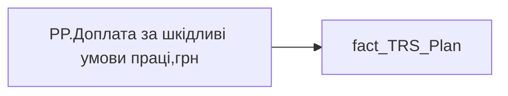

# PP.Доплата за шкідливі умови праці,грн

*тека `Personal_Profile\TRS`*

## Технічний опис

| Властивість | Значення |
|---|---|
| Тип | міра |
| Home table | _Measures |
| displayFolder | `Personal_Profile\TRS` |
| formatString | — |
| dataType | — |
| Прихована | ні |

### DAX

```dax
CALCULATE(
	MAX(fact_TRS_Plan[PAYMENT_PLAN_SUM]),
	fact_TRS_Plan[IS_ACTUAL]=TRUE(),
	fact_TRS_Plan[ACCRUAL_ORG_CODE]="00146"
)
```

### Джерела даних

Вихідні таблиці: `DM.vw_R27_fact_TRS_Plan_PDP`

Колонки: `ACCRUAL_ORG_CODE`, `IS_ACTUAL`, `PAYMENT_PLAN_SUM`

Power Query: `fact_TRS_Plan`

### Залежності (таблиці й колонки)

Таблиці: `fact_TRS_Plan`

Колонки: `fact_TRS_Plan[ACCRUAL_ORG_CODE]`, `fact_TRS_Plan[IS_ACTUAL]`, `fact_TRS_Plan[PAYMENT_PLAN_SUM]`

### Схема



---

## Бізнес-суть

PAYMENT_PLAN_SUM → Річний цільовий дохід; PAYMENT_PLAN_SUM → Розмір фіксованої винагороди плановий, за місяць ПОТОЧНИЙ; PAYMENT_PLAN_SUM → Сума (на поточний момент); PAYMENT_PLAN_SUM → Середній розмір премії за місяць; PAYMENT_PLAN_SUM → Доля учасників із зміною фіксованої винагороди; PAYMENT_PLAN_SUM → Діапазон фіксованої винагороди (план)

PAYMENT_PLAN_SUMх(BONUS_MONTH_SALARY_CNTх12 +BONUS_QUARTER_SALARY_CNTх4+BONUS_YEAR_SALARY_CNT+12) Відібрати записи по працівнику [person_key], періоду [Period], організації [organization_key], підрозділу [division_key], де category_name = Фіксована винагорода, IS_ACTUAL  = "1", END_DATE > поточна дата, або END_DATE = "01.01.2001". (BONUS_MONTH_SALARY_CNT +BONUS_QUARTER_SALARY_CNT+  <br>BONUS_YEAR_SALARY_CNT)* PAYMENT_PLAN_SUM + (PAYMENT_PLAN_SUM*12) Розрахункове поле.  <br>Потрібно зсумувати значення поля [PAYMENT_PLAN_SUM] по тим членам команди, у яких воно > 0,00  по ACCRUAL_ORG_CODE = 00148

**Вимоги:** `Індивідуальний-профіль-працівника/Історія-по-посадам`, `Індивідуальний-профіль-працівника/Історія-по-посадам/Реліз-1.-Історія-по-посадам`, `Індивідуальний-профіль-працівника/Сторінка-Винагорода-працівника`, `Індивідуальний-профіль-працівника/Сторінка-Винагорода-працівника/Деталізація-на-сторінці-Винагорода`, `Індивідуальний-профіль-працівника/Сторінка-Винагорода-працівника/Доопрацювання-сторінки-ТРС`, `Командний-профіль/Сторінка-TRS-команди`, `Командний-профіль/Сторінка-TRS-команди/Доопрацювання-сторінки-TRS`, `Командний-профіль/Сторінка-TRS-команди/Сторінка-Винагорода-групового-профілю#вимоги-до-звіту`

## На сторінках звіту

[Personal Profile](../report/personal-profile.md)

## Пов'язані міри

**Використовується в:** [PP.Позиція в окладній вилці](../measures/pp-pozytsiia-v-okladnii-vyltsi.md)

## Нотатки

_порожньо_
