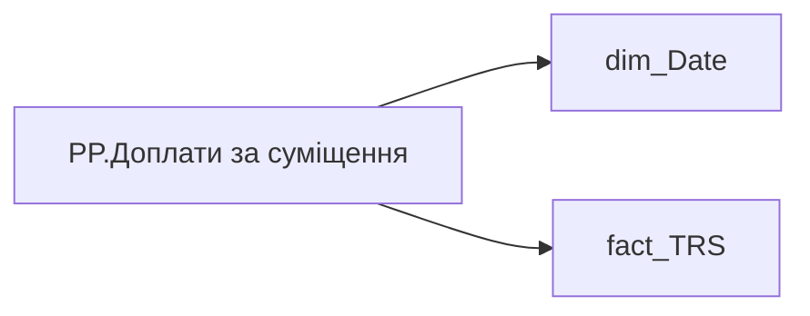

# PP.Доплати за суміщення

*тека `Personal_Profile\TRS` · формат `#,0`*

## Технічний опис

| Властивість | Значення |
|---|---|
| Тип | міра |
| Home table | _Measures |
| displayFolder | `Personal_Profile\TRS` |
| formatString | `#,0` |
| dataType | — |
| Прихована | ні |

### DAX

```dax
CALCULATE(
	SUM(fact_TRS[PAYMENTS_FACT_UAH]),
	fact_TRS[ACCRUAL_TYPES_KEY] IN {
		"00b34057-6d79-2141-77d6-3f280e312196",
		"e48a6efe-4040-3d6c-4fab-7d9671f8a6c6",
		"0b8a5246-2403-aea0-b64c-a76dfc32b115",
		"fbffac97-52df-2478-0a58-c4b4fe8f25a4"
	},
	ISBLANK(fact_TRS[TAX_PIT_ID]),
	DATESINPERIOD('dim_Date'[Date], EOMONTH(TODAY(), -1), -12, MONTH)
)
```

### Джерела даних

Вихідні таблиці: `DM.vw_R27_fact_TRS_PDP`

Колонки: `ACCRUAL_TYPES_KEY`, `Date`, `PAYMENTS_FACT_UAH`, `TAX_PIT_ID`

Power Query: `dim_Date`

### Залежності (таблиці й колонки)

Таблиці: `dim_Date`, `fact_TRS`

Колонки: `dim_Date[Date]`, `fact_TRS[ACCRUAL_TYPES_KEY]`, `fact_TRS[PAYMENTS_FACT_UAH]`, `fact_TRS[TAX_PIT_ID]`

### Схема



---

## Бізнес-суть

**Бізнес-назва:** Доплати за суміщення

### Опис із ТЗ

Відібрати записи за останні 12 місяців де `accrual_types_key` in ('00b34057-6d79-2141-77d6-3f280e312196', 'e48a6efe-4040-3d6c-4fab-7d9671f8a6c6',  '0b8a5246-2403-aea0-b64c-a76dfc32b115', 'fbffac97-52df-2478-0a58-c4b4fe8f25a4') та `tax_pit_id` is null   В деталізацію вивести назву нарахування, суму та період (місяць) виплати

**Вимоги (ТЗ):**

- [Індивідуальний профіль працівника › Сторінка Винагорода працівника](https://dev.azure.com/MHPITDepProjects/People%20Digital%20Profile%20%28PDP%29/_wiki/wikis/PDP.wiki?pagePath=/%D0%A4%D1%83%D0%BD%D0%BA%D1%86%D1%96%D0%BE%D0%BD%D0%B0%D0%BB%D1%8C%D0%BD%D1%96%20%D0%B2%D0%B8%D0%BC%D0%BE%D0%B3%D0%B8/%D0%92%D0%B8%D0%BC%D0%BE%D0%B3%D0%B8%20%D0%B4%D0%BE%20%D0%B7%D0%B2%D1%96%D1%82%D1%83%20People%20Digital%20Profile/%D0%86%D0%BD%D0%B4%D0%B8%D0%B2%D1%96%D0%B4%D1%83%D0%B0%D0%BB%D1%8C%D0%BD%D0%B8%D0%B9%20%D0%BF%D1%80%D0%BE%D1%84%D1%96%D0%BB%D1%8C%20%D0%BF%D1%80%D0%B0%D1%86%D1%96%D0%B2%D0%BD%D0%B8%D0%BA%D0%B0/%D0%A1%D1%82%D0%BE%D1%80%D1%96%D0%BD%D0%BA%D0%B0%20%D0%92%D0%B8%D0%BD%D0%B0%D0%B3%D0%BE%D1%80%D0%BE%D0%B4%D0%B0%20%D0%BF%D1%80%D0%B0%D1%86%D1%96%D0%B2%D0%BD%D0%B8%D0%BA%D0%B0)
- [Індивідуальний профіль працівника › Сторінка Винагорода працівника › Доопрацювання сторінки ТРС](https://dev.azure.com/MHPITDepProjects/People%20Digital%20Profile%20%28PDP%29/_wiki/wikis/PDP.wiki?pagePath=/%D0%A4%D1%83%D0%BD%D0%BA%D1%86%D1%96%D0%BE%D0%BD%D0%B0%D0%BB%D1%8C%D0%BD%D1%96%20%D0%B2%D0%B8%D0%BC%D0%BE%D0%B3%D0%B8/%D0%92%D0%B8%D0%BC%D0%BE%D0%B3%D0%B8%20%D0%B4%D0%BE%20%D0%B7%D0%B2%D1%96%D1%82%D1%83%20People%20Digital%20Profile/%D0%86%D0%BD%D0%B4%D0%B8%D0%B2%D1%96%D0%B4%D1%83%D0%B0%D0%BB%D1%8C%D0%BD%D0%B8%D0%B9%20%D0%BF%D1%80%D0%BE%D1%84%D1%96%D0%BB%D1%8C%20%D0%BF%D1%80%D0%B0%D1%86%D1%96%D0%B2%D0%BD%D0%B8%D0%BA%D0%B0/%D0%A1%D1%82%D0%BE%D1%80%D1%96%D0%BD%D0%BA%D0%B0%20%D0%92%D0%B8%D0%BD%D0%B0%D0%B3%D0%BE%D1%80%D0%BE%D0%B4%D0%B0%20%D0%BF%D1%80%D0%B0%D1%86%D1%96%D0%B2%D0%BD%D0%B8%D0%BA%D0%B0/%D0%94%D0%BE%D0%BE%D0%BF%D1%80%D0%B0%D1%86%D1%8E%D0%B2%D0%B0%D0%BD%D0%BD%D1%8F%20%D1%81%D1%82%D0%BE%D1%80%D1%96%D0%BD%D0%BA%D0%B8%20%D0%A2%D0%A0%D0%A1)

## На сторінках звіту

- [Personal Profile](../report/personal-profile.md) — Винагорода
- [TT:Доплати за суміщення](../report/tt-doplaty-za-sumishchennia.md)

## Пов'язані міри

**Використовується в:** [PP.TRS_category_Y_axis_max_value_Доплати_за_суміщення](../measures/pp-trs-category-y-axis-max-value-doplaty-za-sumishchennia.md)

## Нотатки

_порожньо_
