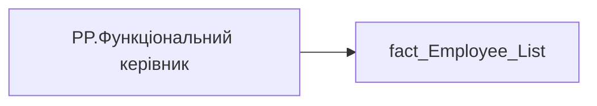

# PP.Функціональний керівник

*тека `Personal_Profile\Загальна інформація`*

## Технічний опис

| Властивість | Значення |
|---|---|
| Тип | міра |
| Home table | _Measures |
| displayFolder | `Personal_Profile\Загальна інформація` |
| formatString | — |
| dataType | — |
| Прихована | ні |

### DAX

```dax
COALESCE(
	SELECTEDVALUE('fact_Employee_List'[EMPLOYEE_FUNC_NAME]),
	"-"
)
```

### Джерела даних


Колонки: `EMPLOYEE_FUNC_NAME`

Power Query: `fact_Employee_List`

### Залежності (таблиці й колонки)

Таблиці: `fact_Employee_List`

Колонки: `fact_Employee_List[EMPLOYEE_FUNC_NAME]`

### Схема



---

## Бізнес-суть

Функціональний керівник

Поле зберігається в довіднику [ dm.vw_R27_dim_person]  <br>Це поле має бути доступне у візуалізаціях, побудованих на основі фактової таблиці [dm.vw_R27_fact_Employee_List_PDP] та таблиці dm.vw_R27_dim_Employee_Special_Head_functional, через відповідний зв’язок за ключем [emp_head_functional_id] = id, щоб із  таблиці dm.vw_R27_dim_person по ключу emp_head_functional_id =person_key витягти значення  full_name.  <br>Якщо значення в полі відсутнє, то показати текст "Дані відсутні"  <br>Якщо ПІБ керівника не вміщається в одну строку, перенести на іншу

**Вимоги:** `Індивідуальний-профіль-працівника/Сторінка-Загальна-інформація-про-працівника`, `Допоміжні-вітрини-для-звіту/Денормалізація-даних-для-вітрини-DM.vw_R27_fact_Employee_List_PDP`

## На сторінках звіту

[Personal Profile](../report/personal-profile.md)

## Пов'язані міри

_Прямих зв'язків з іншими мірами немає._

## Нотатки

_порожньо_
