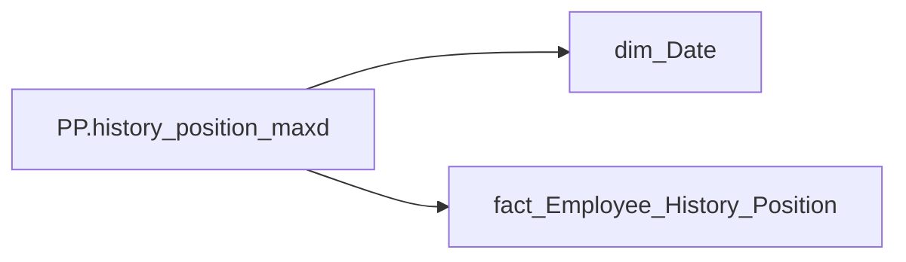

# PP.history_position_maxd

*тека `Personal_Profile\Життєвий цикл` · формат `General Date`*

## Бізнес-суть

PERIOD → Дата нарахування премії Зірка МХП; PERIOD → Дата; PERIOD → Період нарахування; PERIOD → Період

Це дата нарахування/виплати премії Зірка МХП (accrual_types_key = '9781d4aa-3a0d-1458-623a-7a93e90a2284'   та category_of_accrual_sort  = '2' ) Поточний період

**Вимоги:** `Індивідуальний-профіль-працівника/Історія-по-посадам`, `Індивідуальний-профіль-працівника/Історія-по-посадам/Реліз-1.-Історія-по-посадам`, `Індивідуальний-профіль-працівника/Сторінка-Винагорода-працівника/Деталізація-на-сторінці-Винагорода`, `Допоміжні-вітрини-для-звіту/Таблиця-(вью)-для-розрахунку-метрики-Укомплектованість-штату`, `Допоміжні-вітрини-для-звіту/Таблиця-періодична-(попередні-12-міс)-для-розрахунку-метрики-Середній-дохід`

## На сторінках звіту

_Не використовується на основних сторінках звіту._

## Пов'язані міри

**Використовується в:** [PP.Бал](../measures/pp-bal.md), [PP.Бал OKR](../measures/pp-bal-okr.md), [PP.Бонуси Р/К/М](../measures/pp-bonusy-r-k-m.md), [PP.Год. взаємодії](../measures/pp-hod-vzaiemodii.md), [PP.Год. конфліктів](../measures/pp-hod-konfliktiv.md), [PP.Год. нарад](../measures/pp-hod-narad.md), [PP.Год. нероб.](../measures/pp-hod-nerob.md), [PP.Довжина дня](../measures/pp-dovzhyna-dnia.md), [PP.ЖЦ_Категорія посади](../measures/pp-zhts-katehoriia-posady.md), [PP.ЖЦ_Напрям](../measures/pp-zhts-napriam.md), [PP.ЖЦ_Посада](../measures/pp-zhts-posada.md), [PP.ЖЦ_Піднапрям](../measures/pp-zhts-pidnapriam.md), [PP.ЖЦ_Підприємство](../measures/pp-zhts-pidpryiemstvo.md), [PP.Зірка МХП](../measures/pp-zirka-mkhp.md), [PP.Кадровий підрозділ](../measures/pp-kadrovyi-pidrozdil.md), [PP.Категорія (Performance)](../measures/pp-katehoriia-performance.md), [PP.Код посади](../measures/pp-kod-posady.md), [PP.Код підрозділу](../measures/pp-kod-pidrozdilu.md), [PP.Колір (OKR)](../measures/pp-kolir-okr.md), [PP.Колір (Performance)](../measures/pp-kolir-performance.md), [PP.Оклад_detailed](../measures/pp-oklad-detailed.md), [PP.Приріст_РЦД_detailed](../measures/pp-pryrist-rtsd-detailed.md), [PP.РЦД_detailed](../measures/pp-rtsd-detailed.md), [PP.Стаж в холдингу](../measures/pp-stazh-v-kholdynhu.md), [PP.Стаж на посаді](../measures/pp-stazh-na-posadi.md), [PP.Суміщення](../measures/pp-sumishchennia.md), [PP.Тип події](../measures/pp-typ-podii.md), [PP.Форма оплати](../measures/pp-forma-oplaty.md)

---

## Технічний опис

| Властивість | Значення |
|---|---|
| Тип | міра |
| Home table | _Measures |
| displayFolder | `Personal_Profile\Життєвий цикл` |
| formatString | `General Date` |
| dataType | — |
| Прихована | ні |

### DAX

```dax
CALCULATE(
    MAX('fact_Employee_History_Position'[PERIOD]),
    ALLSELECTED('dim_Date'[Date])
)
```

### Джерела даних

Вихідні таблиці: `DM.vw_R27_fact_Employee_History_Position`

Колонки: `Date`, `PERIOD`

Power Query: `dim_Date`

### Залежності (таблиці й колонки)

Таблиці: `dim_Date`, `fact_Employee_History_Position`

Колонки: `dim_Date[Date]`, `fact_Employee_History_Position[PERIOD]`

### Схема



## Нотатки

_порожньо_
