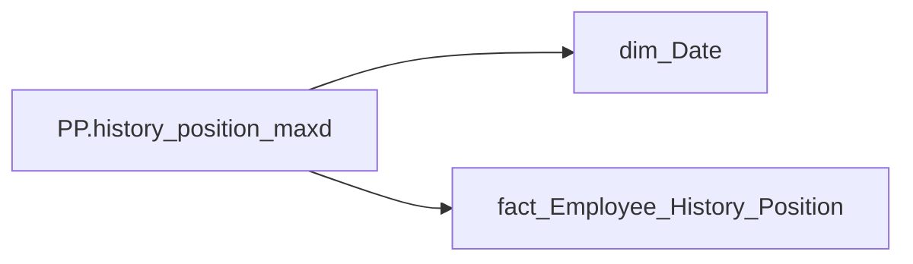

# PP.history_position_maxd

*тека `Personal_Profile\Життєвий цикл` · формат `General Date`*

## Технічний опис

| Властивість | Значення |
|---|---|
| Тип | міра |
| Home table | _Measures |
| displayFolder | `Personal_Profile\Життєвий цикл` |
| formatString | `General Date` |
| dataType | — |
| Прихована | ні |

### DAX

```dax
CALCULATE(
    MAX('fact_Employee_History_Position'[PERIOD]),
    ALLSELECTED('dim_Date'[Date])
)
```

### Джерела даних

Вихідні таблиці: `DM.vw_R27_fact_Employee_History_Position`

Колонки: `Date`, `PERIOD`

Power Query: `dim_Date`

### Залежності (таблиці й колонки)

Таблиці: `dim_Date`, `fact_Employee_History_Position`

Колонки: `dim_Date[Date]`, `fact_Employee_History_Position[PERIOD]`

### Схема



---

## Бізнес-суть

### Опис із ТЗ

Це дата нарахування/виплати премії Зірка МХП (`accrual_types_key` = '9781d4aa-3a0d-1458-623a-7a93e90a2284'   та `category_of_accrual_sort`  = '2' )

Поточний період

??? note "Поля-джерела та пов'язані бізнес-метрики (4)"
    | Поле | Бізнес-метрики |
    |---|---|
    | `PERIOD` | Дата нарахування премії Зірка МХП · Дата · Період нарахування · Період |

**Вимоги (ТЗ):**

- [Індивідуальний профіль працівника › Історія по посадам](https://dev.azure.com/MHPITDepProjects/People%20Digital%20Profile%20%28PDP%29/_wiki/wikis/PDP.wiki?pagePath=/%D0%A4%D1%83%D0%BD%D0%BA%D1%86%D1%96%D0%BE%D0%BD%D0%B0%D0%BB%D1%8C%D0%BD%D1%96%20%D0%B2%D0%B8%D0%BC%D0%BE%D0%B3%D0%B8/%D0%92%D0%B8%D0%BC%D0%BE%D0%B3%D0%B8%20%D0%B4%D0%BE%20%D0%B7%D0%B2%D1%96%D1%82%D1%83%20People%20Digital%20Profile/%D0%86%D0%BD%D0%B4%D0%B8%D0%B2%D1%96%D0%B4%D1%83%D0%B0%D0%BB%D1%8C%D0%BD%D0%B8%D0%B9%20%D0%BF%D1%80%D0%BE%D1%84%D1%96%D0%BB%D1%8C%20%D0%BF%D1%80%D0%B0%D1%86%D1%96%D0%B2%D0%BD%D0%B8%D0%BA%D0%B0/%D0%86%D1%81%D1%82%D0%BE%D1%80%D1%96%D1%8F%20%D0%BF%D0%BE%20%D0%BF%D0%BE%D1%81%D0%B0%D0%B4%D0%B0%D0%BC)
- [Індивідуальний профіль працівника › Історія по посадам › Реліз 1. Історія по посадам](https://dev.azure.com/MHPITDepProjects/People%20Digital%20Profile%20%28PDP%29/_wiki/wikis/PDP.wiki?pagePath=/%D0%A4%D1%83%D0%BD%D0%BA%D1%86%D1%96%D0%BE%D0%BD%D0%B0%D0%BB%D1%8C%D0%BD%D1%96%20%D0%B2%D0%B8%D0%BC%D0%BE%D0%B3%D0%B8/%D0%92%D0%B8%D0%BC%D0%BE%D0%B3%D0%B8%20%D0%B4%D0%BE%20%D0%B7%D0%B2%D1%96%D1%82%D1%83%20People%20Digital%20Profile/%D0%86%D0%BD%D0%B4%D0%B8%D0%B2%D1%96%D0%B4%D1%83%D0%B0%D0%BB%D1%8C%D0%BD%D0%B8%D0%B9%20%D0%BF%D1%80%D0%BE%D1%84%D1%96%D0%BB%D1%8C%20%D0%BF%D1%80%D0%B0%D1%86%D1%96%D0%B2%D0%BD%D0%B8%D0%BA%D0%B0/%D0%86%D1%81%D1%82%D0%BE%D1%80%D1%96%D1%8F%20%D0%BF%D0%BE%20%D0%BF%D0%BE%D1%81%D0%B0%D0%B4%D0%B0%D0%BC/%D0%A0%D0%B5%D0%BB%D1%96%D0%B7%201.%20%D0%86%D1%81%D1%82%D0%BE%D1%80%D1%96%D1%8F%20%D0%BF%D0%BE%20%D0%BF%D0%BE%D1%81%D0%B0%D0%B4%D0%B0%D0%BC)
- [Індивідуальний профіль працівника › Сторінка Винагорода працівника › Деталізація на сторінці Винагорода](https://dev.azure.com/MHPITDepProjects/People%20Digital%20Profile%20%28PDP%29/_wiki/wikis/PDP.wiki?pagePath=/%D0%A4%D1%83%D0%BD%D0%BA%D1%86%D1%96%D0%BE%D0%BD%D0%B0%D0%BB%D1%8C%D0%BD%D1%96%20%D0%B2%D0%B8%D0%BC%D0%BE%D0%B3%D0%B8/%D0%92%D0%B8%D0%BC%D0%BE%D0%B3%D0%B8%20%D0%B4%D0%BE%20%D0%B7%D0%B2%D1%96%D1%82%D1%83%20People%20Digital%20Profile/%D0%86%D0%BD%D0%B4%D0%B8%D0%B2%D1%96%D0%B4%D1%83%D0%B0%D0%BB%D1%8C%D0%BD%D0%B8%D0%B9%20%D0%BF%D1%80%D0%BE%D1%84%D1%96%D0%BB%D1%8C%20%D0%BF%D1%80%D0%B0%D1%86%D1%96%D0%B2%D0%BD%D0%B8%D0%BA%D0%B0/%D0%A1%D1%82%D0%BE%D1%80%D1%96%D0%BD%D0%BA%D0%B0%20%D0%92%D0%B8%D0%BD%D0%B0%D0%B3%D0%BE%D1%80%D0%BE%D0%B4%D0%B0%20%D0%BF%D1%80%D0%B0%D1%86%D1%96%D0%B2%D0%BD%D0%B8%D0%BA%D0%B0/%D0%94%D0%B5%D1%82%D0%B0%D0%BB%D1%96%D0%B7%D0%B0%D1%86%D1%96%D1%8F%20%D0%BD%D0%B0%20%D1%81%D1%82%D0%BE%D1%80%D1%96%D0%BD%D1%86%D1%96%20%D0%92%D0%B8%D0%BD%D0%B0%D0%B3%D0%BE%D1%80%D0%BE%D0%B4%D0%B0)
- [Допоміжні вітрини для звіту › Таблиця (вью) для розрахунку метрики Укомплектованість штату](https://dev.azure.com/MHPITDepProjects/People%20Digital%20Profile%20%28PDP%29/_wiki/wikis/PDP.wiki?pagePath=/%D0%A4%D1%83%D0%BD%D0%BA%D1%86%D1%96%D0%BE%D0%BD%D0%B0%D0%BB%D1%8C%D0%BD%D1%96%20%D0%B2%D0%B8%D0%BC%D0%BE%D0%B3%D0%B8/%D0%92%D0%B8%D0%BC%D0%BE%D0%B3%D0%B8%20%D0%B4%D0%BE%20%D0%B7%D0%B2%D1%96%D1%82%D1%83%20People%20Digital%20Profile/%D0%94%D0%BE%D0%BF%D0%BE%D0%BC%D1%96%D0%B6%D0%BD%D1%96%20%D0%B2%D1%96%D1%82%D1%80%D0%B8%D0%BD%D0%B8%20%D0%B4%D0%BB%D1%8F%20%D0%B7%D0%B2%D1%96%D1%82%D1%83/%D0%A2%D0%B0%D0%B1%D0%BB%D0%B8%D1%86%D1%8F%20%28%D0%B2%D1%8C%D1%8E%29%20%D0%B4%D0%BB%D1%8F%20%D1%80%D0%BE%D0%B7%D1%80%D0%B0%D1%85%D1%83%D0%BD%D0%BA%D1%83%20%D0%BC%D0%B5%D1%82%D1%80%D0%B8%D0%BA%D0%B8%20%D0%A3%D0%BA%D0%BE%D0%BC%D0%BF%D0%BB%D0%B5%D0%BA%D1%82%D0%BE%D0%B2%D0%B0%D0%BD%D1%96%D1%81%D1%82%D1%8C%20%D1%88%D1%82%D0%B0%D1%82%D1%83)
- [Допоміжні вітрини для звіту › Таблиця періодична (попередні 12 міс) для розрахунку метрики Середній дохід](https://dev.azure.com/MHPITDepProjects/People%20Digital%20Profile%20%28PDP%29/_wiki/wikis/PDP.wiki?pagePath=/%D0%A4%D1%83%D0%BD%D0%BA%D1%86%D1%96%D0%BE%D0%BD%D0%B0%D0%BB%D1%8C%D0%BD%D1%96%20%D0%B2%D0%B8%D0%BC%D0%BE%D0%B3%D0%B8/%D0%92%D0%B8%D0%BC%D0%BE%D0%B3%D0%B8%20%D0%B4%D0%BE%20%D0%B7%D0%B2%D1%96%D1%82%D1%83%20People%20Digital%20Profile/%D0%94%D0%BE%D0%BF%D0%BE%D0%BC%D1%96%D0%B6%D0%BD%D1%96%20%D0%B2%D1%96%D1%82%D1%80%D0%B8%D0%BD%D0%B8%20%D0%B4%D0%BB%D1%8F%20%D0%B7%D0%B2%D1%96%D1%82%D1%83/%D0%A2%D0%B0%D0%B1%D0%BB%D0%B8%D1%86%D1%8F%20%D0%BF%D0%B5%D1%80%D1%96%D0%BE%D0%B4%D0%B8%D1%87%D0%BD%D0%B0%20%28%D0%BF%D0%BE%D0%BF%D0%B5%D1%80%D0%B5%D0%B4%D0%BD%D1%96%2012%20%D0%BC%D1%96%D1%81%29%20%D0%B4%D0%BB%D1%8F%20%D1%80%D0%BE%D0%B7%D1%80%D0%B0%D1%85%D1%83%D0%BD%D0%BA%D1%83%20%D0%BC%D0%B5%D1%82%D1%80%D0%B8%D0%BA%D0%B8%20%D0%A1%D0%B5%D1%80%D0%B5%D0%B4%D0%BD%D1%96%D0%B9%20%D0%B4%D0%BE%D1%85%D1%96%D0%B4)

## На сторінках звіту

_Не використовується на основних сторінках звіту._

## Пов'язані міри

**Використовується в:** [PP.Бал](../measures/pp-bal.md), [PP.Бал OKR](../measures/pp-bal-okr.md), [PP.Бонуси Р/К/М](../measures/pp-bonusy-r-k-m.md), [PP.Год. взаємодії](../measures/pp-hod-vzaiemodii.md), [PP.Год. конфліктів](../measures/pp-hod-konfliktiv.md), [PP.Год. нарад](../measures/pp-hod-narad.md), [PP.Год. нероб.](../measures/pp-hod-nerob.md), [PP.Довжина дня](../measures/pp-dovzhyna-dnia.md), [PP.ЖЦ_Категорія посади](../measures/pp-zhts-katehoriia-posady.md), [PP.ЖЦ_Напрям](../measures/pp-zhts-napriam.md), [PP.ЖЦ_Посада](../measures/pp-zhts-posada.md), [PP.ЖЦ_Піднапрям](../measures/pp-zhts-pidnapriam.md), [PP.ЖЦ_Підприємство](../measures/pp-zhts-pidpryiemstvo.md), [PP.Зірка МХП](../measures/pp-zirka-mkhp.md), [PP.Кадровий підрозділ](../measures/pp-kadrovyi-pidrozdil.md), [PP.Категорія (Performance)](../measures/pp-katehoriia-performance.md), [PP.Код посади](../measures/pp-kod-posady.md), [PP.Код підрозділу](../measures/pp-kod-pidrozdilu.md), [PP.Колір (OKR)](../measures/pp-kolir-okr.md), [PP.Колір (Performance)](../measures/pp-kolir-performance.md), [PP.Оклад_detailed](../measures/pp-oklad-detailed.md), [PP.Приріст_РЦД_detailed](../measures/pp-pryrist-rtsd-detailed.md), [PP.РЦД_detailed](../measures/pp-rtsd-detailed.md), [PP.Стаж в холдингу](../measures/pp-stazh-v-kholdynhu.md), [PP.Стаж на посаді](../measures/pp-stazh-na-posadi.md), [PP.Суміщення](../measures/pp-sumishchennia.md), [PP.Тип події](../measures/pp-typ-podii.md), [PP.Форма оплати](../measures/pp-forma-oplaty.md)

## Нотатки

_порожньо_
