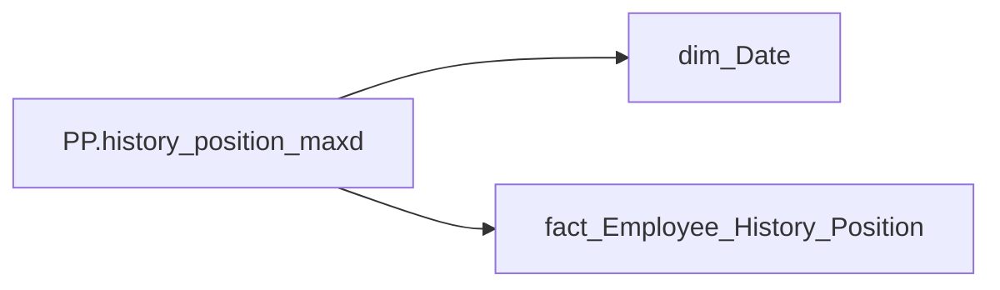

# PP.history_position_maxd

| Властивість | Значення |
|---|---|
| Тип | міра |
| Home table | _Measures |
| displayFolder | `Personal_Profile\Життєвий цикл` |
| formatString | `General Date` |
| dataType | — |
| Прихована | ні |

## DAX

```dax
CALCULATE(
    MAX('fact_Employee_History_Position'[PERIOD]),
    ALLSELECTED('dim_Date'[Date])
)
```

## Джерела

Вихідні таблиці: `DM.vw_R27_fact_Employee_History_Position`

Колонки: `Date`, `PERIOD`

Power Query: `dim_Date`

## Бізнес-суть

PERIOD → Дата нарахування премії Зірка МХП; PERIOD → Дата; PERIOD → Період нарахування; PERIOD → Період

Це дата нарахування/виплати премії Зірка МХП (accrual_types_key = '9781d4aa-3a0d-1458-623a-7a93e90a2284'   та category_of_accrual_sort  = '2' ) Поточний період

**Вимоги:** `Індивідуальний-профіль-працівника/Історія-по-посадам`, `Індивідуальний-профіль-працівника/Історія-по-посадам/Реліз-1.-Історія-по-посадам`, `Індивідуальний-профіль-працівника/Сторінка-Винагорода-працівника/Деталізація-на-сторінці-Винагорода`, `Допоміжні-вітрини-для-звіту/Таблиця-(вью)-для-розрахунку-метрики-Укомплектованість-штату`, `Допоміжні-вітрини-для-звіту/Таблиця-періодична-(попередні-12-міс)-для-розрахунку-метрики-Середній-дохід`

## Залежності

Таблиці: `dim_Date`, `fact_Employee_History_Position`

Колонки: `dim_Date[Date]`, `fact_Employee_History_Position[PERIOD]`

## Схема



## Нотатки

_порожньо_
