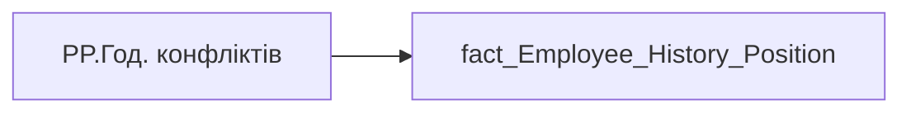

# PP.Год. конфліктів

| Властивість | Значення |
|---|---|
| Тип | міра |
| Home table | _Measures |
| displayFolder | `Personal_Profile\Життєвий цикл` |
| formatString | — |
| dataType | — |
| Прихована | ні |

## DAX

```dax
VAR _maxd = [PP.history_position_maxd]
VAR _res = 
    CALCULATE(
        SELECTEDVALUE(fact_Employee_History_Position[CONFLICTING_MEETING_HOUR]),
        'fact_Employee_History_Position'[PERIOD] = _maxd
    )
RETURN COALESCE(""&_res, "—")
```

## Джерела

Вихідні таблиці: `DM.vw_R27_fact_Employee_History_Position`

Колонки: `CONFLICTING_MEETING_HOUR`, `PERIOD`

Power Query: `fact_Employee_History_Position`

## Бізнес-суть

CONFLICTING_MEETING_HOUR → Годин зустрічей з конфліктами за період від поточної точки до попередньої точки; CONFLICTING_MEETING_HOUR → Доля Conflicting meeting hours по працівнику; CONFLICTING_MEETING_HOUR → Доля Conflicting meeting hours кадровому підрозділу співробітника; CONFLICTING_MEETING_HOUR → Доля Conflicting meeting hours по напряму співробітника; CONFLICTING_MEETING_HOUR → Доля Conflicting meeting hours  по Холдингу; CONFLICTING_MEETING_HOUR → conflicting_meeting_hour_direction; CONFLICTING_MEETING_HOUR → conflicting_meeting_hour_holding; CONFLICTING_MEETING_HOUR → Доля Conflicting meeting hours по працівнику за 3 попередніх місяці; CONFLICTING_MEETING_HOUR → Доля Conflicting meeting hours кадровому підрозділу; CONFLICTING_MEETING_HOUR → Доля Conflicting meeting hours по напряму команди; CONFLICTING_MEETING_HOUR → Годин зустрічей з конфліктами; PERIOD → Дата нарахування премії Зірка МХП; PERIOD → Дата; PERIOD → Період нарахування; PERIOD → Період

Розрахункове значення.  <br>Це поле має бути доступне у візуалізаціях, побудованих на основі фактової таблиці [DM.vw_R27_dim_Employee_Metric_Health_and_Wellbeing]    <br>Відбір по працівнику [person_key], періоду [PERIOD], документу прийому [DOC_JOB_APPLICATION_ID].  <br>Розраховується як середньоденне значення за попередній місяць. Потрібно значення conflicting_meeting_hour поділити на кількість робочих днів в тому місяці. Якщо працівник пропрацював менше місяця, то рахувати за фактично відпрацьований період.  <br>Якщо дані по працівнику у вітрині відсутні, то показати надпис "Дані відсутні" 

**Вимоги:** `Індивідуальний-профіль-працівника/Історія-по-посадам`, `Індивідуальний-профіль-працівника/Історія-по-посадам/Реліз-1.-Історія-по-посадам`, `Індивідуальний-профіль-працівника/Сторінка-Взаємодія-Viva-та-залученість-працівника`, `Індивідуальний-профіль-працівника/Сторінка-Взаємодія-Viva-та-залученість-працівника/Сторінка-Ефективність-працівника`, `Індивідуальний-профіль-працівника/Сторінка-Взаємодія-Viva-та-залученість-працівника/Таблиця-vw_R27_calc_Viva_Direction_PDP`, `Індивідуальний-профіль-працівника/Сторінка-Взаємодія-Viva-та-залученість-працівника/Таблиця-vw_R27_calc_Viva_Holding_PDP`, `Індивідуальний-профіль-працівника/Сторінка-Винагорода-працівника/Деталізація-на-сторінці-Винагорода`, `Допоміжні-вітрини-для-звіту/Таблиця-(вью)-для-розрахунку-метрики-Укомплектованість-штату`, `Допоміжні-вітрини-для-звіту/Таблиця-для-розрахунку-агрегованих-метрик-по-звіту`, `Допоміжні-вітрини-для-звіту/Таблиця-для-розрахунку-агрегованих-метрик-по-звіту/Зміна-алгоритму-розрахунку-метрик-по-Viva-з-урахуванням-дати-завантаження-даних-до-DWH`, `Допоміжні-вітрини-для-звіту/Таблиця-для-розрахунку-агрегованих-метрик-по-звіту/Змінити-період-розрахунку-середніх-значень-по-Віва`, `Допоміжні-вітрини-для-звіту/Таблиця-періодична-(попередні-12-міс)-для-розрахунку-метрики-Середній-дохід`, `Командний-профіль/Сторінка-Взаємодія-Viva-та-залученість-команд`, `Командний-профіль/Сторінка-Ефективність`

## Залежності

Міри: [PP.history_position_maxd](../measures/pp-history-position-maxd.md)

Таблиці: `fact_Employee_History_Position`

Колонки: `fact_Employee_History_Position[CONFLICTING_MEETING_HOUR]`, `fact_Employee_History_Position[PERIOD]`

## Схема



## Нотатки

_порожньо_
