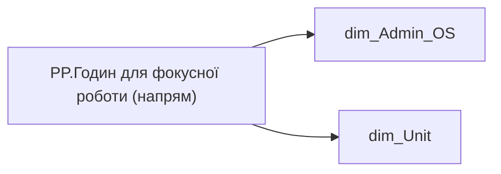

# PP.Годин для фокусної роботи (напрям)

*тека `Personal_Profile\Viva\Viva Collaboration`*

## Технічний опис

| Властивість | Значення |
|---|---|
| Тип | міра |
| Home table | _Measures |
| displayFolder | `Personal_Profile\Viva\Viva Collaboration` |
| formatString | — |
| dataType | — |
| Прихована | ні |

### DAX

```dax
VAR direction = 
FIRSTNONBLANKVALUE(
		VALUES('dim_Admin_OS'[ORDER_NUM]),
		CALCULATE(SELECTEDVALUE('dim_Admin_OS'[DIRECTION])))

VAR __val =
CALCULATE(
	[PP.Годин для фокусної роботи (Холдинг)],
	dim_Unit[DIRECTION] = direction)

RETURN __val
```

### Джерела даних

Вихідні таблиці: `DM.vw_R27_dim_Employee_Access_List`, `DM.vw_R27_dim_Unit`

Колонки: `DIRECTION`, `ORDER_NUM`

Power Query: `dim_Admin_OS`

### Залежності (таблиці й колонки)

Таблиці: `dim_Admin_OS`, `dim_Unit`

Колонки: `dim_Admin_OS[DIRECTION]`, `dim_Admin_OS[ORDER_NUM]`, `dim_Unit[DIRECTION]`

### Схема



---

## Бізнес-суть

!!! note "Бізнес-визначення відсутнє"
    Поля міри не зіставлено з wiki «Таблицями джерел даних». Можна заповнити вручну в `manualNotes`.

## На сторінках звіту

- [Personal Profile](../report/personal-profile.md) — VIVA › Viva
- [Group Profile](../report/group-profile.md) — Viva

## Пов'язані міри

**Використовує:** [PP.Годин для фокусної роботи (Холдинг)](../measures/pp-hodyn-dlia-fokusnoi-roboty-kholdynh.md)

## Нотатки

_порожньо_
