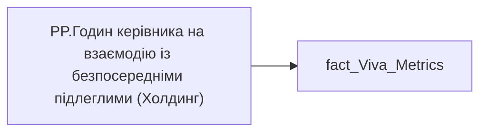

# PP.Годин керівника на взаємодію із безпосередніми підлеглими (Холдинг)

| Властивість | Значення |
|---|---|
| Тип | міра |
| Home table | _Measures |
| displayFolder | `Personal_Profile\Viva\Viva management & Coaching` |
| formatString | — |
| dataType | — |
| Прихована | ні |

## DAX

```dax
VAR __val =
DIVIDE(
	SUM( 'fact_Viva_Metrics'[MANAGER_COACHING_ONE_TO_ONE_HOUR] ),
	CALCULATE(
		COUNTROWS('fact_Viva_Metrics'),
		NOT(ISBLANK('fact_Viva_Metrics'[MANAGER_COACHING_ONE_TO_ONE_HOUR]))))

RETURN __val
```

## Джерела


Колонки: `MANAGER_COACHING_ONE_TO_ONE_HOUR`

Power Query: `fact_Viva_Metrics`

## Бізнес-суть

MANAGER_COACHING_ONE_TO_ONE_HOUR → 1:1 в сер. на 1 підлеглого, год.; MANAGER_COACHING_ONE_TO_ONE_HOUR → Годин керівника на взаємодію із підлеглими за період від поточної точки до попередньої точки; MANAGER_COACHING_ONE_TO_ONE_HOUR → Годин керівника на взаємодію із безпосереднім підлеглим; MANAGER_COACHING_ONE_TO_ONE_HOUR → Годин керівника на взаємодію із безпосередніми підлеглими по кадровому підрозділу; MANAGER_COACHING_ONE_TO_ONE_HOUR → Годин керівника на взаємодію із безпосередніми підлеглими по напряму керівника; MANAGER_COACHING_ONE_TO_ONE_HOUR → Годин керівника на взаємодію із безпосередніми підлеглими   по Холдингу; MANAGER_COACHING_ONE_TO_ONE_HOUR → manager_coaching_one_to_one_hour_direction; MANAGER_COACHING_ONE_TO_ONE_HOUR → manager_coaching_one_to_one_hour_holding; MANAGER_COACHING_ONE_TO_ONE_HOUR → Годин керівника на взаємодію із безпосереднім підлеглим за 3 попередніх місяці; MANAGER_COACHING_ONE_TO_ONE_HOUR → Кількість годин, які Керівник витратив на індивідуальні зустрічі з усіма своїми безпосередніми підлеглими за останні 3 місяці; MANAGER_COACHING_ONE_TO_ONE_HOUR → Годин керівника на взаємодію із підлеглими

Розрахункове значення.  <br>Це поле має бути доступне у візуалізаціях, побудованих на основі фактової таблиці [DM.vw_R27_dim_Employee_Metric_Health_and_Wellbeing]   <br>Відбір по працівнику [person_key], періоду [PERIOD], документу прийому [DOC_JOB_APPLICATION_ID].  <br>Якщо дані по керівник  у вітрині відсутні, то показати надпис "Дані відсутні" (наприклад, якщо немає ліцензії та прцівник не користується teams or outlook Розрахункове значення.  <br>Це поле має бути доступне у візуалізаціях, побудованих на основі фактової таблиці [DM.vw_R27_dim_Employee_Metric_Health_and_Wellbeing]   <br>Потрі

**Вимоги:** `Індивідуальний-профіль-працівника/Історія-по-посадам`, `Індивідуальний-профіль-працівника/Історія-по-посадам/Реліз-1.-Історія-по-посадам`, `Індивідуальний-профіль-працівника/Сторінка-Взаємодія-Viva-та-залученість-працівника`, `Індивідуальний-профіль-працівника/Сторінка-Взаємодія-Viva-та-залученість-працівника/Сторінка-Ефективність-працівника`, `Індивідуальний-профіль-працівника/Сторінка-Взаємодія-Viva-та-залученість-працівника/Таблиця-vw_R27_calc_Viva_Direction_PDP`, `Індивідуальний-профіль-працівника/Сторінка-Взаємодія-Viva-та-залученість-працівника/Таблиця-vw_R27_calc_Viva_Holding_PDP`, `Допоміжні-вітрини-для-звіту/Таблиця-для-розрахунку-агрегованих-метрик-по-звіту`, `Допоміжні-вітрини-для-звіту/Таблиця-для-розрахунку-агрегованих-метрик-по-звіту/Зміна-алгоритму-розрахунку-метрик-по-Viva-з-урахуванням-дати-завантаження-даних-до-DWH`, `Допоміжні-вітрини-для-звіту/Таблиця-для-розрахунку-агрегованих-метрик-по-звіту/Змінити-період-розрахунку-середніх-значень-по-Віва`, `Кейс-Втрати-Продуктивності-Працівників`, `Кейс-Втрати-Продуктивності-Працівників/Деталізація-метрик-в-кейсі-Продуктивність`, `Командний-профіль/Сторінка-Взаємодія-Viva-та-залученість-команд`, `Командний-профіль/Сторінка-Ефективність`

## Залежності

Таблиці: `fact_Viva_Metrics`

Колонки: `fact_Viva_Metrics[MANAGER_COACHING_ONE_TO_ONE_HOUR]`

## Схема



## Нотатки

_порожньо_
