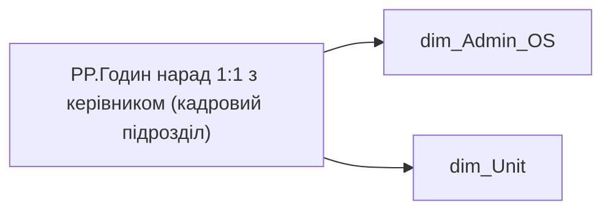

# PP.Годин нарад 1:1 з керівником (кадровий підрозділ)

*тека `Personal_Profile\Viva\Viva management & Coaching`*

!!! abstract "Джерела даних"
    `DM.vw_R27_dim_Employee_Access_List`, `DM.vw_R27_dim_Unit`

## Бізнес-суть

PERSONNEL_UNIT → Кадровий підрозділ працівника; PERSONNEL_UNIT → Підрозділ кадровий; PERSONNEL_UNIT → Назва попереднього кадрового підрозділу; PERSONNEL_UNIT → Назва поточного кадрового підрозділу; PERSONNEL_UNIT → Команда; PERSONNEL_UNIT → division_person

division_person_id = unit_key Поле зберігається в довіднику [dm.vw_R27_dim_unit]  <br>Це поле має бути доступне у візуалізаціях, побудованих на основі фактової таблиці [dm.vw_R27_fact_Employee_List], через відповідний зв’язок за ключем [division_key] = [unit_key].  <br>Поле завжди має значення, пусте поле не допускається  <br>Якщо назва не вміщається в одну строку, перенести на іншу Поле зберігається в довіднику [dm.vw_R27_dim_unit]  <br>Це поле має бути доступне у візуалізаціях, побудованих на основі фактової таблиці [dm.vw_R27_fact_Employee_List_PDP], через відповідний зв’язок за ключем [div

**Вимоги:** `Індивідуальний-профіль-працівника/Історія-по-посадам`, `Індивідуальний-профіль-працівника/Історія-по-посадам/Реліз-1.-Історія-по-посадам`, `Індивідуальний-профіль-працівника/Паспортна-частина-індивідуального-профілю-співробітника`, `Індивідуальний-профіль-працівника/Паспортна-частина-індивідуального-профілю-співробітника/Сторінка-Картка-(паспорт)-працівника`, `Індивідуальний-профіль-працівника/Сторінка-Індивідуальний-профіль-працівника`, `Індивідуальний-профіль-працівника/Сторінка-Загальна-інформація-про-працівника`, `Допоміжні-вітрини-для-звіту/Таблиця-періодична-(попередні-12-міс)-для-розрахунку-метрики-Середній-дохід`, `Командний-профіль/Паспортна-частина-групового-профілю/Метрики-рекрутингу/ТЗ-на-розробку-вітрин-по-метрикам-рекрутингу`, `Командний-профіль/Паспортна-частина-групового-профілю/Редизайн-паспортної-частини-групового-профілю`, `Командний-профіль/Паспортна-частина-групового-профілю/Сторінка-Картка-команди`, `Командний-профіль/Сторінка-Загальна-інформація-про-команду`

## На сторінках звіту

[Personal Profile](../report/personal-profile.md) · [Group Profile](../report/group-profile.md)

## Пов'язані міри

**Використовує:** [PP.Годин нарад 1:1 з керівником (Холдинг)](../measures/pp-hodyn-narad-1-1-z-kerivnykom-kholdynh.md)

---

## Технічний опис

| Властивість | Значення |
|---|---|
| Тип | міра |
| Home table | _Measures |
| displayFolder | `Personal_Profile\Viva\Viva management & Coaching` |
| formatString | — |
| dataType | — |
| Прихована | ні |

### DAX

```dax
VAR department = 
FIRSTNONBLANKVALUE(
		VALUES('dim_Admin_OS'[ORDER_NUM]),
		CALCULATE(SELECTEDVALUE('dim_Admin_OS'[PERSONNEL_UNIT])))

VAR __val =
CALCULATE(
	[PP.Годин нарад 1:1 з керівником (Холдинг)],
	dim_Unit[PERSONNEL_UNIT] = department)

RETURN __val
```

### Джерела даних

Вихідні таблиці: `DM.vw_R27_dim_Employee_Access_List`, `DM.vw_R27_dim_Unit`

Колонки: `ORDER_NUM`, `PERSONNEL_UNIT`

Power Query: `dim_Admin_OS`

### Залежності (таблиці й колонки)

Таблиці: `dim_Admin_OS`, `dim_Unit`

Колонки: `dim_Admin_OS[ORDER_NUM]`, `dim_Admin_OS[PERSONNEL_UNIT]`, `dim_Unit[PERSONNEL_UNIT]`

### Схема



## Нотатки

_порожньо_
