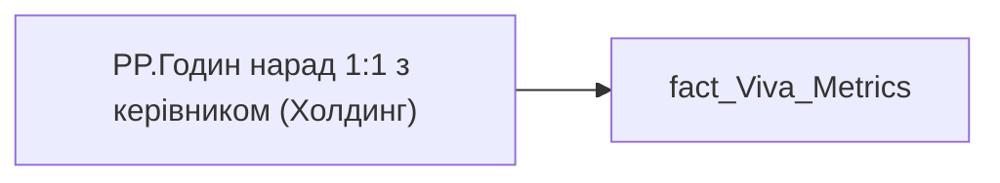

# PP.Годин нарад 1:1 з керівником (Холдинг)

*тека `Personal_Profile\Viva\Viva management & Coaching`*

## Технічний опис

| Властивість | Значення |
|---|---|
| Тип | міра |
| Home table | _Measures |
| displayFolder | `Personal_Profile\Viva\Viva management & Coaching` |
| formatString | — |
| dataType | — |
| Прихована | ні |

### DAX

```dax
VAR __val =
DIVIDE(
	SUM( 'fact_Viva_Metrics'[MEETING_WITH_MANAGER_ONE_TO_ONE_HOUR] ),
	CALCULATE(
		COUNTROWS('fact_Viva_Metrics'),
		NOT(ISBLANK('fact_Viva_Metrics'[MEETING_WITH_MANAGER_ONE_TO_ONE_HOUR]))))

RETURN __val
```

### Джерела даних


Колонки: `MEETING_WITH_MANAGER_ONE_TO_ONE_HOUR`

Power Query: `fact_Viva_Metrics`

### Залежності (таблиці й колонки)

Таблиці: `fact_Viva_Metrics`

Колонки: `fact_Viva_Metrics[MEETING_WITH_MANAGER_ONE_TO_ONE_HOUR]`

### Схема



---

## Бізнес-суть

!!! note "Бізнес-визначення відсутнє"
    Поля міри не зіставлено з wiki «Таблицями джерел даних». Можна заповнити вручну в `manualNotes`.

## На сторінках звіту

[Personal Profile](../report/personal-profile.md) · [Group Profile](../report/group-profile.md)

## Пов'язані міри

**Використовується в:** [PP.Годин нарад 1:1 з керівником (кадровий підрозділ)](../measures/pp-hodyn-narad-1-1-z-kerivnykom-kadrovyi-pidrozdil.md), [PP.Годин нарад 1:1 з керівником (напрям)](../measures/pp-hodyn-narad-1-1-z-kerivnykom-napriam.md), [PP.Годин нарад 1:1 з керівником (співробітник)](../measures/pp-hodyn-narad-1-1-z-kerivnykom-spivrobitnyk.md)

## Нотатки

_порожньо_
