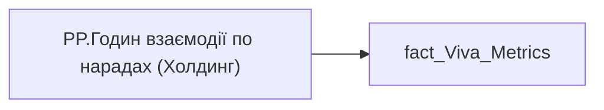

# PP.Годин взаємодії по нарадах (Холдинг)

*тека `Personal_Profile\Viva\Viva Meetings`*

## Технічний опис

| Властивість | Значення |
|---|---|
| Тип | міра |
| Home table | _Measures |
| displayFolder | `Personal_Profile\Viva\Viva Meetings` |
| formatString | — |
| dataType | — |
| Прихована | ні |

### DAX

```dax
VAR __val =
DIVIDE(
	SUM( 'fact_Viva_Metrics'[MEETING_HOUR] ),
	SUM( 'fact_Viva_Metrics'[WORKDAY_WITHOUT_SICKLEAVE_AND_VACATION] ))

RETURN __val
```

### Джерела даних


Колонки: `MEETING_HOUR`, `WORKDAY_WITHOUT_SICKLEAVE_AND_VACATION`

Power Query: `fact_Viva_Metrics`

### Залежності (таблиці й колонки)

Таблиці: `fact_Viva_Metrics`

Колонки: `fact_Viva_Metrics[MEETING_HOUR]`, `fact_Viva_Metrics[WORKDAY_WITHOUT_SICKLEAVE_AND_VACATION]`

### Схема



---

## Бізнес-суть

MEETING_HOUR → Годин взаємодії по нарадах за період від поточної точки до попередньої точки; MEETING_HOUR → Годин взаємодії по нарадах співробітника; MEETING_HOUR → Годин взаємодії по нарадах по кадровому підрозділу співробітника; MEETING_HOUR → Годин взаємодії по нарадах по напряму співробітника; MEETING_HOUR → Годин взаємодії по нарадах по Холдингу; MEETING_HOUR → meeting_hour_direction; MEETING_HOUR → meeting_hour_holding; MEETING_HOUR → Годин взаємодії по нарадах співробітника за 3 попередніх місяці; MEETING_HOUR → Годин взаємодії по нарадах по кадровому підрозділу; MEETING_HOUR → Годин взаємодії по нарадах по напряму команди; MEETING_HOUR → Годин взаємодії по нарадах

Розрахункове значення.  <br>Це поле має бути доступне у візуалізаціях, побудованих на основі фактової таблиці [DM.vw_R27_dim_Employee_Metric_Health_and_Wellbeing]  ]  <br>Відбір по працівнику [person_key], періоду [PERIOD], документу прийому [DOC_JOB_APPLICATION_ID].  <br>Розраховується як середньоденне значення за попередній місяць. Потрібно значення meeting_hour поділити на кількість робочих днів в тому місяці. Якщо працівник пропрацював менше місяця, то рахувати за фактично відпрацьований період.  <br>Якщо дані по працівнику у вітрині відсутні, то показати надпис "Дані відсутні" (наприклад,

**Вимоги:** `Індивідуальний-профіль-працівника/Історія-по-посадам`, `Індивідуальний-профіль-працівника/Історія-по-посадам/Реліз-1.-Історія-по-посадам`, `Індивідуальний-профіль-працівника/Сторінка-Взаємодія-Viva-та-залученість-працівника`, `Індивідуальний-профіль-працівника/Сторінка-Взаємодія-Viva-та-залученість-працівника/Сторінка-Ефективність-працівника`, `Індивідуальний-профіль-працівника/Сторінка-Взаємодія-Viva-та-залученість-працівника/Таблиця-vw_R27_calc_Viva_Direction_PDP`, `Індивідуальний-профіль-працівника/Сторінка-Взаємодія-Viva-та-залученість-працівника/Таблиця-vw_R27_calc_Viva_Holding_PDP`, `Допоміжні-вітрини-для-звіту/Таблиця-для-розрахунку-агрегованих-метрик-по-звіту`, `Допоміжні-вітрини-для-звіту/Таблиця-для-розрахунку-агрегованих-метрик-по-звіту/Зміна-алгоритму-розрахунку-метрик-по-Viva-з-урахуванням-дати-завантаження-даних-до-DWH`, `Допоміжні-вітрини-для-звіту/Таблиця-для-розрахунку-агрегованих-метрик-по-звіту/Змінити-період-розрахунку-середніх-значень-по-Віва`, `Командний-профіль/Сторінка-Взаємодія-Viva-та-залученість-команд`, `Командний-профіль/Сторінка-Ефективність`

## На сторінках звіту

[Personal Profile](../report/personal-profile.md) · [Group Profile](../report/group-profile.md)

## Пов'язані міри

**Використовується в:** [PP.Годин взаємодії по нарадах (кадровий підрозділ)](../measures/pp-hodyn-vzaiemodii-po-naradakh-kadrovyi-pidrozdil.md), [PP.Годин взаємодії по нарадах (напрям)](../measures/pp-hodyn-vzaiemodii-po-naradakh-napriam.md), [PP.Годин взаємодії по нарадах (співробітник)](../measures/pp-hodyn-vzaiemodii-po-naradakh-spivrobitnyk.md)

## Нотатки

_порожньо_
