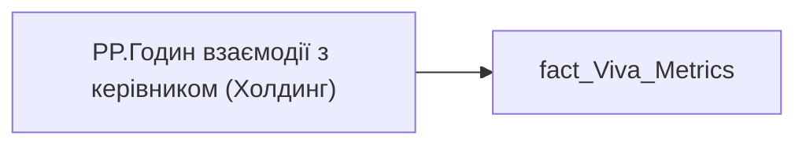

# PP.Годин взаємодії з керівником (Холдинг)

*тека `Personal_Profile\Viva\Viva management & Coaching`*

## Бізнес-суть

MEETING_AND_CALL_WITH_MANAGER_HOUR → meeting_and_call_with_manager_hour_direction; MEETING_AND_CALL_WITH_MANAGER_HOUR → meeting_and_call_with_manager_hour_cnt; MEETING_AND_CALL_WITH_MANAGER_HOUR → meeting_and_call_with_manager_hour_holding; MEETING_AND_CALL_WITH_MANAGER_HOUR → Годин взаємодії з керівником за 3 попередніх місяці; MEETING_WITH_MANAGER_ONE_TO_ONE_HOUR → Годин нарад 1:1 з керівником за період від поточної точки до попередньої точки; MEETING_WITH_MANAGER_ONE_TO_ONE_HOUR → Годин нарад 1:1 з керівником працівника; MEETING_WITH_MANAGER_ONE_TO_ONE_HOUR → Годин нарад 1:1 з керівником кадровому підрозділу співробітника; MEETING_WITH_MANAGER_ONE_TO_ONE_HOUR → Годин нарад 1:1 з керівником по напряму співробітника; MEETING_WITH_MANAGER_ONE_TO_ONE_HOUR → Годин нарад 1:1 з керівником по Холдингу; MEETING_WITH_MANAGER_ONE_TO_ONE_HOUR → meeting_with_manager_one_to_one_hour_direction; MEETING_WITH_MANAGER_ONE_TO_ONE_HOUR → meeting_with_manager_one_to_one_hour_cnt; MEETING_WITH_MANAGER_ONE_TO_ONE_HOUR → meeting_with_manager_one_to_one_hour_holding; MEETING_WITH_MANAGER_ONE_TO_ONE_HOUR → Годин нарад 1:1 з керівником працівника за 3 попередніх місяці; MEETING_WITH_MANAGER_ONE_TO_ONE_HOUR → Чи є ризик вигорання через недостатню взаємодію з керівником?; MEETING_WITH_MANAGER_ONE_TO_ONE_HOUR → Годин 1:1 за попередні 3 міс.; MEETING_WITH_MANAGER_ONE_TO_ONE_HOUR → Годин нарад 1:1 з керівником кадровому підрозділу; MEETING_WITH_MANAGER_ONE_TO_ONE_HOUR → Годин нарад 1:1 з керівником по напряму команди; MEETING_WITH_MANAGER_ONE_TO_ONE_HOUR → Годин нарад 1:1 з керівником; MEETING_WITH_MANAGER_ONE_TO_ONE_HOUR → Рівень coaching (1:1), год/міс

Потрібно зсумувати значення поля meeting_and_call_with_manager_hour по напряму та поділити на кількість записів (кількість працівників) по напряму за попередній місяць.  <br> В розрахунок йдуть ті працівники, по яким є записи по Віва. Це сума по полю meeting_and_call_with_manager_hour за попередній місяць по напряму.  <br>Потрібна для деталізації даних на рівні звіту. Потрібно зсумувати значення поля meeting_and_call_with_manager_hour по Холдингу та поділити на кількість записів (кількість працівників) по Холдингу за попередній місяць.  <br> В розрахунок йдуть ті працівники, по яким є записи п

**Вимоги:** `Індивідуальний-профіль-працівника/Історія-по-посадам`, `Індивідуальний-профіль-працівника/Історія-по-посадам/Реліз-1.-Історія-по-посадам`, `Індивідуальний-профіль-працівника/Сторінка-Взаємодія-Viva-та-залученість-працівника`, `Індивідуальний-профіль-працівника/Сторінка-Взаємодія-Viva-та-залученість-працівника/Сторінка-Ефективність-працівника`, `Індивідуальний-профіль-працівника/Сторінка-Взаємодія-Viva-та-залученість-працівника/Таблиця-vw_R27_calc_Viva_Direction_PDP`, `Індивідуальний-профіль-працівника/Сторінка-Взаємодія-Viva-та-залученість-працівника/Таблиця-vw_R27_calc_Viva_Holding_PDP`, `Допоміжні-вітрини-для-звіту/Таблиця-для-розрахунку-агрегованих-метрик-по-звіту`, `Допоміжні-вітрини-для-звіту/Таблиця-для-розрахунку-агрегованих-метрик-по-звіту/Зміна-алгоритму-розрахунку-метрик-по-Viva-з-урахуванням-дати-завантаження-даних-до-DWH`, `Допоміжні-вітрини-для-звіту/Таблиця-для-розрахунку-агрегованих-метрик-по-звіту/Змінити-період-розрахунку-середніх-значень-по-Віва`, `Допоміжні-вітрини-для-звіту/Таблиця-для-розрахунку-агрегованих-метрик-по-звіту/Змінити-трешхолд-1%3A1-для-кейсу-Утримання-працівника`, `Кейс-Утримання-працівників/Деталізація-метрик-в-кейсі-Утримання-співробітника`, `Командний-профіль/Паспортна-частина-групового-профілю/Редизайн-паспортної-частини-групового-профілю`, `Командний-профіль/Сторінка-Взаємодія-Viva-та-залученість-команд`, `Командний-профіль/Сторінка-Ефективність`, `Командний-профіль/Сторінка-Моя-команда/ТЗ.-Деталізація-метрик-групового-профілю-звіту`

## На сторінках звіту

[Personal Profile](../report/personal-profile.md) · [Group Profile](../report/group-profile.md)

## Пов'язані міри

**Використовується в:** [PP.Годин взаємодії з керівником (кадровий підрозділ)](../measures/pp-hodyn-vzaiemodii-z-kerivnykom-kadrovyi-pidrozdil.md), [PP.Годин взаємодії з керівником (напрям)](../measures/pp-hodyn-vzaiemodii-z-kerivnykom-napriam.md), [PP.Годин взаємодії з керівником (співробітник)](../measures/pp-hodyn-vzaiemodii-z-kerivnykom-spivrobitnyk.md)

---

## Технічний опис

| Властивість | Значення |
|---|---|
| Тип | міра |
| Home table | _Measures |
| displayFolder | `Personal_Profile\Viva\Viva management & Coaching` |
| formatString | — |
| dataType | — |
| Прихована | ні |

### DAX

```dax
VAR __val = 
DIVIDE(
	SUM( 'fact_Viva_Metrics'[MEETING_AND_CALL_WITH_MANAGER_HOUR] ) + SUM('fact_Viva_Metrics'[MEETING_WITH_MANAGER_ONE_TO_ONE_HOUR]),
	CALCULATE(
		COUNTROWS('fact_Viva_Metrics'),
		AND(NOT(ISBLANK('fact_Viva_Metrics'[MEETING_AND_CALL_WITH_MANAGER_HOUR])),NOT(ISBLANK('fact_Viva_Metrics'[MEETING_WITH_MANAGER_ONE_TO_ONE_HOUR])))))
	
RETURN __val
```

### Джерела даних


Колонки: `MEETING_AND_CALL_WITH_MANAGER_HOUR`, `MEETING_WITH_MANAGER_ONE_TO_ONE_HOUR`

Power Query: `fact_Viva_Metrics`

### Залежності (таблиці й колонки)

Таблиці: `fact_Viva_Metrics`

Колонки: `fact_Viva_Metrics[MEETING_AND_CALL_WITH_MANAGER_HOUR]`, `fact_Viva_Metrics[MEETING_WITH_MANAGER_ONE_TO_ONE_HOUR]`

### Схема



## Нотатки

_порожньо_
