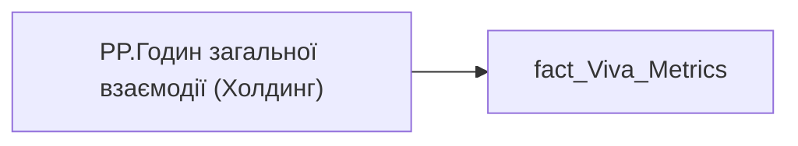

# PP.Годин загальної взаємодії (Холдинг)

*тека `Personal_Profile\Viva\Viva Collaboration`*

## Технічний опис

| Властивість | Значення |
|---|---|
| Тип | міра |
| Home table | _Measures |
| displayFolder | `Personal_Profile\Viva\Viva Collaboration` |
| formatString | — |
| dataType | — |
| Прихована | ні |

### DAX

```dax
VAR __val = 
DIVIDE(
	SUM('fact_Viva_Metrics'[COLLABORATION_HOUR]),
	CALCULATE(
		SUM('fact_Viva_Metrics'[WORKDAY_WITHOUT_SICKLEAVE_AND_VACATION]),
		NOT ISBLANK('fact_Viva_Metrics'[WORKDAY_WITHOUT_SICKLEAVE_AND_VACATION])))

RETURN __val
```

### Джерела даних


Колонки: `COLLABORATION_HOUR`, `WORKDAY_WITHOUT_SICKLEAVE_AND_VACATION`

Power Query: `fact_Viva_Metrics`

### Залежності (таблиці й колонки)

Таблиці: `fact_Viva_Metrics`

Колонки: `fact_Viva_Metrics[COLLABORATION_HOUR]`, `fact_Viva_Metrics[WORKDAY_WITHOUT_SICKLEAVE_AND_VACATION]`

### Схема



---

## Бізнес-суть

!!! note "Бізнес-визначення відсутнє"
    Поля міри не зіставлено з wiki «Таблицями джерел даних». Можна заповнити вручну в `manualNotes`.

## На сторінках звіту

- [Personal Profile](../report/personal-profile.md) — VIVA › Viva
- [Group Profile](../report/group-profile.md) — Viva

## Пов'язані міри

**Використовується в:** [PP.Годин загальної взаємодії (кадровий підрозділ)](../measures/pp-hodyn-zahalnoi-vzaiemodii-kadrovyi-pidrozdil.md), [PP.Годин загальної взаємодії (напрям)](../measures/pp-hodyn-zahalnoi-vzaiemodii-napriam.md), [PP.Годин загальної взаємодії (співробітник)](../measures/pp-hodyn-zahalnoi-vzaiemodii-spivrobitnyk.md)

## Нотатки

_порожньо_
