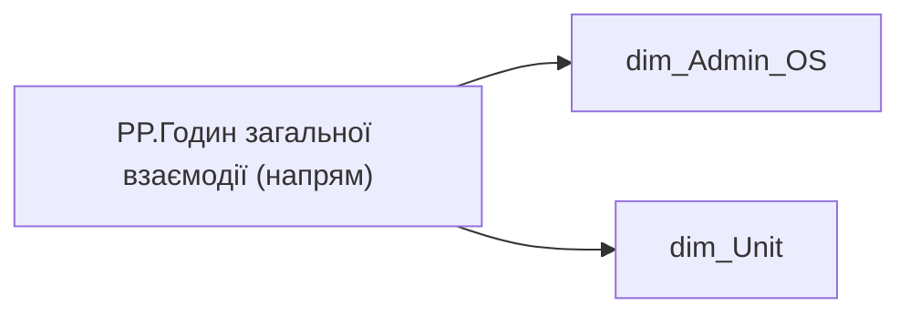

# PP.Годин загальної взаємодії (напрям)

*тека `Personal_Profile\Viva\Viva Collaboration`*

## Технічний опис

| Властивість | Значення |
|---|---|
| Тип | міра |
| Home table | _Measures |
| displayFolder | `Personal_Profile\Viva\Viva Collaboration` |
| formatString | — |
| dataType | — |
| Прихована | ні |

### DAX

```dax
VAR direction = 
FIRSTNONBLANKVALUE(
		VALUES('dim_Admin_OS'[ORDER_NUM]),
		CALCULATE(SELECTEDVALUE('dim_Admin_OS'[DIRECTION])))

VAR __val =
CALCULATE(
	[PP.Годин загальної взаємодії (Холдинг)],
	dim_Unit[DIRECTION] = direction)

RETURN __val
```

### Джерела даних

Вихідні таблиці: `DM.vw_R27_dim_Employee_Access_List`, `DM.vw_R27_dim_Unit`

Колонки: `DIRECTION`, `ORDER_NUM`

Power Query: `dim_Admin_OS`

### Залежності (таблиці й колонки)

Таблиці: `dim_Admin_OS`, `dim_Unit`

Колонки: `dim_Admin_OS[DIRECTION]`, `dim_Admin_OS[ORDER_NUM]`, `dim_Unit[DIRECTION]`

### Схема



---

## Бізнес-суть

DIRECTION → Напрям; DIRECTION → direction_name; DIRECTION → direction

division_person_id = unit_key Поле зберігається в довіднику [dm.vw_R27_dim_unit]  <br>Це поле має бути доступне у візуалізаціях, побудованих на основі фактової таблиці [dm.vw_R27_fact_Employee_List], через відповідний зв’язок за ключем [division_key] = [unit_key].  <br>Поле завжди має значення, пусте поле не допускається  <br>Якщо не вміщається в одну строку, перенести на іншу Поле зберігається в довіднику [dm.vw_R27_dim_unit]  <br>Це поле має бути доступне у візуалізаціях, побудованих на основі фактової таблиці [dm.vw_R27_fact_Employee_List_PDP], через відповідний зв’язок за ключем [division_

**Вимоги:** `Індивідуальний-профіль-працівника/Історія-по-посадам`, `Індивідуальний-профіль-працівника/Історія-по-посадам/Реліз-1.-Історія-по-посадам`, `Індивідуальний-профіль-працівника/Сторінка-Індивідуальний-профіль-працівника`, `Індивідуальний-профіль-працівника/Сторінка-Взаємодія-Viva-та-залученість-працівника/Таблиця-vw_R27_calc_Viva_Direction_PDP`, `Індивідуальний-профіль-працівника/Сторінка-Загальна-інформація-про-працівника`, `Командний-профіль/Паспортна-частина-групового-профілю/Метрики-рекрутингу`, `Командний-профіль/Паспортна-частина-групового-профілю/Метрики-рекрутингу/ТЗ-на-розробку-вітрин-по-метрикам-рекрутингу`, `Командний-профіль/Паспортна-частина-групового-профілю/Редизайн-паспортної-частини-групового-профілю`, `Командний-профіль/Сторінка-Загальна-інформація-про-команду`, `Командний-профіль/Сторінка-Навчання-і-розвиток/Блок-Розвиток-сторінки-Навчання-і-розвиток`, `Командний-профіль/Сторінка-Плинність-та-Exits/Плинність-(вітрина)`, `Командний-профіль/Сторінка-Плинність-та-Exits/Плинність-(вітрина)/Додаткові-вимоги-до-вітрини-Плинність`, `Командний-профіль/Сторінка-Результативність-та-оцінка-команди`, `Командний-профіль/Сторінка-Результативність-та-оцінка-команди/Блок-Додаткові-інструменти`

## На сторінках звіту

[Personal Profile](../report/personal-profile.md) · [Group Profile](../report/group-profile.md)

## Пов'язані міри

**Використовує:** [PP.Годин загальної взаємодії (Холдинг)](../measures/pp-hodyn-zahalnoi-vzaiemodii-kholdynh.md)

## Нотатки

_порожньо_
