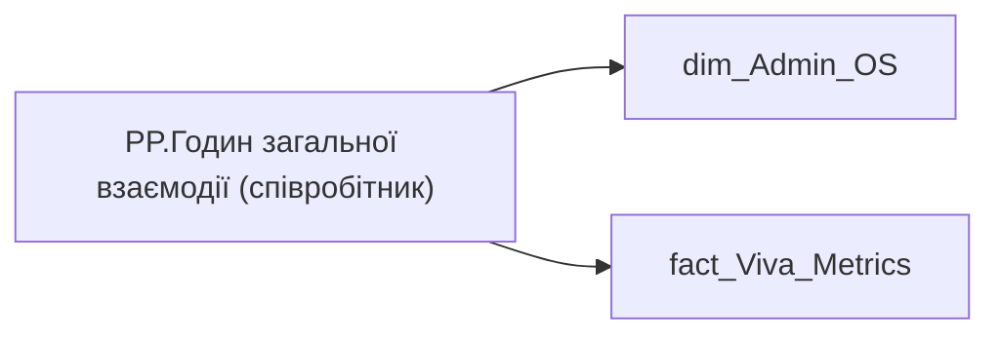

# PP.Годин загальної взаємодії (співробітник)

| Властивість | Значення |
|---|---|
| Тип | міра |
| Home table | _Measures |
| displayFolder | `Personal_Profile\Viva\Viva Collaboration` |
| formatString | — |
| dataType | — |
| Прихована | ні |

## DAX

```dax
VAR employee = 
FIRSTNONBLANKVALUE(
		VALUES('dim_Admin_OS'[ORDER_NUM]),
		CALCULATE(SELECTEDVALUE('dim_Admin_OS'[EMPLOYEE_ID])))

VAR __val =
CALCULATE(
	[PP.Годин загальної взаємодії (Холдинг)],
	fact_Viva_Metrics[EMPLOYEE_ID] = employee)

RETURN __val
```

## Джерела

Вихідні таблиці: `DM.vw_R27_dim_Employee_Access_List`

Колонки: `EMPLOYEE_ID`, `ORDER_NUM`

Power Query: `dim_Admin_OS`

## Бізнес-суть

!!! warning "Без бізнес-визначення"
    Поля міри не знайдено у wiki «Таблицях джерел даних». Заповніть `manualNotes`.

## Залежності

Міри: [PP.Годин загальної взаємодії (Холдинг)](../measures/pp-hodyn-zahalnoi-vzaiemodii-kholdynh.md)

Таблиці: `dim_Admin_OS`, `fact_Viva_Metrics`

Колонки: `dim_Admin_OS[EMPLOYEE_ID]`, `dim_Admin_OS[ORDER_NUM]`, `fact_Viva_Metrics[EMPLOYEE_ID]`

## Схема



## Нотатки

_порожньо_
