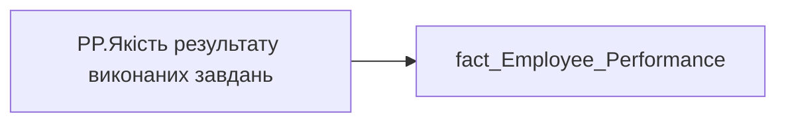

# PP.Якість результату виконаних завдань

*тека `Personal_Profile\Паспорт\Spider`*

## Технічний опис

| Властивість | Значення |
|---|---|
| Тип | міра |
| Home table | _Measures |
| displayFolder | `Personal_Profile\Паспорт\Spider` |
| formatString | — |
| dataType | — |
| Прихована | ні |

### DAX

```dax
LASTNONBLANKVALUE(
	VALUES('fact_Employee_Performance'[performance_PBI_order]),
	CALCULATE(
		[PP.Оцінка результативності базова],
		'fact_Employee_Performance'[Competency_Name] = "Якість результату виконаних завдань",
		'fact_Employee_Performance'[Performance_Type] = "Річна"
	)
)
```

### Джерела даних

Вихідні таблиці: `DM.vw_R27_fact_Employee_Performance_PBI`

Колонки: `Competency_Name`, `Performance_Type`, `performance_PBI_order`

Power Query: `fact_Employee_Performance`

### Залежності (таблиці й колонки)

Таблиці: `fact_Employee_Performance`

Колонки: `fact_Employee_Performance[Competency_Name]`, `fact_Employee_Performance[Performance_Type]`, `fact_Employee_Performance[performance_PBI_order]`

### Схема



---

## Бізнес-суть

!!! note "Бізнес-визначення відсутнє"
    Поля міри не зіставлено з wiki «Таблицями джерел даних». Можна заповнити вручну в `manualNotes`.

## На сторінках звіту

_Не використовується на основних сторінках звіту._

## Пов'язані міри

**Використовує:** [PP.Оцінка результативності базова](../measures/pp-otsinka-rezultatyvnosti-bazova.md)

**Використовується в:** [PP.SVG.SpiderwebVisual](../measures/pp-svg-spiderwebvisual.md)

## Нотатки

_порожньо_
