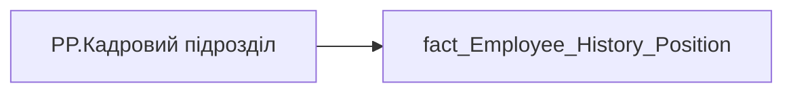

# PP.Кадровий підрозділ

*тека `Personal_Profile\Життєвий цикл`*

## Технічний опис

| Властивість | Значення |
|---|---|
| Тип | міра |
| Home table | _Measures |
| displayFolder | `Personal_Profile\Життєвий цикл` |
| formatString | — |
| dataType | — |
| Прихована | ні |

### DAX

```dax
VAR _maxd = [PP.history_position_maxd]
VAR _res = 
    CALCULATE(
        SELECTEDVALUE(fact_Employee_History_Position[DIVISION_PERSON_NAME]),
        'fact_Employee_History_Position'[PERIOD] = _maxd
    )
RETURN _res
```

### Джерела даних

Вихідні таблиці: `DM.vw_R27_fact_Employee_History_Position`

Колонки: `DIVISION_PERSON_NAME`, `PERIOD`

Power Query: `fact_Employee_History_Position`

### Залежності (таблиці й колонки)

Таблиці: `fact_Employee_History_Position`

Колонки: `fact_Employee_History_Position[DIVISION_PERSON_NAME]`, `fact_Employee_History_Position[PERIOD]`

### Схема



---

## Бізнес-суть

**Бізнес-назва:** Кадровий підрозділ

**Вимоги (ТЗ):**

- [Допоміжні вітрини для звіту › Вью по ієрархії кадрових підрозділів](https://dev.azure.com/MHPITDepProjects/People%20Digital%20Profile%20%28PDP%29/_wiki/wikis/PDP.wiki?pagePath=/%D0%A4%D1%83%D0%BD%D0%BA%D1%86%D1%96%D0%BE%D0%BD%D0%B0%D0%BB%D1%8C%D0%BD%D1%96%20%D0%B2%D0%B8%D0%BC%D0%BE%D0%B3%D0%B8/%D0%92%D0%B8%D0%BC%D0%BE%D0%B3%D0%B8%20%D0%B4%D0%BE%20%D0%B7%D0%B2%D1%96%D1%82%D1%83%20People%20Digital%20Profile/%D0%94%D0%BE%D0%BF%D0%BE%D0%BC%D1%96%D0%B6%D0%BD%D1%96%20%D0%B2%D1%96%D1%82%D1%80%D0%B8%D0%BD%D0%B8%20%D0%B4%D0%BB%D1%8F%20%D0%B7%D0%B2%D1%96%D1%82%D1%83/%D0%92%D1%8C%D1%8E%20%D0%BF%D0%BE%20%D1%96%D1%94%D1%80%D0%B0%D1%80%D1%85%D1%96%D1%97%20%D0%BA%D0%B0%D0%B4%D1%80%D0%BE%D0%B2%D0%B8%D1%85%20%D0%BF%D1%96%D0%B4%D1%80%D0%BE%D0%B7%D0%B4%D1%96%D0%BB%D1%96%D0%B2)
- [Допоміжні вітрини для звіту › Вітрина атрибутів по працівнику](https://dev.azure.com/MHPITDepProjects/People%20Digital%20Profile%20%28PDP%29/_wiki/wikis/PDP.wiki?pagePath=/%D0%A4%D1%83%D0%BD%D0%BA%D1%86%D1%96%D0%BE%D0%BD%D0%B0%D0%BB%D1%8C%D0%BD%D1%96%20%D0%B2%D0%B8%D0%BC%D0%BE%D0%B3%D0%B8/%D0%92%D0%B8%D0%BC%D0%BE%D0%B3%D0%B8%20%D0%B4%D0%BE%20%D0%B7%D0%B2%D1%96%D1%82%D1%83%20People%20Digital%20Profile/%D0%94%D0%BE%D0%BF%D0%BE%D0%BC%D1%96%D0%B6%D0%BD%D1%96%20%D0%B2%D1%96%D1%82%D1%80%D0%B8%D0%BD%D0%B8%20%D0%B4%D0%BB%D1%8F%20%D0%B7%D0%B2%D1%96%D1%82%D1%83/%D0%92%D1%96%D1%82%D1%80%D0%B8%D0%BD%D0%B0%20%D0%B0%D1%82%D1%80%D0%B8%D0%B1%D1%83%D1%82%D1%96%D0%B2%20%D0%BF%D0%BE%20%D0%BF%D1%80%D0%B0%D1%86%D1%96%D0%B2%D0%BD%D0%B8%D0%BA%D1%83)
- [Допоміжні вітрини для звіту › Таблиця (вью) для розрахунку метрики Укомплектованість штату](https://dev.azure.com/MHPITDepProjects/People%20Digital%20Profile%20%28PDP%29/_wiki/wikis/PDP.wiki?pagePath=/%D0%A4%D1%83%D0%BD%D0%BA%D1%86%D1%96%D0%BE%D0%BD%D0%B0%D0%BB%D1%8C%D0%BD%D1%96%20%D0%B2%D0%B8%D0%BC%D0%BE%D0%B3%D0%B8/%D0%92%D0%B8%D0%BC%D0%BE%D0%B3%D0%B8%20%D0%B4%D0%BE%20%D0%B7%D0%B2%D1%96%D1%82%D1%83%20People%20Digital%20Profile/%D0%94%D0%BE%D0%BF%D0%BE%D0%BC%D1%96%D0%B6%D0%BD%D1%96%20%D0%B2%D1%96%D1%82%D1%80%D0%B8%D0%BD%D0%B8%20%D0%B4%D0%BB%D1%8F%20%D0%B7%D0%B2%D1%96%D1%82%D1%83/%D0%A2%D0%B0%D0%B1%D0%BB%D0%B8%D1%86%D1%8F%20%28%D0%B2%D1%8C%D1%8E%29%20%D0%B4%D0%BB%D1%8F%20%D1%80%D0%BE%D0%B7%D1%80%D0%B0%D1%85%D1%83%D0%BD%D0%BA%D1%83%20%D0%BC%D0%B5%D1%82%D1%80%D0%B8%D0%BA%D0%B8%20%D0%A3%D0%BA%D0%BE%D0%BC%D0%BF%D0%BB%D0%B5%D0%BA%D1%82%D0%BE%D0%B2%D0%B0%D0%BD%D1%96%D1%81%D1%82%D1%8C%20%D1%88%D1%82%D0%B0%D1%82%D1%83)

## На сторінках звіту

- [Personal Profile](../report/personal-profile.md) — Життєвий цикл

## Пов'язані міри

**Використовує:** [PP.history_position_maxd](../measures/pp-history-position-maxd.md)

## Нотатки

_порожньо_
