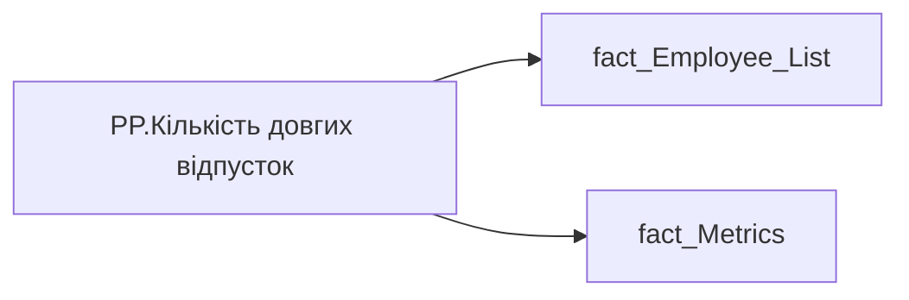

# PP.Кількість довгих відпусток

*тека `Personal_Profile\Здоров'я та благополуччя` · формат `0`*

## Бізнес-суть

IS_MAIN_POSITION → Пріоритетне місце роботи; IS_MAIN_POSITION → is_main_position; Long_Vacation → Наявність довгих відпусток (більше 10 днів); Long_Vacation → Доля співробітників команди з наявними відпустками понад 10 днів; Long_Vacation → Рівень неякісних відпусток (%); Long_Vacation → Кількість довгих відпусток за ост.12 місяців

1 - Так  <br>0 - Ні Розрахункове поле.  <br>В  деталізацію вивести загальну тривалість такихдовгих відпусток (Long_Vacations_Total_Day) Розрахункове поле. Відношення кількості працівників, у яких utilized по кожній окремій відпустці  >=10 за останні 12 місяців (включно із поточним) до загальної кількості працівників Це метрика, обернена до Доля співробітників з наявними відпустками понад 10 днів. Тобто 100% - показник Доля співробітників з наявними відпустками понад 10 днів. Розрахункове поле. Відношення кількості працівників, у яких utilized >=10 за останні 12 місяців до загальної кількості п

**Вимоги:** `Індивідуальний-профіль-працівника/Історія-по-посадам`, `Індивідуальний-профіль-працівника/Історія-по-посадам/Реліз-1.-Історія-по-посадам`, `Індивідуальний-профіль-працівника/Сторінка-Взаємодія-Viva-та-залученість-працівника/Сторінка-Ефективність-працівника/Вітрина-Відвідування-офісів`, `Індивідуальний-профіль-працівника/Сторінка-Загальна-інформація-про-працівника`, `Індивідуальний-профіль-працівника/Сторінка-Здоров'я-та-благополуччя-працівника`, `Командний-профіль/Паспортна-частина-групового-профілю/Редизайн-паспортної-частини-групового-профілю`, `Командний-профіль/Паспортна-частина-групового-профілю/Сторінка-Картка-команди`, `Командний-профіль/Сторінка-Здоров'я-та-благополуччя-команди`, `Командний-профіль/Сторінка-Моя-команда/ТЗ.-Деталізація-метрик-групового-профілю-звіту`, `Командний-профіль/Сторінка-Плинність-та-Exits/ТЗ-на-вітрину-Exits`

## На сторінках звіту

[Personal Profile](../report/personal-profile.md)

## Пов'язані міри

**Використовується в:** [PP.Наявність довгих відпусток](../measures/pp-naiavnist-dovhykh-vidpustok.md), [PP.Ризик.Довгі відпустки 12м](../measures/pp-ryzyk-dovhi-vidpustky-12m.md)

---

## Технічний опис

| Властивість | Значення |
|---|---|
| Тип | міра |
| Home table | _Measures |
| displayFolder | `Personal_Profile\Здоров'я та благополуччя` |
| formatString | `0` |
| dataType | — |
| Прихована | ні |

### DAX

```dax
VAR _employee_id = SELECTEDVALUE('fact_Employee_List'[EMPLOYEE_ID])
VAR _main_position = 
	CALCULATE(
		VALUES('fact_Employee_List'[USER_ACCESS_ID]),
		REMOVEFILTERS('fact_Employee_List'),
		'fact_Employee_List'[EMPLOYEE_ID] = _employee_id,
		'fact_Employee_List'[IS_MAIN_POSITION] = 1
	)
VAR _filter0 = TREATAS({_main_position}, 'fact_Metrics'[USER_ACCESS_ID])
VAR _res = 
	CALCULATE(
		SUM('fact_Metrics'[Long_Vacation]),
		REMOVEFILTERS('fact_Metrics'),
		_filter0
	)
RETURN COALESCE(_res,0)
```

### Джерела даних


Колонки: `EMPLOYEE_ID`, `IS_MAIN_POSITION`, `Long_Vacation`, `USER_ACCESS_ID`

Power Query: `fact_Employee_List`

### Залежності (таблиці й колонки)

Таблиці: `fact_Employee_List`, `fact_Metrics`

Колонки: `fact_Employee_List[EMPLOYEE_ID]`, `fact_Employee_List[IS_MAIN_POSITION]`, `fact_Employee_List[USER_ACCESS_ID]`, `fact_Metrics[Long_Vacation]`, `fact_Metrics[USER_ACCESS_ID]`

### Схема



## Нотатки

_порожньо_
