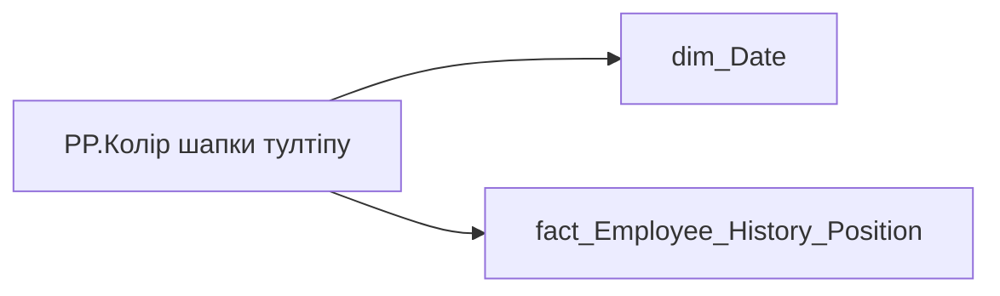

# PP.Колір шапки тултіпу

*тека `Personal_Profile\Життєвий цикл`*

## Технічний опис

| Властивість | Значення |
|---|---|
| Тип | міра |
| Home table | _Measures |
| displayFolder | `Personal_Profile\Життєвий цикл` |
| formatString | — |
| dataType | — |
| Прихована | ні |

### DAX

```dax
VAR _first_date = 
    CALCULATE (
        FIRSTNONBLANK(
            'dim_Date'[Date],
            [PP.РЦД]
        ),
        ALLSELECTED( 'dim_Date'[Date] )
    )
VAR _result = 
    SWITCH(
        TRUE(),
        SELECTEDVALUE('fact_Employee_History_Position'[IS_APRIL_SALARY_REVIEW]), "#5B59C2",
        SELECTEDVALUE('fact_Employee_History_Position'[IS_TECH_POSITION_CHANGE]),  "#0F8C6E",
        SELECTEDVALUE('fact_Employee_History_Position'[IS_TECH_SALARY_TRANSFER]), "#C28814",
        SELECTEDVALUE('dim_Date'[Date]) = _first_date, "#7A8AA0",
        "#7A8AA0"
    )
RETURN _result
```

### Джерела даних

Вихідні таблиці: `DM.vw_R27_fact_Employee_History_Position`

Колонки: `Date`, `IS_APRIL_SALARY_REVIEW`, `IS_TECH_POSITION_CHANGE`, `IS_TECH_SALARY_TRANSFER`

Power Query: `dim_Date`

### Залежності (таблиці й колонки)

Таблиці: `dim_Date`, `fact_Employee_History_Position`

Колонки: `dim_Date[Date]`, `fact_Employee_History_Position[IS_APRIL_SALARY_REVIEW]`, `fact_Employee_History_Position[IS_TECH_POSITION_CHANGE]`, `fact_Employee_History_Position[IS_TECH_SALARY_TRANSFER]`

### Схема



---

## Бізнес-суть

??? note "Поля-джерела та пов'язані бізнес-метрики (3)"
    | Поле | Бізнес-метрики |
    |---|---|
    | `IS_APRIL_SALARY_REVIEW` | Квітневий перегляд заробітної плати |
    | `IS_TECH_POSITION_CHANGE` | Технічна зміна посади |
    | `IS_TECH_SALARY_TRANSFER` | Технічний перелив (з/п) |

**Вимоги (ТЗ):**

- [Індивідуальний профіль працівника › Історія по посадам › Реліз 1. Історія по посадам](https://dev.azure.com/MHPITDepProjects/People%20Digital%20Profile%20%28PDP%29/_wiki/wikis/PDP.wiki?pagePath=/%D0%A4%D1%83%D0%BD%D0%BA%D1%86%D1%96%D0%BE%D0%BD%D0%B0%D0%BB%D1%8C%D0%BD%D1%96%20%D0%B2%D0%B8%D0%BC%D0%BE%D0%B3%D0%B8/%D0%92%D0%B8%D0%BC%D0%BE%D0%B3%D0%B8%20%D0%B4%D0%BE%20%D0%B7%D0%B2%D1%96%D1%82%D1%83%20People%20Digital%20Profile/%D0%86%D0%BD%D0%B4%D0%B8%D0%B2%D1%96%D0%B4%D1%83%D0%B0%D0%BB%D1%8C%D0%BD%D0%B8%D0%B9%20%D0%BF%D1%80%D0%BE%D1%84%D1%96%D0%BB%D1%8C%20%D0%BF%D1%80%D0%B0%D1%86%D1%96%D0%B2%D0%BD%D0%B8%D0%BA%D0%B0/%D0%86%D1%81%D1%82%D0%BE%D1%80%D1%96%D1%8F%20%D0%BF%D0%BE%20%D0%BF%D0%BE%D1%81%D0%B0%D0%B4%D0%B0%D0%BC/%D0%A0%D0%B5%D0%BB%D1%96%D0%B7%201.%20%D0%86%D1%81%D1%82%D0%BE%D1%80%D1%96%D1%8F%20%D0%BF%D0%BE%20%D0%BF%D0%BE%D1%81%D0%B0%D0%B4%D0%B0%D0%BC)

## На сторінках звіту

[Personal Profile](../report/personal-profile.md) · [TT:Життєвий цикл](../report/tt-zhyttievyi-tsykl.md)

## Пов'язані міри

**Використовує:** [PP.РЦД](../measures/pp-rtsd.md)

## Нотатки

_порожньо_
