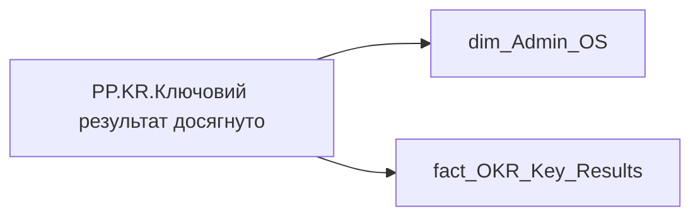

# PP.KR.Ключовий результат досягнуто

*тека `Personal_Profile\Результативність та оцінка\OKR` · формат `0`*

## Технічний опис

| Властивість | Значення |
|---|---|
| Тип | міра |
| Home table | _Measures |
| displayFolder | `Personal_Profile\Результативність та оцінка\OKR` |
| formatString | `0` |
| dataType | — |
| Прихована | ні |

### DAX

```dax
VAR _employee_id = SELECTEDVALUE('dim_Admin_OS'[EMPLOYEE_ID])
VAR _main_position = 
	CALCULATE(
		VALUES('fact_OKR_Key_Results'[USER_ACCESS_ID]),
		REMOVEFILTERS('fact_OKR_Key_Results'),
		'fact_OKR_Key_Results'[EMPLOYEE_ID] = _employee_id
	)
VAR _filter0 = TREATAS({_main_position}, 'fact_OKR_Key_Results'[USER_ACCESS_ID])
VAR _res = 
	CALCULATE(
        COUNTROWS('fact_OKR_Key_Results'),
        'fact_OKR_Key_Results'[KR_COLOR_RATE] > 25,
        'fact_OKR_Key_Results'[KR_WEIGHT] > 0,
		_filter0
	)
VAR _blank_check = 
CALCULATE(
    COUNTROWS('fact_OKR_Key_Results'),
    'fact_OKR_Key_Results'[KR_COLOR_RATE] > 25,
    _filter0
)
RETURN IF(NOT(ISBLANK(_blank_check)), _res)
```

### Джерела даних

Вихідні таблиці: `DM.R27_fact_OKR_Key_Results`, `DM.vw_R27_dim_Employee_Access_List`

Колонки: `EMPLOYEE_ID`, `KR_COLOR_RATE`, `KR_WEIGHT`, `USER_ACCESS_ID`

Power Query: `dim_Admin_OS`

### Залежності (таблиці й колонки)

Таблиці: `dim_Admin_OS`, `fact_OKR_Key_Results`

Колонки: `dim_Admin_OS[EMPLOYEE_ID]`, `fact_OKR_Key_Results[EMPLOYEE_ID]`, `fact_OKR_Key_Results[KR_COLOR_RATE]`, `fact_OKR_Key_Results[KR_WEIGHT]`, `fact_OKR_Key_Results[USER_ACCESS_ID]`

### Схема



---

## Бізнес-суть

### Опис із ТЗ

Якщо поле `kr_color_rate` >= 25

Якщо поле `Calc_Performance_Desc_Rate` <= 24.99

Якщо поле `Calc_Performance_Desc_Rate` < 25

??? note "Поля-джерела та пов'язані бізнес-метрики (4)"
    | Поле | Бізнес-метрики |
    |---|---|
    | `KR_COLOR_RATE` | КР виконано · КР не виконано · Коефіцієнт колірної оцінки КР з плану |
    | `KR_WEIGHT` | Вага КР |

**Вимоги (ТЗ):**

- [Індивідуальний профіль працівника › Сторінка Результативність та оцінка](https://dev.azure.com/MHPITDepProjects/People%20Digital%20Profile%20%28PDP%29/_wiki/wikis/PDP.wiki?pagePath=/%D0%A4%D1%83%D0%BD%D0%BA%D1%86%D1%96%D0%BE%D0%BD%D0%B0%D0%BB%D1%8C%D0%BD%D1%96%20%D0%B2%D0%B8%D0%BC%D0%BE%D0%B3%D0%B8/%D0%92%D0%B8%D0%BC%D0%BE%D0%B3%D0%B8%20%D0%B4%D0%BE%20%D0%B7%D0%B2%D1%96%D1%82%D1%83%20People%20Digital%20Profile/%D0%86%D0%BD%D0%B4%D0%B8%D0%B2%D1%96%D0%B4%D1%83%D0%B0%D0%BB%D1%8C%D0%BD%D0%B8%D0%B9%20%D0%BF%D1%80%D0%BE%D1%84%D1%96%D0%BB%D1%8C%20%D0%BF%D1%80%D0%B0%D1%86%D1%96%D0%B2%D0%BD%D0%B8%D0%BA%D0%B0/%D0%A1%D1%82%D0%BE%D1%80%D1%96%D0%BD%D0%BA%D0%B0%20%D0%A0%D0%B5%D0%B7%D1%83%D0%BB%D1%8C%D1%82%D0%B0%D1%82%D0%B8%D0%B2%D0%BD%D1%96%D1%81%D1%82%D1%8C%20%D1%82%D0%B0%20%D0%BE%D1%86%D1%96%D0%BD%D0%BA%D0%B0)
- [Командний профіль › Сторінка Результативність та оцінка команди › Створити блок Виконання OKR](https://dev.azure.com/MHPITDepProjects/People%20Digital%20Profile%20%28PDP%29/_wiki/wikis/PDP.wiki?pagePath=/%D0%A4%D1%83%D0%BD%D0%BA%D1%86%D1%96%D0%BE%D0%BD%D0%B0%D0%BB%D1%8C%D0%BD%D1%96%20%D0%B2%D0%B8%D0%BC%D0%BE%D0%B3%D0%B8/%D0%92%D0%B8%D0%BC%D0%BE%D0%B3%D0%B8%20%D0%B4%D0%BE%20%D0%B7%D0%B2%D1%96%D1%82%D1%83%20People%20Digital%20Profile/%D0%9A%D0%BE%D0%BC%D0%B0%D0%BD%D0%B4%D0%BD%D0%B8%D0%B9%20%D0%BF%D1%80%D0%BE%D1%84%D1%96%D0%BB%D1%8C/%D0%A1%D1%82%D0%BE%D1%80%D1%96%D0%BD%D0%BA%D0%B0%20%D0%A0%D0%B5%D0%B7%D1%83%D0%BB%D1%8C%D1%82%D0%B0%D1%82%D0%B8%D0%B2%D0%BD%D1%96%D1%81%D1%82%D1%8C%20%D1%82%D0%B0%20%D0%BE%D1%86%D1%96%D0%BD%D0%BA%D0%B0%20%D0%BA%D0%BE%D0%BC%D0%B0%D0%BD%D0%B4%D0%B8/%D0%A1%D1%82%D0%B2%D0%BE%D1%80%D0%B8%D1%82%D0%B8%20%D0%B1%D0%BB%D0%BE%D0%BA%20%D0%92%D0%B8%D0%BA%D0%BE%D0%BD%D0%B0%D0%BD%D0%BD%D1%8F%20OKR)

## На сторінках звіту

[Personal Profile](../report/personal-profile.md)

## Пов'язані міри

_Прямих зв'язків з іншими мірами немає._

## Нотатки

_порожньо_
