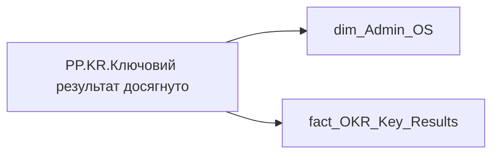

# PP.KR.Ключовий результат досягнуто

| Властивість | Значення |
|---|---|
| Тип | міра |
| Home table | _Measures |
| displayFolder | `Personal_Profile\Результативність та оцінка\OKR` |
| formatString | `0` |
| dataType | — |
| Прихована | ні |

## DAX

```dax
VAR _employee_id = SELECTEDVALUE('dim_Admin_OS'[EMPLOYEE_ID])
VAR _main_position = 
	CALCULATE(
		VALUES('fact_OKR_Key_Results'[USER_ACCESS_ID]),
		REMOVEFILTERS('fact_OKR_Key_Results'),
		'fact_OKR_Key_Results'[EMPLOYEE_ID] = _employee_id
	)
VAR _filter0 = TREATAS({_main_position}, 'fact_OKR_Key_Results'[USER_ACCESS_ID])
VAR _res = 
	CALCULATE(
        COUNTROWS('fact_OKR_Key_Results'),
        'fact_OKR_Key_Results'[KR_COLOR_RATE] > 25,
        'fact_OKR_Key_Results'[KR_WEIGHT] > 0,
		_filter0
	)
VAR _blank_check = 
CALCULATE(
    COUNTROWS('fact_OKR_Key_Results'),
    'fact_OKR_Key_Results'[KR_COLOR_RATE] > 25,
    _filter0
)
RETURN IF(NOT(ISBLANK(_blank_check)), _res)
```

## Джерела

Вихідні таблиці: `DM.R27_fact_OKR_Key_Results`, `DM.vw_R27_dim_Employee_Access_List`

Колонки: `EMPLOYEE_ID`, `KR_COLOR_RATE`, `KR_WEIGHT`, `USER_ACCESS_ID`

Power Query: `dim_Admin_OS`

## Бізнес-суть

KR_COLOR_RATE → КР виконано; KR_COLOR_RATE → КР не виконано; KR_COLOR_RATE → Коефіцієнт колірної оцінки КР з плану; KR_WEIGHT → Вага КР

Якщо поле kr_color_rate >= 25 Якщо поле Calc_Performance_Desc_Rate <= 24.99 Якщо поле Calc_Performance_Desc_Rate < 25

**Вимоги:** `Індивідуальний-профіль-працівника/Сторінка-Результативність-та-оцінка`, `Командний-профіль/Сторінка-Результативність-та-оцінка-команди/Створити-блок-Виконання-OKR`

## Залежності

Таблиці: `dim_Admin_OS`, `fact_OKR_Key_Results`

Колонки: `dim_Admin_OS[EMPLOYEE_ID]`, `fact_OKR_Key_Results[EMPLOYEE_ID]`, `fact_OKR_Key_Results[KR_COLOR_RATE]`, `fact_OKR_Key_Results[KR_WEIGHT]`, `fact_OKR_Key_Results[USER_ACCESS_ID]`

## Схема



## Нотатки

_порожньо_
