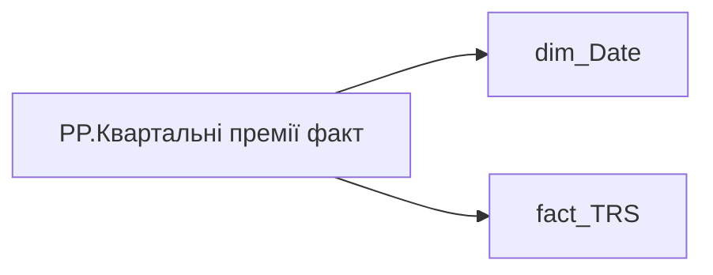

# PP.Квартальні премії факт

*тека `Personal_Profile\TRS` · формат `#,0`*

## Технічний опис

| Властивість | Значення |
|---|---|
| Тип | міра |
| Home table | _Measures |
| displayFolder | `Personal_Profile\TRS` |
| formatString | `#,0` |
| dataType | — |
| Прихована | ні |

### DAX

```dax
VAR _res =
CALCULATE(
	SUM(fact_TRS[PAYMENTS_FACT_UAH]),
	fact_TRS[TRS_CATEGORY] = "Змінна винагорода",
	fact_TRS[SUBCATEGORY_OF_ACCRUAL_TYPE] = "Квартальні премії",
	DATESINPERIOD('dim_Date'[Date], EOMONTH(TODAY(), -1), -12, MONTH)
)
RETURN COALESCE(_res, 0)
```

### Джерела даних

Вихідні таблиці: `DM.vw_R27_fact_TRS_PDP`

Колонки: `Date`, `PAYMENTS_FACT_UAH`, `SUBCATEGORY_OF_ACCRUAL_TYPE`, `TRS_CATEGORY`

Power Query: `dim_Date`

### Залежності (таблиці й колонки)

Таблиці: `dim_Date`, `fact_TRS`

Колонки: `dim_Date[Date]`, `fact_TRS[PAYMENTS_FACT_UAH]`, `fact_TRS[SUBCATEGORY_OF_ACCRUAL_TYPE]`, `fact_TRS[TRS_CATEGORY]`

### Схема



---

## Бізнес-суть

!!! note "Бізнес-визначення відсутнє"
    Поля міри не зіставлено з wiki «Таблицями джерел даних». Можна заповнити вручну в `manualNotes`.

## На сторінках звіту

- [Personal Profile](../report/personal-profile.md) — Винагорода
- [ТТ:Квартальна премія](../report/tt-kvartalna-premiia.md)

## Пов'язані міри

_Прямих зв'язків з іншими мірами немає._

## Нотатки

_порожньо_
