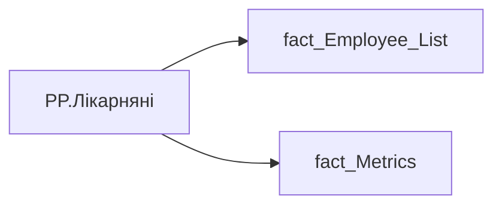

# PP.Лікарняні

*тека `Personal_Profile\Здоров'я та благополуччя`*

## Технічний опис

| Властивість | Значення |
|---|---|
| Тип | міра |
| Home table | _Measures |
| displayFolder | `Personal_Profile\Здоров'я та благополуччя` |
| formatString | — |
| dataType | — |
| Прихована | ні |

### DAX

```dax
VAR _employee_id = SELECTEDVALUE('fact_Employee_List'[EMPLOYEE_ID])
VAR _main_position = 
	CALCULATE(
		VALUES('fact_Employee_List'[USER_ACCESS_ID]),
		REMOVEFILTERS('fact_Employee_List'),
		'fact_Employee_List'[EMPLOYEE_ID] = _employee_id,
		'fact_Employee_List'[IS_MAIN_POSITION] = 1
	)
VAR _filter0 = TREATAS({_main_position}, 'fact_Metrics'[USER_ACCESS_ID])
VAR _sick_leaves_cnt = 
	CALCULATE(
		SUM('fact_Metrics'[sick_leave_id_cnt]),
		REMOVEFILTERS(fact_Metrics),
		_filter0
	)
VAR _sick_leaves_days = 
	CALCULATE(
		SUM('fact_Metrics'[SICK_LEAVE_DAY_TOTAL]),
		REMOVEFILTERS(fact_Metrics),
		_filter0
	)
VAR _result = 
	IF(
		NOT(ISBLANK(_sick_leaves_days)),
		_sick_leaves_cnt & " шт (" & _sick_leaves_days & " дн.)"
	)
RETURN COALESCE(_result, "-")
```

### Джерела даних


Колонки: `EMPLOYEE_ID`, `IS_MAIN_POSITION`, `SICK_LEAVE_DAY_TOTAL`, `USER_ACCESS_ID`, `sick_leave_id_cnt`

Power Query: `fact_Employee_List`

### Залежності (таблиці й колонки)

Таблиці: `fact_Employee_List`, `fact_Metrics`

Колонки: `fact_Employee_List[EMPLOYEE_ID]`, `fact_Employee_List[IS_MAIN_POSITION]`, `fact_Employee_List[USER_ACCESS_ID]`, `fact_Metrics[SICK_LEAVE_DAY_TOTAL]`, `fact_Metrics[USER_ACCESS_ID]`, `fact_Metrics[sick_leave_id_cnt]`

### Схема



---

## Бізнес-суть

IS_MAIN_POSITION → Пріоритетне місце роботи; IS_MAIN_POSITION → is_main_position; SICK_LEAVE_DAY_TOTAL → Середня тривалість лікарняного; SICK_LEAVE_DAY_TOTAL → Тривалість лікарняного (зважена на ФТЕ); SICK_LEAVE_DAY_TOTAL → Середня тривалість лікарняного на співробітника; sick_leave_id_cnt → #68049; sick_leave_id_cnt → Кількість лікарняних; sick_leave_id_cnt → Середня кількість лікарняних на співробітника; sick_leave_id_cnt → Лікарняні

1 - Так  <br>0 - Ні Розраховується шляхом ділення загальної кількості днів на лікарняному за останні 12 місяців, НЕ включаючи поточний місяць, на кількість унікальних лікарняних листів.  <br> = sick_leave_day_Total/sick_leave_id_cnt Розрахункове поле.  <br>Відношення загальної кількості днів лікарняних (крім по вагітності та пологам) до кількості унікальних оформлених лікарняних на команду.  <br>Цифру округлювати до десятих, в більшу сторону, якщо друга цифра після коми 5-9, і в меншу сторону, якщо друга цифра після коми 0-4. sick_leave_day_Total/sick_leave_id_cnt Розрахункове поле.  <br>Вивод

**Вимоги:** `Індивідуальний-профіль-працівника/Історія-по-посадам`, `Індивідуальний-профіль-працівника/Історія-по-посадам/Реліз-1.-Історія-по-посадам`, `Індивідуальний-профіль-працівника/Паспортна-частина-індивідуального-профілю-співробітника/Деталізація-в-паспортній-частині`, `Індивідуальний-профіль-працівника/Сторінка-Взаємодія-Viva-та-залученість-працівника/Сторінка-Ефективність-працівника/Вітрина-Відвідування-офісів`, `Індивідуальний-профіль-працівника/Сторінка-Загальна-інформація-про-працівника`, `Індивідуальний-профіль-працівника/Сторінка-Здоров'я-та-благополуччя-працівника`, `Командний-профіль/Сторінка-Здоров'я-та-благополуччя-команди`, `Командний-профіль/Сторінка-Моя-команда/ТЗ.-Деталізація-метрик-групового-профілю-звіту`, `Командний-профіль/Сторінка-Плинність-та-Exits/ТЗ-на-вітрину-Exits`

## На сторінках звіту

[Personal Profile](../report/personal-profile.md)

## Пов'язані міри

**Використовується в:** [PP.Чи виплачено лікарняні від компанії](../measures/pp-chy-vyplacheno-likarniani-vid-kompanii.md)

## Нотатки

_порожньо_
