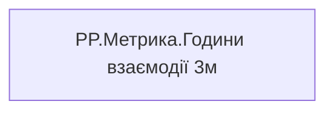

# PP.Метрика.Години взаємодії 3м

*тека `Personal_Profile\Паспорт\Метрики`*

## Технічний опис

| Властивість | Значення |
|---|---|
| Тип | міра |
| Home table | _Measures |
| displayFolder | `Personal_Profile\Паспорт\Метрики` |
| formatString | — |
| dataType | — |
| Прихована | ні |

### DAX

```dax
VAR _v = [PP.Годин загальної взаємодії (співробітник)]
RETURN
	IF(ISBLANK(_v), "Дані відсутні", FORMAT(_v, "0.0") & " год")
```

### Джерела даних

—

### Залежності (таблиці й колонки)

—

### Схема



---

## Бізнес-суть

!!! note "Бізнес-визначення відсутнє"
    Поля міри не зіставлено з wiki «Таблицями джерел даних». Можна заповнити вручну в `manualNotes`.

## На сторінках звіту

- [Personal Profile](../report/personal-profile.md) — Паспортна частина

## Пов'язані міри

**Використовує:** [PP.Годин загальної взаємодії (співробітник)](../measures/pp-hodyn-zahalnoi-vzaiemodii-spivrobitnyk.md)

## Нотатки

_порожньо_
