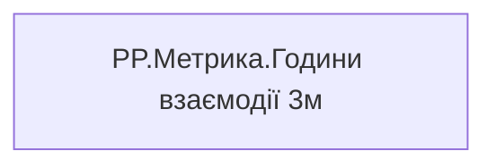

# PP.Метрика.Години взаємодії 3м

| Властивість | Значення |
|---|---|
| Тип | міра |
| Home table | _Measures |
| displayFolder | `Personal_Profile\Паспорт\Метрики` |
| formatString | — |
| dataType | — |
| Прихована | ні |

## DAX

```dax
VAR _v = [PP.Годин загальної взаємодії (співробітник)]
RETURN
	IF(ISBLANK(_v), "Дані відсутні", FORMAT(_v, "0.0") & " год")
```

## Джерела

—

## Бізнес-суть

!!! warning "Без бізнес-визначення"
    Поля міри не знайдено у wiki «Таблицях джерел даних». Заповніть `manualNotes`.

## Залежності

Міри: [PP.Годин загальної взаємодії (співробітник)](../measures/pp-hodyn-zahalnoi-vzaiemodii-spivrobitnyk.md)


## Схема



## Нотатки

_порожньо_
