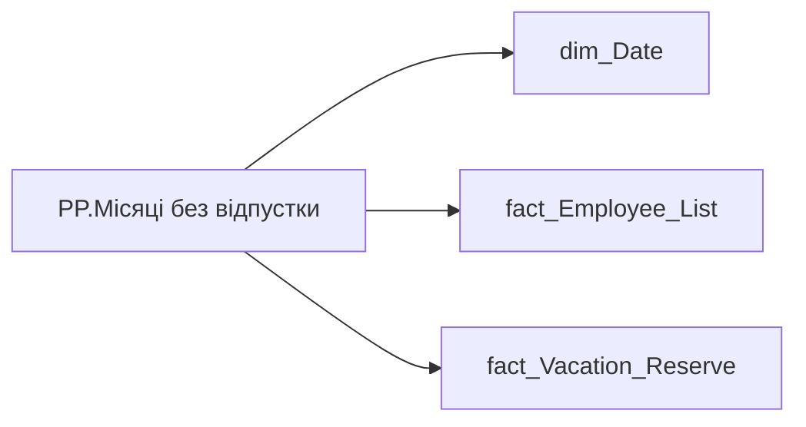

# PP.Місяці без відпустки

*тека `Personal_Profile\Здоров'я та благополуччя` · формат `0;-0;0`*

## Технічний опис

| Властивість | Значення |
|---|---|
| Тип | міра |
| Home table | _Measures |
| displayFolder | `Personal_Profile\Здоров'я та благополуччя` |
| formatString | `0;-0;0` |
| dataType | — |
| Прихована | ні |

### DAX

```dax
VAR _employee_id = SELECTEDVALUE('fact_Employee_List'[EMPLOYEE_ID])
VAR _main_position = 
	CALCULATE(
		VALUES('fact_Employee_List'[USER_ACCESS_ID]),
		REMOVEFILTERS('fact_Employee_List'),
		'fact_Employee_List'[EMPLOYEE_ID] = _employee_id,
		'fact_Employee_List'[IS_MAIN_POSITION] = 1
	)
VAR _filter0 = TREATAS({_main_position}, 'fact_Vacation_Reserve'[USER_ACCESS_ID])
VAR _res =
CALCULATE(
	LASTNONBLANKVALUE(
		VALUES('dim_Date'[Date]),
		CALCULATE(MAX('fact_Vacation_Reserve'[no_vacation_duration_months]))
	),
	REMOVEFILTERS('fact_Vacation_Reserve'),
	_filter0
)
RETURN _res
```

### Джерела даних

Вихідні таблиці: `DM.vw_R27_fact_Vacation_Reserve_PDP`

Колонки: `Date`, `EMPLOYEE_ID`, `IS_MAIN_POSITION`, `USER_ACCESS_ID`, `no_vacation_duration_months`

Power Query: `dim_Date`

### Залежності (таблиці й колонки)

Таблиці: `dim_Date`, `fact_Employee_List`, `fact_Vacation_Reserve`

Колонки: `dim_Date[Date]`, `fact_Employee_List[EMPLOYEE_ID]`, `fact_Employee_List[IS_MAIN_POSITION]`, `fact_Employee_List[USER_ACCESS_ID]`, `fact_Vacation_Reserve[USER_ACCESS_ID]`, `fact_Vacation_Reserve[no_vacation_duration_months]`

### Схема



---

## Бізнес-суть

**Бізнес-назва:** Місяці без відпустки

### Опис із ТЗ

Кількість місяців працівник не був у відпустці   Це поле має бути доступне у візуалізаціях, побудованих на основі фактової таблиці ` DM.vw_R27_fact_Vacation_Reserve`.   Якщо значення в полі відсутнє, то показати текст "Дані відсутні" або знак "-".   Цифру округлювати до цілих в більшу сторону, якщо цифра після коми 5-9, і в меншу сторону, якщо цифра після коми 0-4.

**Вимоги (ТЗ):**

- [Індивідуальний профіль працівника › Сторінка Здоров'я та благополуччя працівника](https://dev.azure.com/MHPITDepProjects/People%20Digital%20Profile%20%28PDP%29/_wiki/wikis/PDP.wiki?pagePath=/%D0%A4%D1%83%D0%BD%D0%BA%D1%86%D1%96%D0%BE%D0%BD%D0%B0%D0%BB%D1%8C%D0%BD%D1%96%20%D0%B2%D0%B8%D0%BC%D0%BE%D0%B3%D0%B8/%D0%92%D0%B8%D0%BC%D0%BE%D0%B3%D0%B8%20%D0%B4%D0%BE%20%D0%B7%D0%B2%D1%96%D1%82%D1%83%20People%20Digital%20Profile/%D0%86%D0%BD%D0%B4%D0%B8%D0%B2%D1%96%D0%B4%D1%83%D0%B0%D0%BB%D1%8C%D0%BD%D0%B8%D0%B9%20%D0%BF%D1%80%D0%BE%D1%84%D1%96%D0%BB%D1%8C%20%D0%BF%D1%80%D0%B0%D1%86%D1%96%D0%B2%D0%BD%D0%B8%D0%BA%D0%B0/%D0%A1%D1%82%D0%BE%D1%80%D1%96%D0%BD%D0%BA%D0%B0%20%D0%97%D0%B4%D0%BE%D1%80%D0%BE%D0%B2%27%D1%8F%20%D1%82%D0%B0%20%D0%B1%D0%BB%D0%B0%D0%B3%D0%BE%D0%BF%D0%BE%D0%BB%D1%83%D1%87%D1%87%D1%8F%20%D0%BF%D1%80%D0%B0%D1%86%D1%96%D0%B2%D0%BD%D0%B8%D0%BA%D0%B0)
- [Командний профіль › Сторінка Моя команда › ТЗ. Деталізація метрик групового профілю звіту](https://dev.azure.com/MHPITDepProjects/People%20Digital%20Profile%20%28PDP%29/_wiki/wikis/PDP.wiki?pagePath=/%D0%A4%D1%83%D0%BD%D0%BA%D1%86%D1%96%D0%BE%D0%BD%D0%B0%D0%BB%D1%8C%D0%BD%D1%96%20%D0%B2%D0%B8%D0%BC%D0%BE%D0%B3%D0%B8/%D0%92%D0%B8%D0%BC%D0%BE%D0%B3%D0%B8%20%D0%B4%D0%BE%20%D0%B7%D0%B2%D1%96%D1%82%D1%83%20People%20Digital%20Profile/%D0%9A%D0%BE%D0%BC%D0%B0%D0%BD%D0%B4%D0%BD%D0%B8%D0%B9%20%D0%BF%D1%80%D0%BE%D1%84%D1%96%D0%BB%D1%8C/%D0%A1%D1%82%D0%BE%D1%80%D1%96%D0%BD%D0%BA%D0%B0%20%D0%9C%D0%BE%D1%8F%20%D0%BA%D0%BE%D0%BC%D0%B0%D0%BD%D0%B4%D0%B0/%D0%A2%D0%97.%20%D0%94%D0%B5%D1%82%D0%B0%D0%BB%D1%96%D0%B7%D0%B0%D1%86%D1%96%D1%8F%20%D0%BC%D0%B5%D1%82%D1%80%D0%B8%D0%BA%20%D0%B3%D1%80%D1%83%D0%BF%D0%BE%D0%B2%D0%BE%D0%B3%D0%BE%20%D0%BF%D1%80%D0%BE%D1%84%D1%96%D0%BB%D1%8E%20%D0%B7%D0%B2%D1%96%D1%82%D1%83)

## На сторінках звіту

[Personal Profile](../report/personal-profile.md)

## Пов'язані міри

_Прямих зв'язків з іншими мірами немає._

## Нотатки

_порожньо_
