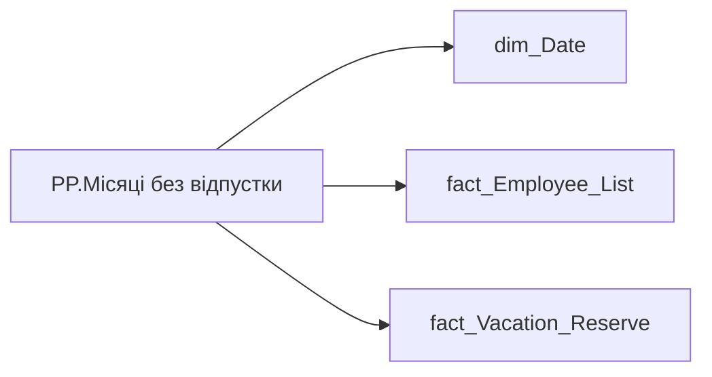

# PP.Місяці без відпустки

*тека `Personal_Profile\Здоров'я та благополуччя` · формат `0;-0;0`*

## Бізнес-суть

IS_MAIN_POSITION → Пріоритетне місце роботи; IS_MAIN_POSITION → is_main_position; no_vacation_duration_months → Лідер за часом без відпустки

1 - Так  <br>0 - Ні Розрахункове поле.  <br>Відібрати EMPLOYEE_ID, де no_vacation_duration_months має найбільше значення та вивести це значення та ПІБ працівника (full_name)  <br>Якщо є кілька співробітників із однаковим значенням місяців без відпустки, то виводити кожного з них. Виводити максимально моюливу кількість записів списком. Якщо не вміщається, поставити в кінці ..., а по наведенню мишки показувати всіх.  <br>Якщо значення в полі відсутнє, то показати текст "Дані відсутні" або знак "-".

**Вимоги:** `Індивідуальний-профіль-працівника/Історія-по-посадам`, `Індивідуальний-профіль-працівника/Історія-по-посадам/Реліз-1.-Історія-по-посадам`, `Індивідуальний-профіль-працівника/Сторінка-Взаємодія-Viva-та-залученість-працівника/Сторінка-Ефективність-працівника/Вітрина-Відвідування-офісів`, `Індивідуальний-профіль-працівника/Сторінка-Загальна-інформація-про-працівника`, `Командний-профіль/Сторінка-Здоров'я-та-благополуччя-команди`, `Командний-профіль/Сторінка-Плинність-та-Exits/ТЗ-на-вітрину-Exits`

## На сторінках звіту

[Personal Profile](../report/personal-profile.md)

## Пов'язані міри

_Прямих зв'язків з іншими мірами немає._

---

## Технічний опис

| Властивість | Значення |
|---|---|
| Тип | міра |
| Home table | _Measures |
| displayFolder | `Personal_Profile\Здоров'я та благополуччя` |
| formatString | `0;-0;0` |
| dataType | — |
| Прихована | ні |

### DAX

```dax
VAR _employee_id = SELECTEDVALUE('fact_Employee_List'[EMPLOYEE_ID])
VAR _main_position = 
	CALCULATE(
		VALUES('fact_Employee_List'[USER_ACCESS_ID]),
		REMOVEFILTERS('fact_Employee_List'),
		'fact_Employee_List'[EMPLOYEE_ID] = _employee_id,
		'fact_Employee_List'[IS_MAIN_POSITION] = 1
	)
VAR _filter0 = TREATAS({_main_position}, 'fact_Vacation_Reserve'[USER_ACCESS_ID])
VAR _res =
CALCULATE(
	LASTNONBLANKVALUE(
		VALUES('dim_Date'[Date]),
		CALCULATE(MAX('fact_Vacation_Reserve'[no_vacation_duration_months]))
	),
	REMOVEFILTERS('fact_Vacation_Reserve'),
	_filter0
)
RETURN _res
```

### Джерела даних

Вихідні таблиці: `DM.vw_R27_fact_Vacation_Reserve_PDP`

Колонки: `Date`, `EMPLOYEE_ID`, `IS_MAIN_POSITION`, `USER_ACCESS_ID`, `no_vacation_duration_months`

Power Query: `dim_Date`

### Залежності (таблиці й колонки)

Таблиці: `dim_Date`, `fact_Employee_List`, `fact_Vacation_Reserve`

Колонки: `dim_Date[Date]`, `fact_Employee_List[EMPLOYEE_ID]`, `fact_Employee_List[IS_MAIN_POSITION]`, `fact_Employee_List[USER_ACCESS_ID]`, `fact_Vacation_Reserve[USER_ACCESS_ID]`, `fact_Vacation_Reserve[no_vacation_duration_months]`

### Схема



## Нотатки

_порожньо_
