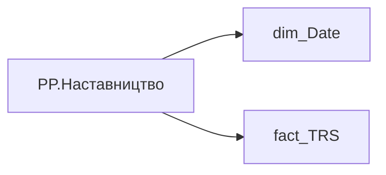

# PP.Наставництво

*тека `Personal_Profile\Viva\Залученість та інша інформація`*

## Технічний опис

| Властивість | Значення |
|---|---|
| Тип | міра |
| Home table | _Measures |
| displayFolder | `Personal_Profile\Viva\Залученість та інша інформація` |
| formatString | — |
| dataType | — |
| Прихована | ні |

### DAX

```dax
VAR __val =
	VAR __End = TODAY()
	VAR __Start = EDATE( __End, -12 )
	VAR __has =
		CALCULATE(
			COUNTROWS(fact_TRS),
			DATESBETWEEN( dim_Date[Date], __Start, __End ),
			fact_TRS[ACCRUAL_TYPES_KEY] = "83ce68c2-8a36-d6d5-21bd-27fc6b970114" 
		)
	RETURN
		IF(
			__has > 0
			, "Так"
			, BLANK( )
		)
RETURN
	IF(
		ISBLANK( __val )
		, BLANK( )
		, __val
	)
```

### Джерела даних

Вихідні таблиці: `DM.vw_R27_fact_TRS_PDP`

Колонки: `ACCRUAL_TYPES_KEY`, `Date`

Power Query: `dim_Date`

### Залежності (таблиці й колонки)

Таблиці: `dim_Date`, `fact_TRS`

Колонки: `dim_Date[Date]`, `fact_TRS[ACCRUAL_TYPES_KEY]`

### Схема



---

## Бізнес-суть

Наставництво

Потрібно відібрати всі записи по працівнику [person_key], періоду [Period], організації [organization_key] , підрозділу [division_key], посаді [position_key], де  поле accrual_types_key = '83ce68c2-8a36-d6d5-21bd-27fc6b970114'   та category_of_accrual_sort  = '3' за останні 12 місяців, НЕ включаючи поточний.

**Вимоги:** `Індивідуальний-профіль-працівника/Паспортна-частина-індивідуального-профілю-співробітника/Бейджики-під-фото-працівника`

## На сторінках звіту

[Personal Profile](../report/personal-profile.md)

## Пов'язані міри

_Прямих зв'язків з іншими мірами немає._

## Нотатки

_порожньо_
