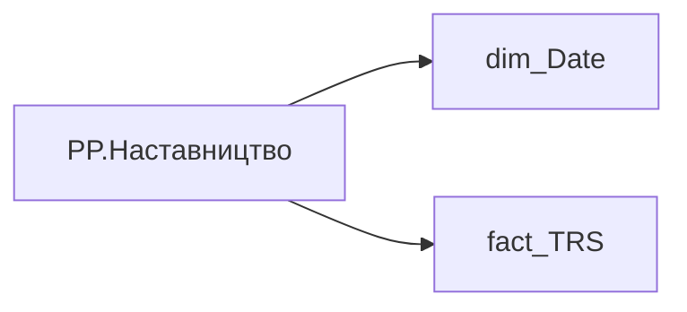

# PP.Наставництво

*тека `Personal_Profile\Viva\Залученість та інша інформація`*

## Технічний опис

| Властивість | Значення |
|---|---|
| Тип | міра |
| Home table | _Measures |
| displayFolder | `Personal_Profile\Viva\Залученість та інша інформація` |
| formatString | — |
| dataType | — |
| Прихована | ні |

### DAX

```dax
VAR __val =
	VAR __End = TODAY()
	VAR __Start = EDATE( __End, -12 )
	VAR __has =
		CALCULATE(
			COUNTROWS(fact_TRS),
			DATESBETWEEN( dim_Date[Date], __Start, __End ),
			fact_TRS[ACCRUAL_TYPES_KEY] = "83ce68c2-8a36-d6d5-21bd-27fc6b970114" 
		)
	RETURN
		IF(
			__has > 0
			, "Так"
			, BLANK( )
		)
RETURN
	IF(
		ISBLANK( __val )
		, BLANK( )
		, __val
	)
```

### Джерела даних

Вихідні таблиці: `DM.vw_R27_fact_TRS_PDP`

Колонки: `ACCRUAL_TYPES_KEY`, `Date`

Power Query: `dim_Date`

### Залежності (таблиці й колонки)

Таблиці: `dim_Date`, `fact_TRS`

Колонки: `dim_Date[Date]`, `fact_TRS[ACCRUAL_TYPES_KEY]`

### Схема



---

## Бізнес-суть

**Бізнес-назва:** Наставництво

### Опис із ТЗ

Потрібно відібрати всі записи по працівнику `person_key`, періоду `Period`, організації `organization_key` , підрозділу `division_key`, посаді `position_key`, де  поле `accrual_types_key` = '83ce68c2-8a36-d6d5-21bd-27fc6b970114'   та `category_of_accrual_sort`  = '3' за останні 12 місяців, НЕ включаючи поточний.

**Вимоги (ТЗ):**

- [Індивідуальний профіль працівника › Паспортна частина індивідуального профілю співробітника › Бейджики під фото працівника](https://dev.azure.com/MHPITDepProjects/People%20Digital%20Profile%20%28PDP%29/_wiki/wikis/PDP.wiki?pagePath=/%D0%A4%D1%83%D0%BD%D0%BA%D1%86%D1%96%D0%BE%D0%BD%D0%B0%D0%BB%D1%8C%D0%BD%D1%96%20%D0%B2%D0%B8%D0%BC%D0%BE%D0%B3%D0%B8/%D0%92%D0%B8%D0%BC%D0%BE%D0%B3%D0%B8%20%D0%B4%D0%BE%20%D0%B7%D0%B2%D1%96%D1%82%D1%83%20People%20Digital%20Profile/%D0%86%D0%BD%D0%B4%D0%B8%D0%B2%D1%96%D0%B4%D1%83%D0%B0%D0%BB%D1%8C%D0%BD%D0%B8%D0%B9%20%D0%BF%D1%80%D0%BE%D1%84%D1%96%D0%BB%D1%8C%20%D0%BF%D1%80%D0%B0%D1%86%D1%96%D0%B2%D0%BD%D0%B8%D0%BA%D0%B0/%D0%9F%D0%B0%D1%81%D0%BF%D0%BE%D1%80%D1%82%D0%BD%D0%B0%20%D1%87%D0%B0%D1%81%D1%82%D0%B8%D0%BD%D0%B0%20%D1%96%D0%BD%D0%B4%D0%B8%D0%B2%D1%96%D0%B4%D1%83%D0%B0%D0%BB%D1%8C%D0%BD%D0%BE%D0%B3%D0%BE%20%D0%BF%D1%80%D0%BE%D1%84%D1%96%D0%BB%D1%8E%20%D1%81%D0%BF%D1%96%D0%B2%D1%80%D0%BE%D0%B1%D1%96%D1%82%D0%BD%D0%B8%D0%BA%D0%B0/%D0%91%D0%B5%D0%B9%D0%B4%D0%B6%D0%B8%D0%BA%D0%B8%20%D0%BF%D1%96%D0%B4%20%D1%84%D0%BE%D1%82%D0%BE%20%D0%BF%D1%80%D0%B0%D1%86%D1%96%D0%B2%D0%BD%D0%B8%D0%BA%D0%B0)

## На сторінках звіту

[Personal Profile](../report/personal-profile.md)

## Пов'язані міри

_Прямих зв'язків з іншими мірами немає._

## Нотатки

_порожньо_
