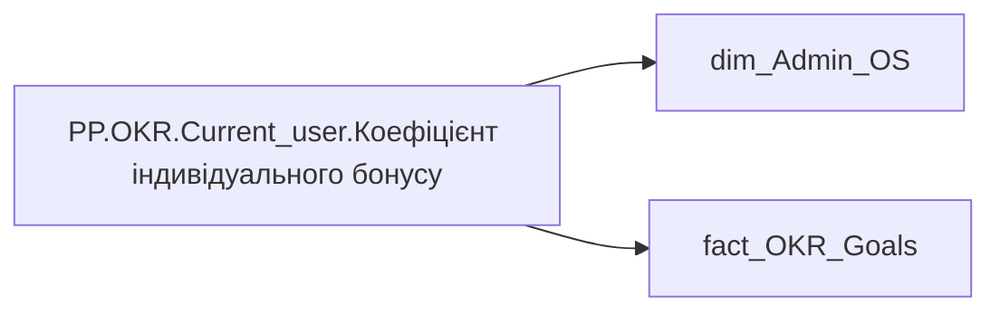

# PP.OKR.Current_user.Коефіцієнт індивідуального бонусу

*тека `Personal_Profile\Результативність та оцінка\OKR`*

!!! abstract "Джерела даних"
    `DM.R27_fact_OKR_Goals`, `DM.vw_R27_dim_Employee_Access_List`

## Бізнес-суть

Ind_Bonus_Rate → Коефіцієнт індивідуального бонусу; Ind_Bonus_Rate → Коефіцієнт індивідуального бонусу ОКР; Ind_Bonus_Rate → Значення коефіцієнта індивідуального бонусу за останній період; Ind_Bonus_Rate → Значення коефіцієнта індивідуального бонусу за передостанній період; Ind_Bonus_Rate → Тренд оцінки OKR

Останнє НЕ пусте актуальне значення на дату (date) поточного запису Тренд оцінки ОКР визначається порівнянням коефіцієнту індивідуального бонусу за останні два періоди.  <br>Якщо Ind_Bonus_Rate за останній рік [OKR_Last_Year_Rate] дорівнює Ind_Bonus_Rate за попередній рік [OKR_Prev_Year_Rate], то Стабільний  <br>Якщо Ind_Bonus_Rate за останній рік [OKR_Last_Year_Rate]  більше ніж Ind_Bonus_Rate за попередній рік [OKR_Prev_Year_Rate], то Зростання  <br>Якщо Ind_Bonus_Rate за останній рік [OKR_Last_Year_Rate] менше ніж Ind_Bonus_Rate за попередній рік [OKR_Prev_Year_Rate], то Спадання. Якщо у пр

**Вимоги:** `Індивідуальний-профіль-працівника/Історія-по-посадам`, `Індивідуальний-профіль-працівника/Історія-по-посадам/Реліз-1.-Історія-по-посадам`, `Індивідуальний-профіль-працівника/Паспортна-частина-індивідуального-профілю-співробітника`, `Індивідуальний-профіль-працівника/Паспортна-частина-індивідуального-профілю-співробітника/Сторінка-Картка-(паспорт)-працівника/Редизайн-паспортної-частини`, `Індивідуальний-профіль-працівника/Сторінка-Результативність-та-оцінка`, `Допоміжні-вітрини-для-звіту/Таблиця-для-розрахунку-агрегованих-метрик-по-звіту`, `Командний-профіль/Паспортна-частина-групового-профілю/Редизайн-паспортної-частини-групового-профілю`, `Командний-профіль/Сторінка-Моя-команда/ТЗ.-Деталізація-метрик-групового-профілю-звіту`, `Командний-профіль/Сторінка-Результативність-та-оцінка-команди/Створити-блок-Виконання-OKR`

## На сторінках звіту

_Не використовується на основних сторінках звіту._

## Пов'язані міри

**Використовується в:** [PP.SVG.OKR.Загальна оцінка](../measures/pp-svg-okr-zahalna-otsinka.md)

---

## Технічний опис

| Властивість | Значення |
|---|---|
| Тип | міра |
| Home table | _Measures |
| displayFolder | `Personal_Profile\Результативність та оцінка\OKR` |
| formatString | — |
| dataType | — |
| Прихована | ні |

### DAX

```dax
VAR _employee_id = SELECTEDVALUE('dim_Admin_OS'[EMPLOYEE_ID])
VAR _main_position = 
	CALCULATE(
		VALUES('fact_OKR_Goals'[USER_ACCESS_ID]),
		REMOVEFILTERS('fact_OKR_Goals'),
		'fact_OKR_Goals'[EMPLOYEE_ID] = _employee_id
	)
VAR _filter0 = TREATAS({_main_position}, 'fact_OKR_Goals'[USER_ACCESS_ID])
VAR _res = 
	CALCULATE(
		AVERAGE('fact_OKR_Goals'[Ind_Bonus_Rate]),
		_filter0
	)
RETURN _res
```

### Джерела даних

Вихідні таблиці: `DM.R27_fact_OKR_Goals`, `DM.vw_R27_dim_Employee_Access_List`

Колонки: `EMPLOYEE_ID`, `Ind_Bonus_Rate`, `USER_ACCESS_ID`

Power Query: `dim_Admin_OS`

### Залежності (таблиці й колонки)

Таблиці: `dim_Admin_OS`, `fact_OKR_Goals`

Колонки: `dim_Admin_OS[EMPLOYEE_ID]`, `fact_OKR_Goals[EMPLOYEE_ID]`, `fact_OKR_Goals[Ind_Bonus_Rate]`, `fact_OKR_Goals[USER_ACCESS_ID]`

### Схема



## Нотатки

_порожньо_
