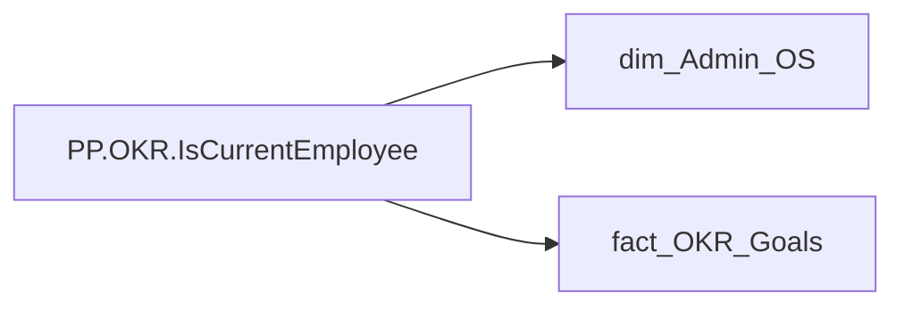

# PP.OKR.IsCurrentEmployee

| Властивість | Значення |
|---|---|
| Тип | міра |
| Home table | _Measures |
| displayFolder | `Personal_Profile\Результативність та оцінка\OKR` |
| formatString | `0` |
| dataType | — |
| Прихована | ні |

## DAX

```dax
VAR _current = SELECTEDVALUE('dim_Admin_OS'[EMPLOYEE_ID])
RETURN
    IF(
        CALCULATE(
            COUNTROWS('fact_OKR_Goals'),
            TREATAS({_current}, 'fact_OKR_Goals'[EMPLOYEE_ID])
        ) > 0,
        1
    )
```

## Джерела

Вихідні таблиці: `DM.R27_fact_OKR_Goals`, `DM.vw_R27_dim_Employee_Access_List`

Колонки: `EMPLOYEE_ID`

Power Query: `dim_Admin_OS`

## Бізнес-суть

!!! warning "Без бізнес-визначення"
    Поля міри не знайдено у wiki «Таблицях джерел даних». Заповніть `manualNotes`.

## Залежності

Таблиці: `dim_Admin_OS`, `fact_OKR_Goals`

Колонки: `dim_Admin_OS[EMPLOYEE_ID]`, `fact_OKR_Goals[EMPLOYEE_ID]`

## Схема



## Нотатки

_порожньо_
