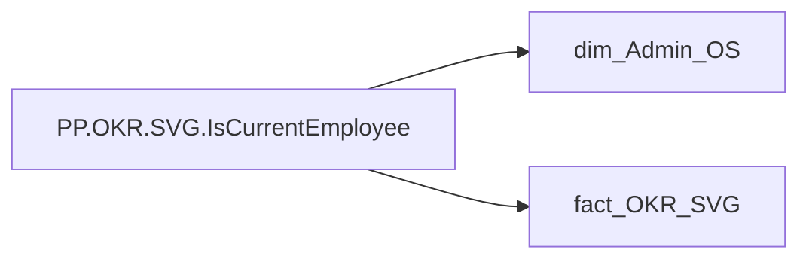

# PP.OKR.SVG.IsCurrentEmployee

*тека `Personal_Profile\Результативність та оцінка\OKR` · формат `0`*

## Технічний опис

| Властивість | Значення |
|---|---|
| Тип | міра |
| Home table | _Measures |
| displayFolder | `Personal_Profile\Результативність та оцінка\OKR` |
| formatString | `0` |
| dataType | — |
| Прихована | ні |

### DAX

```dax
VAR _current = SELECTEDVALUE('dim_Admin_OS'[EMPLOYEE_ID])
RETURN
    IF(
        CALCULATE(
            COUNTROWS('fact_OKR_SVG'),
            TREATAS({_current}, 'fact_OKR_SVG'[EMPLOYEE_ID])
        ) > 0,
        1
    )
```

### Джерела даних

Вихідні таблиці: `DM.vw_R27_dim_Employee_Access_List`

Колонки: `EMPLOYEE_ID`

Power Query: `dim_Admin_OS`

### Залежності (таблиці й колонки)

Таблиці: `dim_Admin_OS`, `fact_OKR_SVG`

Колонки: `dim_Admin_OS[EMPLOYEE_ID]`, `fact_OKR_SVG[EMPLOYEE_ID]`

### Схема



---

## Бізнес-суть

!!! note "Бізнес-визначення відсутнє"
    Поля міри не зіставлено з wiki «Таблицями джерел даних». Можна заповнити вручну в `manualNotes`.

## На сторінках звіту

_Не використовується на основних сторінках звіту._

## Пов'язані міри

_Прямих зв'язків з іншими мірами немає._

## Нотатки

_порожньо_
