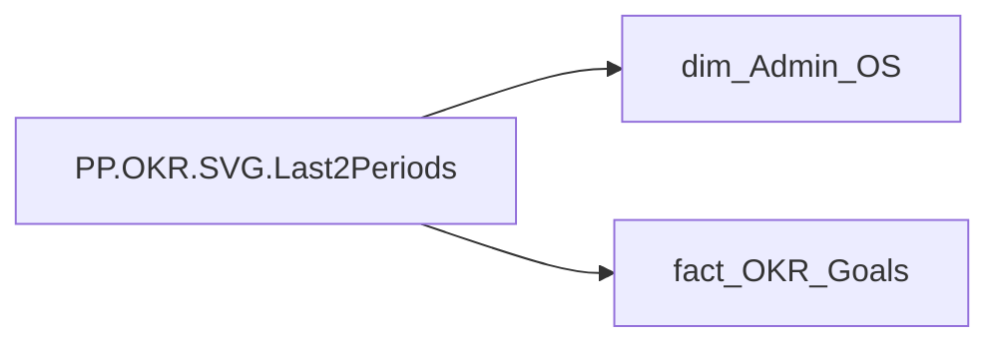

# PP.OKR.SVG.Last2Periods

*тека `Personal_Profile\Паспорт\OKR`*

## Технічний опис

| Властивість | Значення |
|---|---|
| Тип | міра |
| Home table | _Measures |
| displayFolder | `Personal_Profile\Паспорт\OKR` |
| formatString | — |
| dataType | — |
| Прихована | ні |

### DAX

```dax
VAR _fontFamily = "Segoe UI"
VAR _employee_id = SELECTEDVALUE('dim_Admin_OS'[EMPLOYEE_ID])

// ─── Дані ───
// Значення стовпця (висота + підпис) = Calc_Performance_Str_Rate (оцінка).
// Бонус (Ind_Bonus_Rate) не використовується. Вікно — останні 2 РОКИ;
// усередині року окремий стовпець на кожну унікальну оцінку (без усереднення).

// 1) Грань періодів співробітника: рік × оцінка. SUMMARIZE — лише наявні комбінації.
VAR _periodsAll =
	CALCULATETABLE(
		SUMMARIZE(
			'fact_OKR_Goals',
			'fact_OKR_Goals'[PLAN_YEAR],
			'fact_OKR_Goals'[Calc_Performance_Str_Rate]
		),
		'fact_OKR_Goals'[EMPLOYEE_ID] = _employee_id
	)

// 2) Числове значення оцінки + категорія (колір) на грань періоду.
//    @value: оцінка — це сама групувальна колонка рядка; VALUE() → число,
//            IFERROR відсікає порожні/нечислові у BLANK.
//    @cat:   EMPLOYEE_ID повторюється, бо context transition переносить у фільтр
//            лише рік + оцінку, не EMPLOYEE_ID.
VAR _periodsData =
	ADDCOLUMNS(
		_periodsAll,
		"@value", IFERROR(VALUE('fact_OKR_Goals'[Calc_Performance_Str_Rate]), BLANK()),
		"@cat",
			CALCULATE(
				SELECTEDVALUE('fact_OKR_Goals'[Calc_Performance_Desc_Rate]),
				'fact_OKR_Goals'[EMPLOYEE_ID] = _employee_id
			)
	)

// 3) Лише періоди з валідною оцінкою
VAR _periodsNonBlank = FILTER(_periodsData, NOT ISBLANK([@value]))

// 4) Останні 2 РОКИ серед наявних (відбір по роках, не по оцінках).
//    Роки унікальні → у TOPN ничиї немає → рівно 2 роки.
VAR _last2Years =
	TOPN(
		2,
		DISTINCT(SELECTCOLUMNS(_periodsNonBlank, "@y", 'fact_OKR_Goals'[PLAN_YEAR])),
		[@y],
		DESC
	)

// 5) Усі періоди цих 2 років
VAR _scoped =
	FILTER(
		_periodsNonBlank,
		'fact_OKR_Goals'[PLAN_YEAR] IN _last2Years
	)

// 6) Композитний індекс позиції стовпця: ключ "рік|оцінка".
//    Рік уже не унікальний → RANKX лише за роком накладав би стовпці.
//    Порядок усередині року довільний; між роками — старіший лівіше.
VAR _data =
	ADDCOLUMNS(
		_scoped,
		"@i",
			RANKX(
				_scoped,
				FORMAT('fact_OKR_Goals'[PLAN_YEAR], "0000") & "|" & 'fact_OKR_Goals'[Calc_Performance_Str_Rate],
				,
				ASC,
				Dense
			) - 1
	)

VAR _maxScore = MAXX(_data, [@value])
VAR _MaxValue = MAX(_maxScore, 100)

VAR _W = 100
VAR _H = 80
VAR _MarginX = 10
VAR _BarCount = COUNTROWS(_data)
VAR _Avail = _W - 2 * _MarginX
VAR _ColWidth = DIVIDE(_Avail, MAX(_BarCount, 1))
VAR _BarWidth = MIN(14, _ColWidth * 0.58)
VAR _StartX = _MarginX + (_Avail - _ColWidth * _BarCount) / 2
VAR _Rx = _BarWidth / 2
VAR _ValueY = 9
VAR _BarTop = 19
VAR _BarBot = 67
VAR _BarMaxH = _BarBot - _BarTop
VAR _YearY = 76

VAR _Cols = CONCATENATEX(
	_data,
	VAR _val = [@value]
	VAR _cat = [@cat]
	VAR _yr  = 'fact_OKR_Goals'[PLAN_YEAR]
	VAR _fill = SWITCH(_cat,
		"Супер зелений", "#009051",
		"Суперзелений",  "#009051",
		"Зелений",       "#02BD3D",
		"Жовто-зелений", "#A6CE39",
		"Жовтий",        "#FFE521",
		"Жовто-червоний","#FF7E0D",
		"Червоний",      "#F23711",
		"#A0AEC0"
	)
	VAR _x  = _StartX + [@i] * _ColWidth
	VAR _cx = _x + (_ColWidth / 2)
	VAR _bx = _cx - (_BarWidth / 2)
	VAR _h  = MIN(DIVIDE(_val, _MaxValue, 0), 1) * _BarMaxH
	VAR _y  = _BarBot - _h
	VAR _valueLabel =
		"<text x='" & _cx & "' y='" & _ValueY & "' text-anchor='middle' style='font-family:" & _fontFamily & "; font-size:6px; fill:" & _fill & "; font-weight:700;'>" &
			SUBSTITUTE(FORMAT(_val, "0.0"), ".", ",") &
		"</text>"
	VAR _bar =
		"<rect x='" & FORMAT(_bx, "0.0") & "' y='" & FORMAT(_y, "0.0") & "' width='" & FORMAT(_BarWidth, "0.0") & "' height='" & FORMAT(_h, "0.0") & "' rx='" & FORMAT(_Rx, "0.0") & "' fill='" & _fill & "'/>"
	VAR _yearLabel =
		"<text x='" & _cx & "' y='" & _YearY & "' text-anchor='middle' style='font-family:" & _fontFamily & "; font-size:4.5px; fill:#94A3B8; font-weight:500;'>" &
			FORMAT(_yr, "0") &
		"</text>"
	RETURN _valueLabel & _bar & _yearLabel,
	"",
	[@i], ASC
)

VAR _Empty =
	"<text x='" & _W/2 & "' y='" & _H/2 & "' text-anchor='middle' style='font-family:" & _fontFamily & "; font-size:11px; fill:#A0AEC0; font-style:italic;'>Дані відсутні</text>"

VAR _Body = IF(_BarCount = 0, _Empty, _Cols)

VAR _SVG =
	"<div style='width:100%;height:100%;overflow:hidden;display:flex;align-items:center;justify-content:center;'><svg xmlns='http://www.w3.org/2000/svg' viewBox='0 0 " & _W & " " & _H & "' preserveAspectRatio='xMidYMid meet' overflow='hidden' style='display:block; max-width:100%; max-height:100%; overflow:hidden;'>" &
		_Body &
	"</svg></div>"

RETURN  _SVG
```

### Джерела даних

Вихідні таблиці: `DM.R27_fact_OKR_Goals`, `DM.vw_R27_dim_Employee_Access_List`

Колонки: `Calc_Performance_Desc_Rate`, `Calc_Performance_Str_Rate`, `EMPLOYEE_ID`, `PLAN_YEAR`

Power Query: `dim_Admin_OS`

### Залежності (таблиці й колонки)

Таблиці: `dim_Admin_OS`, `fact_OKR_Goals`

Колонки: `dim_Admin_OS[EMPLOYEE_ID]`, `fact_OKR_Goals[Calc_Performance_Desc_Rate]`, `fact_OKR_Goals[Calc_Performance_Str_Rate]`, `fact_OKR_Goals[EMPLOYEE_ID]`, `fact_OKR_Goals[PLAN_YEAR]`

### Схема



---

## Бізнес-суть

### Опис із ТЗ

Останнє НЕ пусте актуальне значення на дату (date) поточного запису

Якщо поле `Calc_Performance_Desc_Rate` має значення Супер зелений, або Жовто-зелений, або Зелений, або Жовтий, або Жовто-червоний

Якщо поле `Calc_Performance_Desc_Rate` має значення Червоний

Останнє доступне значення станом на дату поточного запису, релевантне відповідній оцінці результативності.

Значення останнього року оцінки ОКР визначати в залежності від того, які дані доступні на поточний момент. Наприклад, протягом 2025 року в оцінку брати коефіцієнт індивідуального бонусу працівника за 2023-2024 роки, бо за 2025 рік оцінки ще немає. Тому останній рік буде 2024. На початку 2026 року, коли з'являться результати оцінки ОКР за 2025 рік, потрібно буде змістити період і брати 2025 рік.      Для того, що визначити період (рік), за який виставлено індивідуальний бонус, потрібно:   1. Із таблиці dwh.`t_sf_okr_objective_monitor` потрібно визначити `Form_template_ID` по ключу `Form_Employee_ID`.   2. Піти в таблицю dwh.`dim_SF_Form_Template` та використати `Form_template_ID`, щоб знайти значення `Parent_ID`.   3. На основі `Parent_ID` визначити значення ID і взяти поле `Plan_Year`.  Запит для визначення року ОКР select fe.* from `DWH`.`dim_sf_form_template` ft join dwh.`t_SF_Form_Employee` fe on fe.`form_template_id` = ft.id left join `DWH`.`dim_sf_form_template` fow on fow.id = fe.`form_template_owner_id` where ft.`Form_Type_Code` in ('`OKR_MONITORING`')  and fow.Code = 'OKR_ЗА_2024_РІК'

??? note "Поля-джерела та пов'язані бізнес-метрики (15)"
    | Поле | Бізнес-метрики |
    |---|---|
    | `Calc_Performance_Desc_Rate` | Колірна оцінка ОКР · Загальна колірна оцінка ОКР · Загальна колірна оцінка OKR · Ціль виконана · Ціль не виконана · Колірна оцінка OKR за останній період · Колірна оцінка OKR за передостанній період · Загальний колір ОКР · Колірна оцінка OKR |
    | `Calc_Performance_Str_Rate` | Загальна оцінка ОКР · Загальна оцінка OKR · Оцінка OKR |
    | `PLAN_YEAR` | Рік ОКР · Значення останнього року оцінки ОКР · Значення передостаннього  року оцінки ОКР |

**Вимоги (ТЗ):**

- [Індивідуальний профіль працівника › Історія по посадам](https://dev.azure.com/MHPITDepProjects/People%20Digital%20Profile%20%28PDP%29/_wiki/wikis/PDP.wiki?pagePath=/%D0%A4%D1%83%D0%BD%D0%BA%D1%86%D1%96%D0%BE%D0%BD%D0%B0%D0%BB%D1%8C%D0%BD%D1%96%20%D0%B2%D0%B8%D0%BC%D0%BE%D0%B3%D0%B8/%D0%92%D0%B8%D0%BC%D0%BE%D0%B3%D0%B8%20%D0%B4%D0%BE%20%D0%B7%D0%B2%D1%96%D1%82%D1%83%20People%20Digital%20Profile/%D0%86%D0%BD%D0%B4%D0%B8%D0%B2%D1%96%D0%B4%D1%83%D0%B0%D0%BB%D1%8C%D0%BD%D0%B8%D0%B9%20%D0%BF%D1%80%D0%BE%D1%84%D1%96%D0%BB%D1%8C%20%D0%BF%D1%80%D0%B0%D1%86%D1%96%D0%B2%D0%BD%D0%B8%D0%BA%D0%B0/%D0%86%D1%81%D1%82%D0%BE%D1%80%D1%96%D1%8F%20%D0%BF%D0%BE%20%D0%BF%D0%BE%D1%81%D0%B0%D0%B4%D0%B0%D0%BC)
- [Індивідуальний профіль працівника › Історія по посадам › Реліз 1. Історія по посадам](https://dev.azure.com/MHPITDepProjects/People%20Digital%20Profile%20%28PDP%29/_wiki/wikis/PDP.wiki?pagePath=/%D0%A4%D1%83%D0%BD%D0%BA%D1%86%D1%96%D0%BE%D0%BD%D0%B0%D0%BB%D1%8C%D0%BD%D1%96%20%D0%B2%D0%B8%D0%BC%D0%BE%D0%B3%D0%B8/%D0%92%D0%B8%D0%BC%D0%BE%D0%B3%D0%B8%20%D0%B4%D0%BE%20%D0%B7%D0%B2%D1%96%D1%82%D1%83%20People%20Digital%20Profile/%D0%86%D0%BD%D0%B4%D0%B8%D0%B2%D1%96%D0%B4%D1%83%D0%B0%D0%BB%D1%8C%D0%BD%D0%B8%D0%B9%20%D0%BF%D1%80%D0%BE%D1%84%D1%96%D0%BB%D1%8C%20%D0%BF%D1%80%D0%B0%D1%86%D1%96%D0%B2%D0%BD%D0%B8%D0%BA%D0%B0/%D0%86%D1%81%D1%82%D0%BE%D1%80%D1%96%D1%8F%20%D0%BF%D0%BE%20%D0%BF%D0%BE%D1%81%D0%B0%D0%B4%D0%B0%D0%BC/%D0%A0%D0%B5%D0%BB%D1%96%D0%B7%201.%20%D0%86%D1%81%D1%82%D0%BE%D1%80%D1%96%D1%8F%20%D0%BF%D0%BE%20%D0%BF%D0%BE%D1%81%D0%B0%D0%B4%D0%B0%D0%BC)
- [Індивідуальний профіль працівника › Паспортна частина індивідуального профілю співробітника](https://dev.azure.com/MHPITDepProjects/People%20Digital%20Profile%20%28PDP%29/_wiki/wikis/PDP.wiki?pagePath=/%D0%A4%D1%83%D0%BD%D0%BA%D1%86%D1%96%D0%BE%D0%BD%D0%B0%D0%BB%D1%8C%D0%BD%D1%96%20%D0%B2%D0%B8%D0%BC%D0%BE%D0%B3%D0%B8/%D0%92%D0%B8%D0%BC%D0%BE%D0%B3%D0%B8%20%D0%B4%D0%BE%20%D0%B7%D0%B2%D1%96%D1%82%D1%83%20People%20Digital%20Profile/%D0%86%D0%BD%D0%B4%D0%B8%D0%B2%D1%96%D0%B4%D1%83%D0%B0%D0%BB%D1%8C%D0%BD%D0%B8%D0%B9%20%D0%BF%D1%80%D0%BE%D1%84%D1%96%D0%BB%D1%8C%20%D0%BF%D1%80%D0%B0%D1%86%D1%96%D0%B2%D0%BD%D0%B8%D0%BA%D0%B0/%D0%9F%D0%B0%D1%81%D0%BF%D0%BE%D1%80%D1%82%D0%BD%D0%B0%20%D1%87%D0%B0%D1%81%D1%82%D0%B8%D0%BD%D0%B0%20%D1%96%D0%BD%D0%B4%D0%B8%D0%B2%D1%96%D0%B4%D1%83%D0%B0%D0%BB%D1%8C%D0%BD%D0%BE%D0%B3%D0%BE%20%D0%BF%D1%80%D0%BE%D1%84%D1%96%D0%BB%D1%8E%20%D1%81%D0%BF%D1%96%D0%B2%D1%80%D0%BE%D0%B1%D1%96%D1%82%D0%BD%D0%B8%D0%BA%D0%B0)
- [Індивідуальний профіль працівника › Паспортна частина індивідуального профілю співробітника › Сторінка Картка (паспорт) працівника › Редизайн паспортної частини](https://dev.azure.com/MHPITDepProjects/People%20Digital%20Profile%20%28PDP%29/_wiki/wikis/PDP.wiki?pagePath=/%D0%A4%D1%83%D0%BD%D0%BA%D1%86%D1%96%D0%BE%D0%BD%D0%B0%D0%BB%D1%8C%D0%BD%D1%96%20%D0%B2%D0%B8%D0%BC%D0%BE%D0%B3%D0%B8/%D0%92%D0%B8%D0%BC%D0%BE%D0%B3%D0%B8%20%D0%B4%D0%BE%20%D0%B7%D0%B2%D1%96%D1%82%D1%83%20People%20Digital%20Profile/%D0%86%D0%BD%D0%B4%D0%B8%D0%B2%D1%96%D0%B4%D1%83%D0%B0%D0%BB%D1%8C%D0%BD%D0%B8%D0%B9%20%D0%BF%D1%80%D0%BE%D1%84%D1%96%D0%BB%D1%8C%20%D0%BF%D1%80%D0%B0%D1%86%D1%96%D0%B2%D0%BD%D0%B8%D0%BA%D0%B0/%D0%9F%D0%B0%D1%81%D0%BF%D0%BE%D1%80%D1%82%D0%BD%D0%B0%20%D1%87%D0%B0%D1%81%D1%82%D0%B8%D0%BD%D0%B0%20%D1%96%D0%BD%D0%B4%D0%B8%D0%B2%D1%96%D0%B4%D1%83%D0%B0%D0%BB%D1%8C%D0%BD%D0%BE%D0%B3%D0%BE%20%D0%BF%D1%80%D0%BE%D1%84%D1%96%D0%BB%D1%8E%20%D1%81%D0%BF%D1%96%D0%B2%D1%80%D0%BE%D0%B1%D1%96%D1%82%D0%BD%D0%B8%D0%BA%D0%B0/%D0%A1%D1%82%D0%BE%D1%80%D1%96%D0%BD%D0%BA%D0%B0%20%D0%9A%D0%B0%D1%80%D1%82%D0%BA%D0%B0%20%28%D0%BF%D0%B0%D1%81%D0%BF%D0%BE%D1%80%D1%82%29%20%D0%BF%D1%80%D0%B0%D1%86%D1%96%D0%B2%D0%BD%D0%B8%D0%BA%D0%B0/%D0%A0%D0%B5%D0%B4%D0%B8%D0%B7%D0%B0%D0%B9%D0%BD%20%D0%BF%D0%B0%D1%81%D0%BF%D0%BE%D1%80%D1%82%D0%BD%D0%BE%D1%97%20%D1%87%D0%B0%D1%81%D1%82%D0%B8%D0%BD%D0%B8)
- [Індивідуальний профіль працівника › Сторінка Результативність та оцінка](https://dev.azure.com/MHPITDepProjects/People%20Digital%20Profile%20%28PDP%29/_wiki/wikis/PDP.wiki?pagePath=/%D0%A4%D1%83%D0%BD%D0%BA%D1%86%D1%96%D0%BE%D0%BD%D0%B0%D0%BB%D1%8C%D0%BD%D1%96%20%D0%B2%D0%B8%D0%BC%D0%BE%D0%B3%D0%B8/%D0%92%D0%B8%D0%BC%D0%BE%D0%B3%D0%B8%20%D0%B4%D0%BE%20%D0%B7%D0%B2%D1%96%D1%82%D1%83%20People%20Digital%20Profile/%D0%86%D0%BD%D0%B4%D0%B8%D0%B2%D1%96%D0%B4%D1%83%D0%B0%D0%BB%D1%8C%D0%BD%D0%B8%D0%B9%20%D0%BF%D1%80%D0%BE%D1%84%D1%96%D0%BB%D1%8C%20%D0%BF%D1%80%D0%B0%D1%86%D1%96%D0%B2%D0%BD%D0%B8%D0%BA%D0%B0/%D0%A1%D1%82%D0%BE%D1%80%D1%96%D0%BD%D0%BA%D0%B0%20%D0%A0%D0%B5%D0%B7%D1%83%D0%BB%D1%8C%D1%82%D0%B0%D1%82%D0%B8%D0%B2%D0%BD%D1%96%D1%81%D1%82%D1%8C%20%D1%82%D0%B0%20%D0%BE%D1%86%D1%96%D0%BD%D0%BA%D0%B0)
- [Допоміжні вітрини для звіту › Таблиця для розрахунку агрегованих метрик по звіту](https://dev.azure.com/MHPITDepProjects/People%20Digital%20Profile%20%28PDP%29/_wiki/wikis/PDP.wiki?pagePath=/%D0%A4%D1%83%D0%BD%D0%BA%D1%86%D1%96%D0%BE%D0%BD%D0%B0%D0%BB%D1%8C%D0%BD%D1%96%20%D0%B2%D0%B8%D0%BC%D0%BE%D0%B3%D0%B8/%D0%92%D0%B8%D0%BC%D0%BE%D0%B3%D0%B8%20%D0%B4%D0%BE%20%D0%B7%D0%B2%D1%96%D1%82%D1%83%20People%20Digital%20Profile/%D0%94%D0%BE%D0%BF%D0%BE%D0%BC%D1%96%D0%B6%D0%BD%D1%96%20%D0%B2%D1%96%D1%82%D1%80%D0%B8%D0%BD%D0%B8%20%D0%B4%D0%BB%D1%8F%20%D0%B7%D0%B2%D1%96%D1%82%D1%83/%D0%A2%D0%B0%D0%B1%D0%BB%D0%B8%D1%86%D1%8F%20%D0%B4%D0%BB%D1%8F%20%D1%80%D0%BE%D0%B7%D1%80%D0%B0%D1%85%D1%83%D0%BD%D0%BA%D1%83%20%D0%B0%D0%B3%D1%80%D0%B5%D0%B3%D0%BE%D0%B2%D0%B0%D0%BD%D0%B8%D1%85%20%D0%BC%D0%B5%D1%82%D1%80%D0%B8%D0%BA%20%D0%BF%D0%BE%20%D0%B7%D0%B2%D1%96%D1%82%D1%83)
- [Командний профіль › Паспортна частина групового профілю › Редизайн паспортної частини групового профілю](https://dev.azure.com/MHPITDepProjects/People%20Digital%20Profile%20%28PDP%29/_wiki/wikis/PDP.wiki?pagePath=/%D0%A4%D1%83%D0%BD%D0%BA%D1%86%D1%96%D0%BE%D0%BD%D0%B0%D0%BB%D1%8C%D0%BD%D1%96%20%D0%B2%D0%B8%D0%BC%D0%BE%D0%B3%D0%B8/%D0%92%D0%B8%D0%BC%D0%BE%D0%B3%D0%B8%20%D0%B4%D0%BE%20%D0%B7%D0%B2%D1%96%D1%82%D1%83%20People%20Digital%20Profile/%D0%9A%D0%BE%D0%BC%D0%B0%D0%BD%D0%B4%D0%BD%D0%B8%D0%B9%20%D0%BF%D1%80%D0%BE%D1%84%D1%96%D0%BB%D1%8C/%D0%9F%D0%B0%D1%81%D0%BF%D0%BE%D1%80%D1%82%D0%BD%D0%B0%20%D1%87%D0%B0%D1%81%D1%82%D0%B8%D0%BD%D0%B0%20%D0%B3%D1%80%D1%83%D0%BF%D0%BE%D0%B2%D0%BE%D0%B3%D0%BE%20%D0%BF%D1%80%D0%BE%D1%84%D1%96%D0%BB%D1%8E/%D0%A0%D0%B5%D0%B4%D0%B8%D0%B7%D0%B0%D0%B9%D0%BD%20%D0%BF%D0%B0%D1%81%D0%BF%D0%BE%D1%80%D1%82%D0%BD%D0%BE%D1%97%20%D1%87%D0%B0%D1%81%D1%82%D0%B8%D0%BD%D0%B8%20%D0%B3%D1%80%D1%83%D0%BF%D0%BE%D0%B2%D0%BE%D0%B3%D0%BE%20%D0%BF%D1%80%D0%BE%D1%84%D1%96%D0%BB%D1%8E)
- [Командний профіль › Сторінка Моя команда › ТЗ. Деталізація метрик групового профілю звіту](https://dev.azure.com/MHPITDepProjects/People%20Digital%20Profile%20%28PDP%29/_wiki/wikis/PDP.wiki?pagePath=/%D0%A4%D1%83%D0%BD%D0%BA%D1%86%D1%96%D0%BE%D0%BD%D0%B0%D0%BB%D1%8C%D0%BD%D1%96%20%D0%B2%D0%B8%D0%BC%D0%BE%D0%B3%D0%B8/%D0%92%D0%B8%D0%BC%D0%BE%D0%B3%D0%B8%20%D0%B4%D0%BE%20%D0%B7%D0%B2%D1%96%D1%82%D1%83%20People%20Digital%20Profile/%D0%9A%D0%BE%D0%BC%D0%B0%D0%BD%D0%B4%D0%BD%D0%B8%D0%B9%20%D0%BF%D1%80%D0%BE%D1%84%D1%96%D0%BB%D1%8C/%D0%A1%D1%82%D0%BE%D1%80%D1%96%D0%BD%D0%BA%D0%B0%20%D0%9C%D0%BE%D1%8F%20%D0%BA%D0%BE%D0%BC%D0%B0%D0%BD%D0%B4%D0%B0/%D0%A2%D0%97.%20%D0%94%D0%B5%D1%82%D0%B0%D0%BB%D1%96%D0%B7%D0%B0%D1%86%D1%96%D1%8F%20%D0%BC%D0%B5%D1%82%D1%80%D0%B8%D0%BA%20%D0%B3%D1%80%D1%83%D0%BF%D0%BE%D0%B2%D0%BE%D0%B3%D0%BE%20%D0%BF%D1%80%D0%BE%D1%84%D1%96%D0%BB%D1%8E%20%D0%B7%D0%B2%D1%96%D1%82%D1%83)
- [Командний профіль › Сторінка Результативність та оцінка команди › Створити блок Виконання OKR](https://dev.azure.com/MHPITDepProjects/People%20Digital%20Profile%20%28PDP%29/_wiki/wikis/PDP.wiki?pagePath=/%D0%A4%D1%83%D0%BD%D0%BA%D1%86%D1%96%D0%BE%D0%BD%D0%B0%D0%BB%D1%8C%D0%BD%D1%96%20%D0%B2%D0%B8%D0%BC%D0%BE%D0%B3%D0%B8/%D0%92%D0%B8%D0%BC%D0%BE%D0%B3%D0%B8%20%D0%B4%D0%BE%20%D0%B7%D0%B2%D1%96%D1%82%D1%83%20People%20Digital%20Profile/%D0%9A%D0%BE%D0%BC%D0%B0%D0%BD%D0%B4%D0%BD%D0%B8%D0%B9%20%D0%BF%D1%80%D0%BE%D1%84%D1%96%D0%BB%D1%8C/%D0%A1%D1%82%D0%BE%D1%80%D1%96%D0%BD%D0%BA%D0%B0%20%D0%A0%D0%B5%D0%B7%D1%83%D0%BB%D1%8C%D1%82%D0%B0%D1%82%D0%B8%D0%B2%D0%BD%D1%96%D1%81%D1%82%D1%8C%20%D1%82%D0%B0%20%D0%BE%D1%86%D1%96%D0%BD%D0%BA%D0%B0%20%D0%BA%D0%BE%D0%BC%D0%B0%D0%BD%D0%B4%D0%B8/%D0%A1%D1%82%D0%B2%D0%BE%D1%80%D0%B8%D1%82%D0%B8%20%D0%B1%D0%BB%D0%BE%D0%BA%20%D0%92%D0%B8%D0%BA%D0%BE%D0%BD%D0%B0%D0%BD%D0%BD%D1%8F%20OKR)

## На сторінках звіту

[Personal Profile](../report/personal-profile.md)

## Пов'язані міри

_Прямих зв'язків з іншими мірами немає._

## Нотатки

_порожньо_
