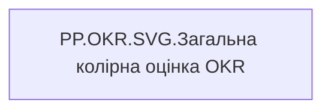

# PP.OKR.SVG.Загальна колірна оцінка OKR

*тека `Personal_Profile\Результативність та оцінка\OKR`*

## Технічний опис

| Властивість | Значення |
|---|---|
| Тип | міра |
| Home table | _Measures |
| displayFolder | `Personal_Profile\Результативність та оцінка\OKR` |
| formatString | — |
| dataType | — |
| Прихована | ні |

### DAX

```dax
VAR _fontFamily = "Segoe UI"
VAR _MaxValue = 100

VAR _Value = [PP.OKR.Current_user.Загальна  оцінка OKR]
VAR _CatName = [PP.OKR.Current_user.Загальна колірна оцінка OKR]

VAR _ColorFill = SWITCH(_CatName,
    "Супер зелений", "#009051",
    "Зелений", "#02BD3D",
    "Жовто-зелений", "#C2E330",
    "Жовтий", "#FFE521",
    "Жовто-червоний", "#FF7E0D",
    "Червоний", "#F23711",
    "#CDE58E"
)

VAR _ColorText = SWITCH(_CatName,
    "Супер зелений", "#005C33",
    "Зелений", "#017A27",
    "Жовто-зелений", "#5C6B00",
    "Жовтий", "#7A6D00",
    "Жовто-червоний", "#994B00",
    "Червоний", "#991500",
    "#5C5C5C"
)

VAR _W = 300
VAR _BarMaxW = 150
VAR _H = 14
VAR _RX = _H / 2
VAR _BarW = MIN(DIVIDE(_Value, _MaxValue, 0), 1) * _BarMaxW

VAR _BgBar = "<rect x='0' y='0' width='" & _BarMaxW & "' height='" & _H & "' rx='" & _RX & "' ry='" & _RX & "' fill='" & _ColorFill & "' fill-opacity='0.15' />"
VAR _FillBar = "<rect x='0' y='0' width='" & FORMAT(_BarW, "0.0") & "' height='" & _H & "' rx='" & _RX & "' ry='" & _RX & "' fill='" & _ColorFill & "' />"
VAR _Label = "<text x='" & (_BarMaxW + 6) & "' y='" & (_H / 2 + 4) & "' style='font-family:" & _fontFamily & "; font-size:11px; fill:" & _ColorText & ";'>" & _CatName & "</text>"

VAR _SVG = 
    "<svg xmlns='http://www.w3.org/2000/svg' width='" & _W & "' height='" & _H & "' viewBox='0 0 " & _W & " " & _H & "'>" &
        _BgBar & _FillBar & _Label &
    "</svg>"

RETURN
IF(
    ISBLANK(_Value),
    BLANK(),
    "data:image/svg+xml;utf8," & _SVG
)
```

### Джерела даних

—

### Залежності (таблиці й колонки)

—

### Схема



---

## Бізнес-суть

**Бізнес-назва:** Загальна колірна оцінка OKR

**Вимоги (ТЗ):**

- [Індивідуальний профіль працівника › Сторінка Результативність та оцінка](https://dev.azure.com/MHPITDepProjects/People%20Digital%20Profile%20%28PDP%29/_wiki/wikis/PDP.wiki?pagePath=/%D0%A4%D1%83%D0%BD%D0%BA%D1%86%D1%96%D0%BE%D0%BD%D0%B0%D0%BB%D1%8C%D0%BD%D1%96%20%D0%B2%D0%B8%D0%BC%D0%BE%D0%B3%D0%B8/%D0%92%D0%B8%D0%BC%D0%BE%D0%B3%D0%B8%20%D0%B4%D0%BE%20%D0%B7%D0%B2%D1%96%D1%82%D1%83%20People%20Digital%20Profile/%D0%86%D0%BD%D0%B4%D0%B8%D0%B2%D1%96%D0%B4%D1%83%D0%B0%D0%BB%D1%8C%D0%BD%D0%B8%D0%B9%20%D0%BF%D1%80%D0%BE%D1%84%D1%96%D0%BB%D1%8C%20%D0%BF%D1%80%D0%B0%D1%86%D1%96%D0%B2%D0%BD%D0%B8%D0%BA%D0%B0/%D0%A1%D1%82%D0%BE%D1%80%D1%96%D0%BD%D0%BA%D0%B0%20%D0%A0%D0%B5%D0%B7%D1%83%D0%BB%D1%8C%D1%82%D0%B0%D1%82%D0%B8%D0%B2%D0%BD%D1%96%D1%81%D1%82%D1%8C%20%D1%82%D0%B0%20%D0%BE%D1%86%D1%96%D0%BD%D0%BA%D0%B0)
- [Командний профіль › Сторінка Результативність та оцінка команди › Створити блок Виконання OKR](https://dev.azure.com/MHPITDepProjects/People%20Digital%20Profile%20%28PDP%29/_wiki/wikis/PDP.wiki?pagePath=/%D0%A4%D1%83%D0%BD%D0%BA%D1%86%D1%96%D0%BE%D0%BD%D0%B0%D0%BB%D1%8C%D0%BD%D1%96%20%D0%B2%D0%B8%D0%BC%D0%BE%D0%B3%D0%B8/%D0%92%D0%B8%D0%BC%D0%BE%D0%B3%D0%B8%20%D0%B4%D0%BE%20%D0%B7%D0%B2%D1%96%D1%82%D1%83%20People%20Digital%20Profile/%D0%9A%D0%BE%D0%BC%D0%B0%D0%BD%D0%B4%D0%BD%D0%B8%D0%B9%20%D0%BF%D1%80%D0%BE%D1%84%D1%96%D0%BB%D1%8C/%D0%A1%D1%82%D0%BE%D1%80%D1%96%D0%BD%D0%BA%D0%B0%20%D0%A0%D0%B5%D0%B7%D1%83%D0%BB%D1%8C%D1%82%D0%B0%D1%82%D0%B8%D0%B2%D0%BD%D1%96%D1%81%D1%82%D1%8C%20%D1%82%D0%B0%20%D0%BE%D1%86%D1%96%D0%BD%D0%BA%D0%B0%20%D0%BA%D0%BE%D0%BC%D0%B0%D0%BD%D0%B4%D0%B8/%D0%A1%D1%82%D0%B2%D0%BE%D1%80%D0%B8%D1%82%D0%B8%20%D0%B1%D0%BB%D0%BE%D0%BA%20%D0%92%D0%B8%D0%BA%D0%BE%D0%BD%D0%B0%D0%BD%D0%BD%D1%8F%20OKR)

## На сторінках звіту

_Не використовується на основних сторінках звіту._

## Пов'язані міри

**Використовує:** [PP.OKR.Current_user.Загальна  оцінка OKR](../measures/pp-okr-current-user-zahalna-otsinka-okr.md), [PP.OKR.Current_user.Загальна колірна оцінка OKR](../measures/pp-okr-current-user-zahalna-kolirna-otsinka-okr.md)

## Нотатки

_порожньо_
