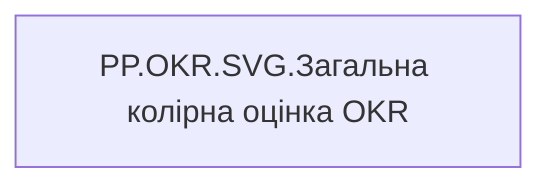

# PP.OKR.SVG.Загальна колірна оцінка OKR

| Властивість | Значення |
|---|---|
| Тип | міра |
| Home table | _Measures |
| displayFolder | `Personal_Profile\Результативність та оцінка\OKR` |
| formatString | — |
| dataType | — |
| Прихована | ні |

## DAX

```dax
VAR _fontFamily = "Segoe UI"
VAR _MaxValue = 100

VAR _Value = [PP.OKR.Current_user.Загальна  оцінка OKR]
VAR _CatName = [PP.OKR.Current_user.Загальна колірна оцінка OKR]

VAR _ColorFill = SWITCH(_CatName,
    "Супер зелений", "#009051",
    "Зелений", "#02BD3D",
    "Жовто-зелений", "#C2E330",
    "Жовтий", "#FFE521",
    "Жовто-червоний", "#FF7E0D",
    "Червоний", "#F23711",
    "#CDE58E"
)

VAR _ColorText = SWITCH(_CatName,
    "Супер зелений", "#005C33",
    "Зелений", "#017A27",
    "Жовто-зелений", "#5C6B00",
    "Жовтий", "#7A6D00",
    "Жовто-червоний", "#994B00",
    "Червоний", "#991500",
    "#5C5C5C"
)

VAR _W = 300
VAR _BarMaxW = 150
VAR _H = 14
VAR _RX = _H / 2
VAR _BarW = MIN(DIVIDE(_Value, _MaxValue, 0), 1) * _BarMaxW

VAR _BgBar = "<rect x='0' y='0' width='" & _BarMaxW & "' height='" & _H & "' rx='" & _RX & "' ry='" & _RX & "' fill='" & _ColorFill & "' fill-opacity='0.15' />"
VAR _FillBar = "<rect x='0' y='0' width='" & FORMAT(_BarW, "0.0") & "' height='" & _H & "' rx='" & _RX & "' ry='" & _RX & "' fill='" & _ColorFill & "' />"
VAR _Label = "<text x='" & (_BarMaxW + 6) & "' y='" & (_H / 2 + 4) & "' style='font-family:" & _fontFamily & "; font-size:11px; fill:" & _ColorText & ";'>" & _CatName & "</text>"

VAR _SVG = 
    "<svg xmlns='http://www.w3.org/2000/svg' width='" & _W & "' height='" & _H & "' viewBox='0 0 " & _W & " " & _H & "'>" &
        _BgBar & _FillBar & _Label &
    "</svg>"

RETURN
IF(
    ISBLANK(_Value),
    BLANK(),
    "data:image/svg+xml;utf8," & _SVG
)
```

## Джерела

—

## Бізнес-суть

Загальна колірна оцінка OKR

**Вимоги:** `Індивідуальний-профіль-працівника/Сторінка-Результативність-та-оцінка`, `Командний-профіль/Сторінка-Результативність-та-оцінка-команди/Створити-блок-Виконання-OKR`

## Залежності

Міри: [PP.OKR.Current_user.Загальна  оцінка OKR](../measures/pp-okr-current-user-zahalna-otsinka-okr.md), [PP.OKR.Current_user.Загальна колірна оцінка OKR](../measures/pp-okr-current-user-zahalna-kolirna-otsinka-okr.md)


## Схема



## Нотатки

_порожньо_
