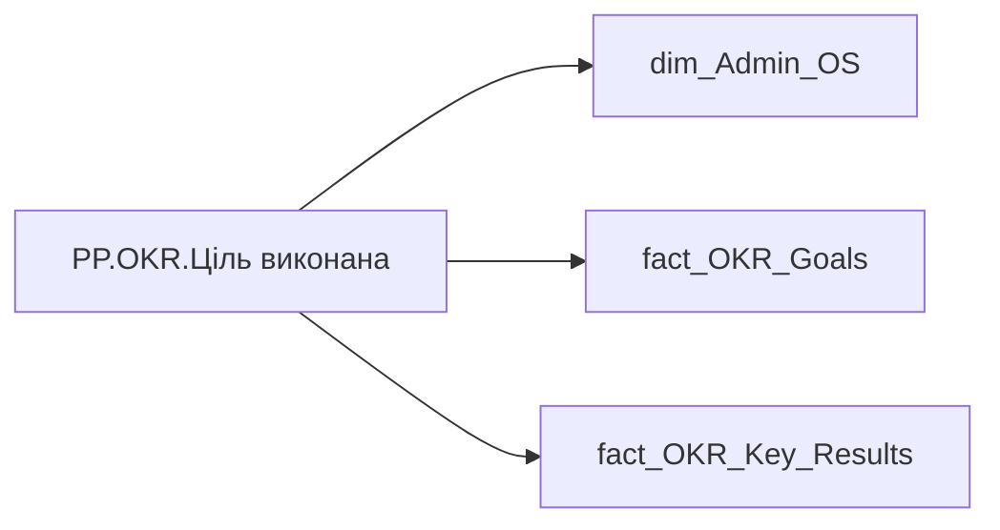

# PP.OKR.Ціль виконана

*тека `Personal_Profile\Результативність та оцінка\OKR` · формат `0`*

## Технічний опис

| Властивість | Значення |
|---|---|
| Тип | міра |
| Home table | _Measures |
| displayFolder | `Personal_Profile\Результативність та оцінка\OKR` |
| formatString | `0` |
| dataType | — |
| Прихована | ні |

### DAX

```dax
VAR _employee_id = SELECTEDVALUE('dim_Admin_OS'[EMPLOYEE_ID])
VAR _main_position = 
	CALCULATE(
		VALUES('fact_OKR_Goals'[USER_ACCESS_ID]),
		REMOVEFILTERS('fact_OKR_Goals'),
		'fact_OKR_Goals'[EMPLOYEE_ID] = _employee_id
	)
VAR _filter0 = TREATAS({_main_position}, 'fact_OKR_Goals'[USER_ACCESS_ID])
VAR _res = 
	CALCULATE(
        COUNTROWS('fact_OKR_Goals'),
        'fact_OKR_Goals'[Calc_Performance_Desc_Rate] <> "Червоний",
        'fact_OKR_Key_Results'[KR_CHANGE] <> "DELETE",
        NOT(ISBLANK('fact_OKR_Goals'[CALC_PERFORMANCE_STR_RATE])),
		_filter0
	)
VAR _blank_check = 
CALCULATE(
    COUNTROWS('fact_OKR_Goals'),
    'fact_OKR_Goals'[Calc_Performance_Desc_Rate] <> "Червоний",
    NOT(ISBLANK('fact_OKR_Goals'[CALC_PERFORMANCE_STR_RATE]))
)
RETURN IF(NOT(ISBLANK(_blank_check)), _res)
```

### Джерела даних

Вихідні таблиці: `DM.R27_fact_OKR_Goals`, `DM.R27_fact_OKR_Key_Results`, `DM.vw_R27_dim_Employee_Access_List`

Колонки: `CALC_PERFORMANCE_STR_RATE`, `Calc_Performance_Desc_Rate`, `EMPLOYEE_ID`, `KR_CHANGE`, `USER_ACCESS_ID`

Power Query: `dim_Admin_OS`

### Залежності (таблиці й колонки)

Таблиці: `dim_Admin_OS`, `fact_OKR_Goals`, `fact_OKR_Key_Results`

Колонки: `dim_Admin_OS[EMPLOYEE_ID]`, `fact_OKR_Goals[CALC_PERFORMANCE_STR_RATE]`, `fact_OKR_Goals[Calc_Performance_Desc_Rate]`, `fact_OKR_Goals[EMPLOYEE_ID]`, `fact_OKR_Goals[USER_ACCESS_ID]`, `fact_OKR_Key_Results[KR_CHANGE]`

### Схема



---

## Бізнес-суть

CALC_PERFORMANCE_STR_RATE → Загальна оцінка ОКР; CALC_PERFORMANCE_STR_RATE → Загальна оцінка OKR; CALC_PERFORMANCE_STR_RATE → Оцінка OKR; Calc_Performance_Desc_Rate → Колірна оцінка ОКР; Calc_Performance_Desc_Rate → Загальна колірна оцінка ОКР; Calc_Performance_Desc_Rate → Загальна колірна оцінка OKR; Calc_Performance_Desc_Rate → Ціль виконана; Calc_Performance_Desc_Rate → Ціль не виконана; Calc_Performance_Desc_Rate → Колірна оцінка OKR за останній період; Calc_Performance_Desc_Rate → Колірна оцінка OKR за передостанній період; Calc_Performance_Desc_Rate → Загальний колір ОКР; Calc_Performance_Desc_Rate → Колірна оцінка OKR; KR_CHANGE → КР змінено; KR_CHANGE → КР без змін; KR_CHANGE → КР видалено; KR_CHANGE → Новий КР; KR_CHANGE → Ознака зміни KR

Останнє НЕ пусте актуальне значення на дату (date) поточного запису Якщо поле Calc_Performance_Desc_Rate має значення Супер зелений, або Жовто-зелений, або Зелений, або Жовтий, або Жовто-червоний Якщо поле Calc_Performance_Desc_Rate має значення Червоний КР змінено, якщо поле kr_change= CHANGE КР без змін, якщо поле kr_change= NO CHANGE КР видалено, якщо поле kr_change= DELETE КР змінено, якщо поле kr_change= NEW

**Вимоги:** `Індивідуальний-профіль-працівника/Історія-по-посадам`, `Індивідуальний-профіль-працівника/Історія-по-посадам/Реліз-1.-Історія-по-посадам`, `Індивідуальний-профіль-працівника/Паспортна-частина-індивідуального-профілю-співробітника`, `Індивідуальний-профіль-працівника/Паспортна-частина-індивідуального-профілю-співробітника/Сторінка-Картка-(паспорт)-працівника/Редизайн-паспортної-частини`, `Індивідуальний-профіль-працівника/Сторінка-Результативність-та-оцінка`, `Допоміжні-вітрини-для-звіту/Таблиця-для-розрахунку-агрегованих-метрик-по-звіту`, `Командний-профіль/Паспортна-частина-групового-профілю/Редизайн-паспортної-частини-групового-профілю`, `Командний-профіль/Сторінка-Моя-команда/ТЗ.-Деталізація-метрик-групового-профілю-звіту`, `Командний-профіль/Сторінка-Результативність-та-оцінка-команди/Створити-блок-Виконання-OKR`

## На сторінках звіту

[Personal Profile](../report/personal-profile.md)

## Пов'язані міри

_Прямих зв'язків з іншими мірами немає._

## Нотатки

_порожньо_
