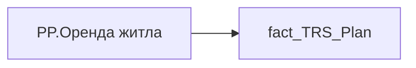

# PP.Оренда житла

*тека `Personal_Profile\TRS` · формат `0`*

## Технічний опис

| Властивість | Значення |
|---|---|
| Тип | міра |
| Home table | _Measures |
| displayFolder | `Personal_Profile\TRS` |
| formatString | `0` |
| dataType | — |
| Прихована | ні |

### DAX

```dax
CALCULATE(
	MAX(fact_TRS_Plan[INIT_PAYMENT_PLAN_SUM]),
	fact_TRS_Plan[IS_ACTUAL]=TRUE(),
	fact_TRS_Plan[ACCRUAL_ORG_CODE]="00144"
)
```

### Джерела даних

Вихідні таблиці: `DM.vw_R27_fact_TRS_Plan_PDP`

Колонки: `ACCRUAL_ORG_CODE`, `INIT_PAYMENT_PLAN_SUM`, `IS_ACTUAL`

Power Query: `fact_TRS_Plan`

### Залежності (таблиці й колонки)

Таблиці: `fact_TRS_Plan`

Колонки: `fact_TRS_Plan[ACCRUAL_ORG_CODE]`, `fact_TRS_Plan[INIT_PAYMENT_PLAN_SUM]`, `fact_TRS_Plan[IS_ACTUAL]`

### Схема



---

## Бізнес-суть

**Бізнес-назва:** Оренда житла

### Опис із ТЗ

Це поле має бути доступне у візуалізаціях, побудованих на основі фактової таблиці `DM.vw_R29_fact_TRS_Plan`   Відібрати записи по працівнику по працівнику `person_key`, періоду `Period`, організації `organization_key` , підрозділу `division_key`, посаді `position_key`, де `ACCRUAL_ORG_CODE` = 00144, `IS_ACTUAL`  = "1", `END_DATE` > поточна дата, або `END_DATE` = "01.01.2001

Відібрати записи по працівнику по працівнику `person_key`, періоду `Period`, організації `organization_key` , підрозділу `division_key`, посаді `position_key`, де `ACCRUAL_ORG_CODE` = 00144, `IS_ACTUAL`  = "1", `END_DATE` > поточна дата, або `END_DATE` = "01.01.2001

**Вимоги (ТЗ):**

- [Індивідуальний профіль працівника › Сторінка Винагорода працівника](https://dev.azure.com/MHPITDepProjects/People%20Digital%20Profile%20%28PDP%29/_wiki/wikis/PDP.wiki?pagePath=/%D0%A4%D1%83%D0%BD%D0%BA%D1%86%D1%96%D0%BE%D0%BD%D0%B0%D0%BB%D1%8C%D0%BD%D1%96%20%D0%B2%D0%B8%D0%BC%D0%BE%D0%B3%D0%B8/%D0%92%D0%B8%D0%BC%D0%BE%D0%B3%D0%B8%20%D0%B4%D0%BE%20%D0%B7%D0%B2%D1%96%D1%82%D1%83%20People%20Digital%20Profile/%D0%86%D0%BD%D0%B4%D0%B8%D0%B2%D1%96%D0%B4%D1%83%D0%B0%D0%BB%D1%8C%D0%BD%D0%B8%D0%B9%20%D0%BF%D1%80%D0%BE%D1%84%D1%96%D0%BB%D1%8C%20%D0%BF%D1%80%D0%B0%D1%86%D1%96%D0%B2%D0%BD%D0%B8%D0%BA%D0%B0/%D0%A1%D1%82%D0%BE%D1%80%D1%96%D0%BD%D0%BA%D0%B0%20%D0%92%D0%B8%D0%BD%D0%B0%D0%B3%D0%BE%D1%80%D0%BE%D0%B4%D0%B0%20%D0%BF%D1%80%D0%B0%D1%86%D1%96%D0%B2%D0%BD%D0%B8%D0%BA%D0%B0)
- [Командний профіль › Сторінка Моя команда › ТЗ. Деталізація метрик групового профілю звіту](https://dev.azure.com/MHPITDepProjects/People%20Digital%20Profile%20%28PDP%29/_wiki/wikis/PDP.wiki?pagePath=/%D0%A4%D1%83%D0%BD%D0%BA%D1%86%D1%96%D0%BE%D0%BD%D0%B0%D0%BB%D1%8C%D0%BD%D1%96%20%D0%B2%D0%B8%D0%BC%D0%BE%D0%B3%D0%B8/%D0%92%D0%B8%D0%BC%D0%BE%D0%B3%D0%B8%20%D0%B4%D0%BE%20%D0%B7%D0%B2%D1%96%D1%82%D1%83%20People%20Digital%20Profile/%D0%9A%D0%BE%D0%BC%D0%B0%D0%BD%D0%B4%D0%BD%D0%B8%D0%B9%20%D0%BF%D1%80%D0%BE%D1%84%D1%96%D0%BB%D1%8C/%D0%A1%D1%82%D0%BE%D1%80%D1%96%D0%BD%D0%BA%D0%B0%20%D0%9C%D0%BE%D1%8F%20%D0%BA%D0%BE%D0%BC%D0%B0%D0%BD%D0%B4%D0%B0/%D0%A2%D0%97.%20%D0%94%D0%B5%D1%82%D0%B0%D0%BB%D1%96%D0%B7%D0%B0%D1%86%D1%96%D1%8F%20%D0%BC%D0%B5%D1%82%D1%80%D0%B8%D0%BA%20%D0%B3%D1%80%D1%83%D0%BF%D0%BE%D0%B2%D0%BE%D0%B3%D0%BE%20%D0%BF%D1%80%D0%BE%D1%84%D1%96%D0%BB%D1%8E%20%D0%B7%D0%B2%D1%96%D1%82%D1%83)

## На сторінках звіту

- [Personal Profile](../report/personal-profile.md) — Винагорода

## Пов'язані міри

_Прямих зв'язків з іншими мірами немає._

## Нотатки

_порожньо_
