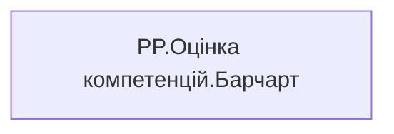

# PP.Оцінка компетенцій.Барчарт

## Технічний опис

| Властивість | Значення |
|---|---|
| Тип | міра |
| Home table | _Measures |
| displayFolder | — |
| formatString | — |
| dataType | — |
| Прихована | ні |

### DAX

```dax
// 1. Значення 5 мір. COALESCE замінює BLANK на 0
VAR _v1 = COALESCE ( [PP.Оцінка компетенцій.Самооцінка], 0 )
VAR _v2 = COALESCE ( [PP.Оцінка компетенцій.Оцінка керівника], 0 )
VAR _v3 = COALESCE ( [PP.Оцінка компетенцій.Оцінка підлеглих], 0 )
VAR _v4 = COALESCE ( [PP.Оцінка компетенцій.Оцінка колег], 0 )
VAR _v5 = COALESCE ( [PP.Оцінка компетенцій.Оцінка крос-колег], 0 )

// 2. Віртуальна таблиця: рядок = (порядок, підпис із екрана, значення)
VAR _data =
    UNION (
        ROW ( "Idx", 1, "Label", "Самооцінка",  "Val", _v1 ),
        ROW ( "Idx", 2, "Label", "Керівник",    "Val", _v2 ),
        ROW ( "Idx", 3, "Label", "Підлеглі",    "Val", _v3 ),
        ROW ( "Idx", 4, "Label", "Колеги",      "Val", _v4 ),
        ROW ( "Idx", 5, "Label", "Крос-колеги", "Val", _v5 )
    )

// 3. Масштаб довжини бару (найдовший = повна довжина треку).
//    Для пропорцій від нуля до фіксованої межі — заміни _dataMax на число (напр. 5 або 100).
VAR _dataMax  = MAXX ( _data, [Val] )
VAR _scaleMax = IF ( _dataMax = 0, 1, _dataMax )

// 4. Внутрішня система координат = пропорції об'єкта 262 × 230.
//    width/height=100% + viewBox → адаптивність під контейнер.
VAR _vbW       = 262
VAR _vbH       = 230
VAR _barTrackW = 150   // макс. довжина бару; решта ширини — під мітку (категорія + значення)
VAR _barH      = 28    // товщина бару
VAR _lblGap    = 5     // відступ мітки від кінця бару
VAR _fLbl      = 18    // шрифт мітки

// Вертикальне розкладання: відступ зверху ЗБЕРІГАЄТЬСЯ, відступ знизу = 0.
// Проміжки між барами рахуються так, щоб нижній край останнього бару = _vbH.
VAR _n   = COUNTROWS ( _data )
VAR _top = 14                                          // відступ зверху (підлаштуй за потреби)
VAR _gap = ( _vbH - _top - _n * _barH ) / ( _n - 1 )  // рівні проміжки між барами; знизу 0

// 5. Один прохід: бар (прямий лівий край від x=0, заокруглений правий) + мітка "Категорія Значення"
VAR _bars =
    CONCATENATEX (
        _data,
        VAR _yTop = _top + ( [Idx] - 1 ) * ( _barH + _gap )
        VAR _yBot = _yTop + _barH
        VAR _yc   = _yTop + _barH / 2
        VAR _r    = _barH / 2                  // радіус правого півкола
        VAR _w0   = _barTrackW * DIVIDE ( [Val], _scaleMax )
        VAR _w    = MAX ( _w0, _r )            // ширина >= радіус → валідний path
        VAR _xArc = _w - _r                    // початок правої дуги
        VAR _txt  = FORMAT ( [Val], "0.0", "en-US" )   // формат значення: "0"=ціле, "0.0%"=відсоток
        RETURN
            "<path d='M 0 " & FORMAT ( _yTop, "0.0", "en-US" )
                & " L " & FORMAT ( _xArc, "0.0", "en-US" ) & " " & FORMAT ( _yTop, "0.0", "en-US" )
                & " A " & FORMAT ( _r, "0.0", "en-US" ) & " " & FORMAT ( _r, "0.0", "en-US" )
                    & " 0 0 1 " & FORMAT ( _xArc, "0.0", "en-US" ) & " " & FORMAT ( _yBot, "0.0", "en-US" )
                & " L 0 " & FORMAT ( _yBot, "0.0", "en-US" )
                & " Z' fill='#2D7FF9'/>"
            & "<text x='" & FORMAT ( _w + _lblGap, "0.0", "en-US" ) & "' y='" & FORMAT ( _yc, "0.0", "en-US" )
                & "' font-family='Segoe UI, sans-serif' font-size='" & _fLbl & "' fill='#333333'"
                & " text-anchor='start' dominant-baseline='central'>" & [Label] & " " & _txt & "</text>",
        "",
        [Idx], ASC
    )

// 6. Складання SVG. width/height=100% + viewBox у пропорціях об'єкта
VAR _svg =
    "<svg xmlns='http://www.w3.org/2000/svg' width='100%' height='100%'"
        & " viewBox='0 0 " & _vbW & " " & _vbH & "' preserveAspectRatio='xMidYMid meet'>"
        & "<rect x='0' y='0' width='" & _vbW & "' height='" & _vbH & "' fill='#FFFFFF'/>"
        & _bars
        & "</svg>"

// 7. Прямий SVG-візуал: сира розмітка без префікса й без екранування
RETURN
    _svg
```

### Джерела даних

—

### Залежності (таблиці й колонки)

—

### Схема



---

## Бізнес-суть

!!! note "Бізнес-визначення відсутнє"
    Поля міри не зіставлено з wiki «Таблицями джерел даних». Можна заповнити вручну в `manualNotes`.

## На сторінках звіту

- [Personal Profile](../report/personal-profile.md) — Результативність та оцінка › Оцінка компет.Детально

## Пов'язані міри

**Використовує:** [PP.Оцінка компетенцій.Оцінка керівника](../measures/pp-otsinka-kompetentsii-otsinka-kerivnyka.md), [PP.Оцінка компетенцій.Оцінка колег](../measures/pp-otsinka-kompetentsii-otsinka-koleh.md), [PP.Оцінка компетенцій.Оцінка крос-колег](../measures/pp-otsinka-kompetentsii-otsinka-kros-koleh.md), [PP.Оцінка компетенцій.Оцінка підлеглих](../measures/pp-otsinka-kompetentsii-otsinka-pidlehlykh.md), [PP.Оцінка компетенцій.Самооцінка](../measures/pp-otsinka-kompetentsii-samootsinka.md)

## Нотатки

_порожньо_
