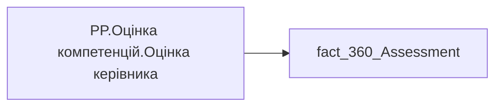

# PP.Оцінка компетенцій.Оцінка керівника

## Технічний опис

| Властивість | Значення |
|---|---|
| Тип | міра |
| Home table | _Measures |
| displayFolder | — |
| formatString | — |
| dataType | — |
| Прихована | ні |

### DAX

```dax
AVERAGE('fact_360_Assessment'[Manager_Assessment])
```

### Джерела даних

Вихідні таблиці: `DM.vw_R27_fact_360_Assessment`

Колонки: `Manager_Assessment`

Power Query: `fact_360_Assessment`

### Залежності (таблиці й колонки)

Таблиці: `fact_360_Assessment`

Колонки: `fact_360_Assessment[Manager_Assessment]`

### Схема



---

## Бізнес-суть

!!! note "Бізнес-визначення відсутнє"
    Поля міри не зіставлено з wiki «Таблицями джерел даних». Можна заповнити вручну в `manualNotes`.

## На сторінках звіту

- [Personal Profile](../report/personal-profile.md) — Результативність та оцінка › Оцінка компет.Детально

## Пов'язані міри

**Використовується в:** [PP.SVG.Оцінка компетенцій.Хітмап по блоках](../measures/pp-svg-otsinka-kompetentsii-khitmap-po-blokakh.md), [PP.SVG.Приховані можливості](../measures/pp-svg-prykhovani-mozhlyvosti.md), [PP.SVG.Сліпі плями](../measures/pp-svg-slipi-pliamy.md), [PP.Оцінка компетенцій.Барчарт](../measures/pp-otsinka-kompetentsii-barchart.md)

## Нотатки

_порожньо_
