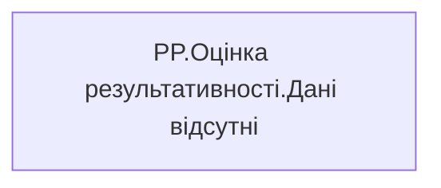

# PP.Оцінка результативності.Дані відсутні

*тека `Personal_Profile\Паспорт\Результативність`*

## Технічний опис

| Властивість | Значення |
|---|---|
| Тип | міра |
| Home table | _Measures |
| displayFolder | `Personal_Profile\Паспорт\Результативність` |
| formatString | — |
| dataType | — |
| Прихована | ні |

### DAX

```dax
IF(
    ISBLANK([PP.Оцінка результативності.Керівником.Total])
    && ISBLANK([PP.Оцінка результативності.Керівником])
    && ISBLANK([PP.Оцінка результативності.Самооцінка.Total])
    && ISBLANK([PP.Оцінка результативності.Самооцінка]), 
    "Дані відсутні", 
    ""
)
```

### Джерела даних

—

### Залежності (таблиці й колонки)

—

### Схема



---

## Бізнес-суть

**Бізнес-назва:** Оцінка результативності

**Вимоги (ТЗ):**

- [Індивідуальний профіль працівника › Історія по посадам](https://dev.azure.com/MHPITDepProjects/People%20Digital%20Profile%20%28PDP%29/_wiki/wikis/PDP.wiki?pagePath=/%D0%A4%D1%83%D0%BD%D0%BA%D1%86%D1%96%D0%BE%D0%BD%D0%B0%D0%BB%D1%8C%D0%BD%D1%96%20%D0%B2%D0%B8%D0%BC%D0%BE%D0%B3%D0%B8/%D0%92%D0%B8%D0%BC%D0%BE%D0%B3%D0%B8%20%D0%B4%D0%BE%20%D0%B7%D0%B2%D1%96%D1%82%D1%83%20People%20Digital%20Profile/%D0%86%D0%BD%D0%B4%D0%B8%D0%B2%D1%96%D0%B4%D1%83%D0%B0%D0%BB%D1%8C%D0%BD%D0%B8%D0%B9%20%D0%BF%D1%80%D0%BE%D1%84%D1%96%D0%BB%D1%8C%20%D0%BF%D1%80%D0%B0%D1%86%D1%96%D0%B2%D0%BD%D0%B8%D0%BA%D0%B0/%D0%86%D1%81%D1%82%D0%BE%D1%80%D1%96%D1%8F%20%D0%BF%D0%BE%20%D0%BF%D0%BE%D1%81%D0%B0%D0%B4%D0%B0%D0%BC)
- [Індивідуальний профіль працівника › Історія по посадам › Реліз 1. Історія по посадам](https://dev.azure.com/MHPITDepProjects/People%20Digital%20Profile%20%28PDP%29/_wiki/wikis/PDP.wiki?pagePath=/%D0%A4%D1%83%D0%BD%D0%BA%D1%86%D1%96%D0%BE%D0%BD%D0%B0%D0%BB%D1%8C%D0%BD%D1%96%20%D0%B2%D0%B8%D0%BC%D0%BE%D0%B3%D0%B8/%D0%92%D0%B8%D0%BC%D0%BE%D0%B3%D0%B8%20%D0%B4%D0%BE%20%D0%B7%D0%B2%D1%96%D1%82%D1%83%20People%20Digital%20Profile/%D0%86%D0%BD%D0%B4%D0%B8%D0%B2%D1%96%D0%B4%D1%83%D0%B0%D0%BB%D1%8C%D0%BD%D0%B8%D0%B9%20%D0%BF%D1%80%D0%BE%D1%84%D1%96%D0%BB%D1%8C%20%D0%BF%D1%80%D0%B0%D1%86%D1%96%D0%B2%D0%BD%D0%B8%D0%BA%D0%B0/%D0%86%D1%81%D1%82%D0%BE%D1%80%D1%96%D1%8F%20%D0%BF%D0%BE%20%D0%BF%D0%BE%D1%81%D0%B0%D0%B4%D0%B0%D0%BC/%D0%A0%D0%B5%D0%BB%D1%96%D0%B7%201.%20%D0%86%D1%81%D1%82%D0%BE%D1%80%D1%96%D1%8F%20%D0%BF%D0%BE%20%D0%BF%D0%BE%D1%81%D0%B0%D0%B4%D0%B0%D0%BC)

## На сторінках звіту

- [Personal Profile](../report/personal-profile.md) — Результативність та оцінка › Результативність.Детально › Ініціативність при виконанні завдань, Результативність та оцінка › Результативність.Детально › Автономність при виконанні завдань, Результативність та оцінка › Результативність.Детально › Виконання завдань у встановлені терміни, Результативність та оцінка › Результативність.Детально › Відповідність кількості виконаних завдань функціоналу, Результативність та оцінка › Результативність.Детально › Націленість на отримання результату, Результативність та оцінка › Результативність.Детально › Подолання перешкод при вирішенні проблем, Результативність та оцінка › Результативність.Детально › Прийняття відповідальності за отриманий результат, Результативність та оцінка › Результативність.Детально › Якість результату виконаних завдань

## Пов'язані міри

**Використовує:** [PP.Оцінка результативності.Керівником](../measures/pp-otsinka-rezultatyvnosti-kerivnykom.md), [PP.Оцінка результативності.Керівником.Total](../measures/pp-otsinka-rezultatyvnosti-kerivnykom-total.md), [PP.Оцінка результативності.Самооцінка](../measures/pp-otsinka-rezultatyvnosti-samootsinka.md), [PP.Оцінка результативності.Самооцінка.Total](../measures/pp-otsinka-rezultatyvnosti-samootsinka-total.md)

## Нотатки

_порожньо_
