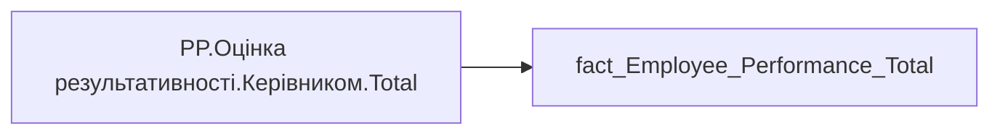

# PP.Оцінка результативності.Керівником.Total

*тека `Personal_Profile\Результативність та оцінка\Результативність` · формат `#,0.00`*

## Технічний опис

| Властивість | Значення |
|---|---|
| Тип | міра |
| Home table | _Measures |
| displayFolder | `Personal_Profile\Результативність та оцінка\Результативність` |
| formatString | `#,0.00` |
| dataType | — |
| Прихована | ні |

### DAX

```dax
CALCULATE(AVERAGE('fact_Employee_Performance_Total'[General_Performance_Desc_Rate]))
```

### Джерела даних

Вихідні таблиці: `DM.vw_R27_fact_Employee_Performance_General_PBI`

Колонки: `General_Performance_Desc_Rate`

Power Query: `fact_Employee_Performance_Total`

### Залежності (таблиці й колонки)

Таблиці: `fact_Employee_Performance_Total`

Колонки: `fact_Employee_Performance_Total[General_Performance_Desc_Rate]`

### Схема



---

## Бізнес-суть

General_Performance_Desc_Rate → Бал оцінки результативності; General_Performance_Desc_Rate → Загальна оцінка; General_Performance_Desc_Rate → Загальна оцінка співробітника за останній період (рік); General_Performance_Desc_Rate → Загальна оцінка співробітника за передостанній період (рік); General_Performance_Desc_Rate → Остання доступна оцінка керівника,  бал

Останнє НЕ пусте актуальне значення на дату (date) поточного запису Останнє НЕ пусте актуальне значення на дату (date) поточного запису. Відбираємо один будь-який рядок по даті запуску форми оцінювання. Якщо у працівника є дві оцінки (форми) за один період, від адміністративного та функціонального керівника, то потрібно вивести середньоарифметичне значення

**Вимоги:** `Індивідуальний-профіль-працівника/Історія-по-посадам`, `Індивідуальний-профіль-працівника/Історія-по-посадам/Реліз-1.-Історія-по-посадам`, `Індивідуальний-профіль-працівника/Паспортна-частина-індивідуального-профілю-співробітника/Сторінка-Картка-(паспорт)-працівника/ТЗ-на-побудову-візуала-Павутинка-по-оцінці-результативності-працівника`, `Індивідуальний-профіль-працівника/Сторінка-Результативність-та-оцінка`, `Допоміжні-вітрини-для-звіту/Таблиця-для-розрахунку-агрегованих-метрик-по-звіту`, `Командний-профіль/Паспортна-частина-групового-профілю/Редизайн-паспортної-частини-групового-профілю`, `Командний-профіль/Сторінка-Моя-команда/ТЗ.-Деталізація-метрик-групового-профілю-звіту`, `Командний-профіль/Сторінка-Результативність-та-оцінка-команди`

## На сторінках звіту

_Не використовується на основних сторінках звіту._

## Пов'язані міри

**Використовується в:** [PP.SVG.Оцінка результативності.Total](../measures/pp-svg-otsinka-rezultatyvnosti-total.md), [PP.Оцінка результативності.Дані відсутні](../measures/pp-otsinka-rezultatyvnosti-dani-vidsutni.md)

## Нотатки

_порожньо_
