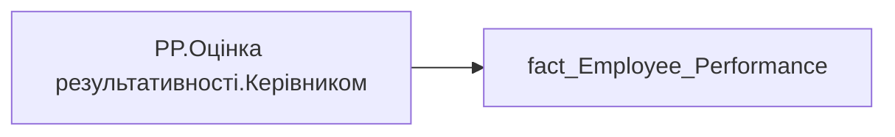

# PP.Оцінка результативності.Керівником

*тека `Personal_Profile\Результативність та оцінка\Результативність` · формат `0.00`*

## Бізнес-суть

Official_Rate → Оцінка керівника (Офіційна оцінка компетенції); Official_Rate → Оцінка кожного індикатора керівником

**Вимоги:** `Індивідуальний-профіль-працівника/Паспортна-частина-індивідуального-профілю-співробітника/Зміна-джерела-даних-для-павутинки-Оцінка-результативності`, `Індивідуальний-профіль-працівника/Паспортна-частина-індивідуального-профілю-співробітника/Сторінка-Картка-(паспорт)-працівника/ТЗ-на-побудову-візуала-Павутинка-по-оцінці-результативності-працівника`, `Індивідуальний-профіль-працівника/Сторінка-Результативність-та-оцінка`, `Командний-профіль/Паспортна-частина-групового-профілю/Редизайн-паспортної-частини-групового-профілю`, `Командний-профіль/Сторінка-Моя-команда/ТЗ.-Деталізація-метрик-групового-профілю-звіту`, `Командний-профіль/Сторінка-Результативність-та-оцінка-команди`

## На сторінках звіту

_Не використовується на основних сторінках звіту._

## Пов'язані міри

**Використовується в:** [PP.SVG.Оцінка результативності](../measures/pp-svg-otsinka-rezultatyvnosti.md), [PP.Оцінка результативності](../measures/pp-otsinka-rezultatyvnosti.md), [PP.Оцінка результативності.Дані відсутні](../measures/pp-otsinka-rezultatyvnosti-dani-vidsutni.md)

---

## Технічний опис

| Властивість | Значення |
|---|---|
| Тип | міра |
| Home table | _Measures |
| displayFolder | `Personal_Profile\Результативність та оцінка\Результативність` |
| formatString | `0.00` |
| dataType | — |
| Прихована | ні |

### DAX

```dax
CALCULATE(AVERAGE('fact_Employee_Performance'[Official_Rate]))
```

### Джерела даних

Вихідні таблиці: `DM.vw_R27_fact_Employee_Performance_PBI`

Колонки: `Official_Rate`

Power Query: `fact_Employee_Performance`

### Залежності (таблиці й колонки)

Таблиці: `fact_Employee_Performance`

Колонки: `fact_Employee_Performance[Official_Rate]`

### Схема



## Нотатки

_порожньо_
