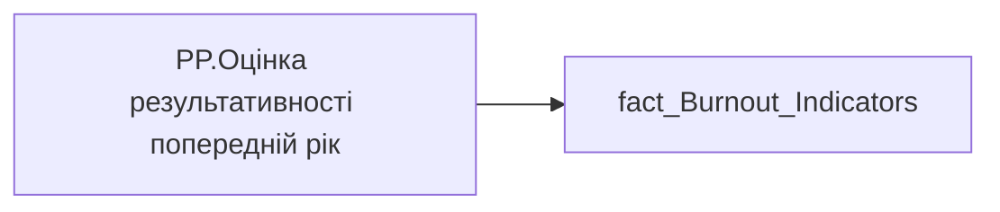

# PP.Оцінка результативності попередній рік

| Властивість | Значення |
|---|---|
| Тип | міра |
| Home table | _Measures |
| displayFolder | `Personal_Profile\Паспорт\Результативність` |
| formatString | — |
| dataType | — |
| Прихована | ні |

## DAX

```dax
SUM('fact_Burnout_Indicators'[PREV_YEAR_PERFORMANCE_DESC_RATE])
```

## Джерела


Колонки: `PREV_YEAR_PERFORMANCE_DESC_RATE`

Power Query: `fact_Burnout_Indicators`

## Бізнес-суть

PREV_YEAR_PERFORMANCE_DESC_RATE → Оцінка результативності за передостанній рік в цифровому форматі; PREV_YEAR_PERFORMANCE_DESC_RATE → Оцінка результативності (ОР) за попередній рік; PREV_YEAR_PERFORMANCE_DESC_RATE → Загальна оцінка співробітника за передостанній період (рік); PREV_YEAR_PERFORMANCE_DESC_RATE → Середня оцінка результативності команди за передостанній рік в цифровому форматі

Для розрахунку метрики "Тренд оцінки рез-ті" Ці дані виводяться в деталізацію по тренду оцінки результативності Потрібно вирахувати середнє значення по команді = сума значень всіх оцінок членів команди станом на поточний момент поділити на кіл-сть таких членів команди (кількість записів). Тобто, якщо в складі команди є працівники, які не оцінювалися, вони участі в розрахунку не приймають.  <br>В розрахунок беремо оцінку всіх працівників, які станом на поточний момент є членами команди. На те, що вони могли працювати та оцінюватися на інших підприємствах/підрозділах не заважати.

**Вимоги:** `Індивідуальний-профіль-працівника/Паспортна-частина-індивідуального-профілю-співробітника/Сторінка-Картка-(паспорт)-працівника/Додати-інформацію-про-оцінку-результативності-працівника-в-Картку-працівника`, `Кейс-Втрати-Продуктивності-Працівників/Деталізація-метрик-в-кейсі-Продуктивність`, `Кейс-Утримання-працівників/Опис-джерел-для-сторінки-%22Кейс-звільнення-(вигорання)%22`, `Командний-профіль/Паспортна-частина-групового-профілю/Додати-інформацію-про-ОКР-команди-та-середню-оцінку-результативності-по-команді`

## Залежності

Таблиці: `fact_Burnout_Indicators`

Колонки: `fact_Burnout_Indicators[PREV_YEAR_PERFORMANCE_DESC_RATE]`

## Схема



## Нотатки

_порожньо_
