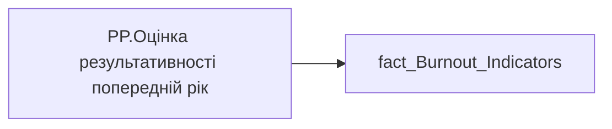

# PP.Оцінка результативності попередній рік

*тека `Personal_Profile\Паспорт\Результативність`*

## Технічний опис

| Властивість | Значення |
|---|---|
| Тип | міра |
| Home table | _Measures |
| displayFolder | `Personal_Profile\Паспорт\Результативність` |
| formatString | — |
| dataType | — |
| Прихована | ні |

### DAX

```dax
SUM('fact_Burnout_Indicators'[PREV_YEAR_PERFORMANCE_DESC_RATE])
```

### Джерела даних


Колонки: `PREV_YEAR_PERFORMANCE_DESC_RATE`

Power Query: `fact_Burnout_Indicators`

### Залежності (таблиці й колонки)

Таблиці: `fact_Burnout_Indicators`

Колонки: `fact_Burnout_Indicators[PREV_YEAR_PERFORMANCE_DESC_RATE]`

### Схема



---

## Бізнес-суть

!!! note "Бізнес-визначення відсутнє"
    Поля міри не зіставлено з wiki «Таблицями джерел даних». Можна заповнити вручну в `manualNotes`.

## На сторінках звіту

_Не використовується на основних сторінках звіту._

## Пов'язані міри

**Використовується в:** [PP.SVG.Perfomance_Prev_Year](../measures/pp-svg-perfomance-prev-year.md), [PP.SVG.Performance.Last2Periods](../measures/pp-svg-performance-last2periods.md), [PP.Оцінка результативності попередній рік (пусто)](../measures/pp-otsinka-rezultatyvnosti-poperednii-rik-pusto.md)

## Нотатки

_порожньо_
